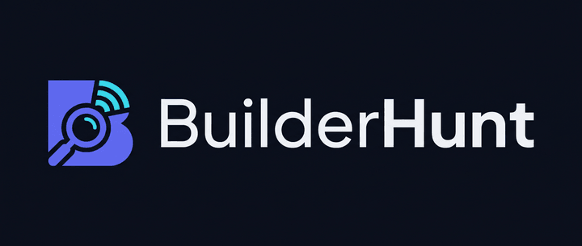
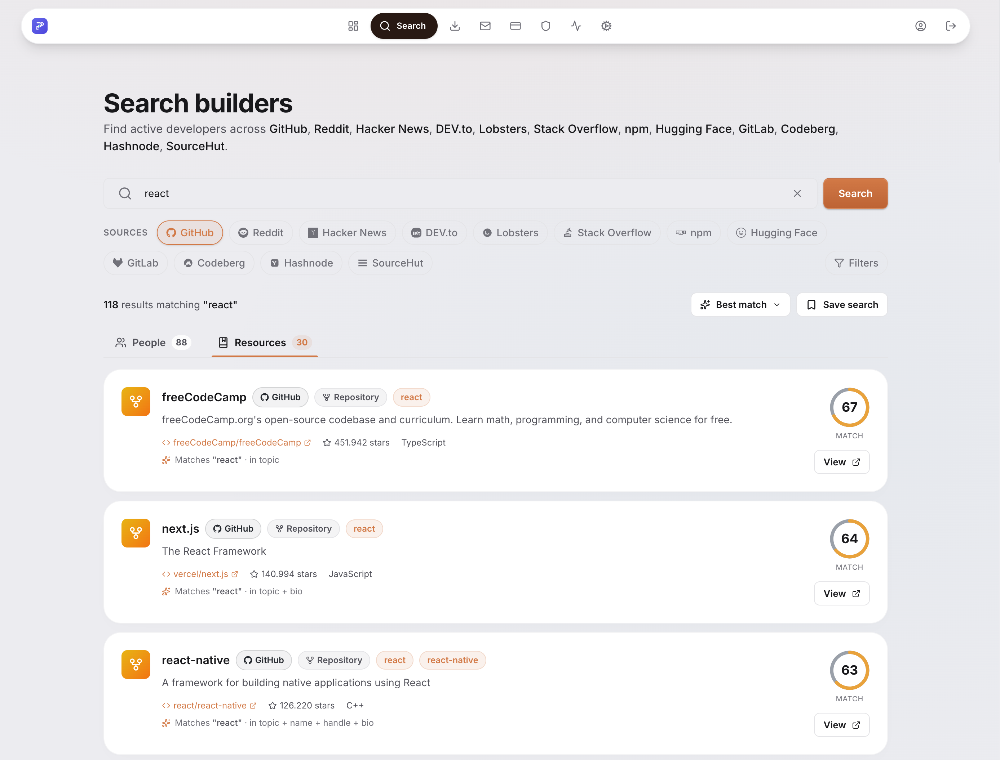
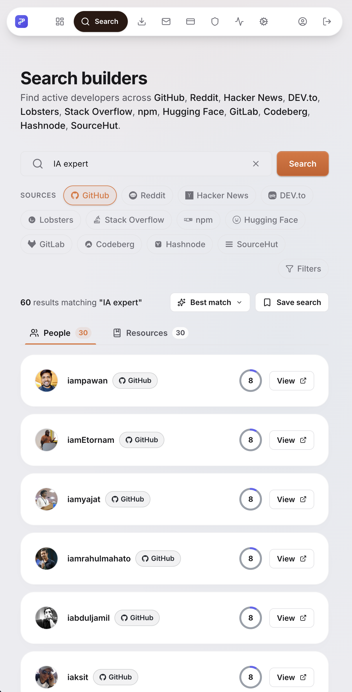
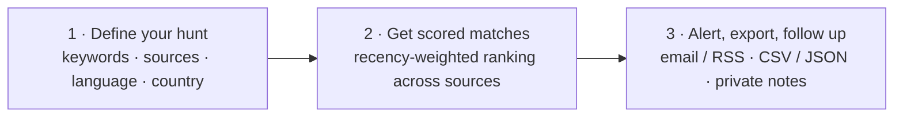
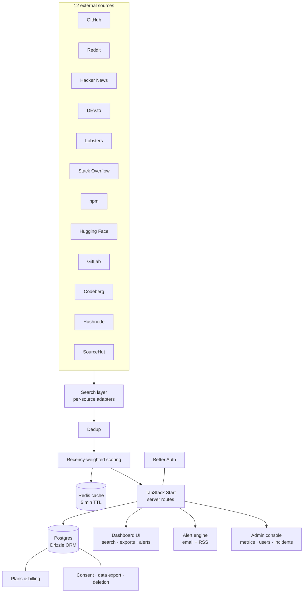

<div align="center">



### Find builders, not just repos.

**BuilderHunt aggregates public developer activity from 12 sources, scores it for recency,
and turns "who's actively shipping in X right now?" into a 30-second search — not a
30-minute Boolean-string hunt across five different tabs.**

[](#-project-status)
[](#-tech-stack)
[](#-tech-stack)
[](#-tech-stack)
[](#-tech-stack)
[](#-license)

[Live product](#-live-product) · [Business model](#-business-model--pricing) · [Sources](#-data-sources) ·
[Architecture](#-architecture) · [Getting started](#-getting-started) · [Roadmap](#-roadmap)

</div>

<br />

<p align="center">
  
</p>

<br />

---

## Table of contents

- [The problem](#the-problem)
- [The product](#the-product)
- [Live product](#-live-product)
- [Key features](#-key-features)
- [How it works](#-how-it-works)
- [Who it's for](#-who-its-for)
- [Data sources](#-data-sources)
- [Business model & pricing](#-business-model--pricing)
- [Architecture](#-architecture)
- [Tech stack](#-tech-stack)
- [Project structure](#-project-structure)
- [Data model](#-data-model)
- [Getting started](#-getting-started)
- [Environment variables](#-environment-variables)
- [Available scripts](#-available-scripts)
- [Quality gates](#-quality-gates)
- [Admin & operations](#-admin--operations)
- [Privacy & compliance](#-privacy--compliance)
- [Project status](#-project-status)
- [Roadmap](#-roadmap)
- [License](#-license)

<br />

## The problem

Sourcing developers is broken, and everyone who's ever hired one knows it:

- **Job posts drown in noise.** Two good candidates buried under two hundred
  "passionate developer with 5 years of experience" form letters.
- **Resumes lie. Git history doesn't.** The signal you actually want — who is
  *shipping right now*, in the stack you care about — isn't on LinkedIn.
- **The people worth finding are scattered.** A senior Rust maintainer might be
  most visible on GitHub, a rising indie hacker on Hacker News, a prolific
  writer on DEV.to, a domain expert answering questions on Stack Overflow. No
  single platform gives you the full picture, and manually cross-referencing
  four or five tabs per candidate doesn't scale past your third search.
- **Recruiting tools weren't built for this.** Boolean search on LinkedIn finds
  keywords, not proof of active work. Nothing tells you the moment a new
  matching builder shows up.

## The product

BuilderHunt is a **developer discovery and talent-sourcing platform**. Search
once across GitHub, Reddit, Hacker News, DEV.to, Lobsters, Stack Overflow, npm,
Hugging Face, GitLab, Codeberg, Hashnode and SourceHut, and get back real
people — ranked by a recency-weighted score that favors builders shipping this
week over ones who shipped three years ago — not just repositories.

Save the search, get an email or RSS alert the instant a new match appears,
attach private notes to any builder, and export your shortlist to CSV/JSON
whenever you're ready to reach out. No scraping DMs, no messaging on your
behalf, no reselling profile data — you find them, you decide what to do next.

It's built and operated as a real product with a real business model (see
[Business model & pricing](#-business-model--pricing)), not a weekend
prototype: authentication, billing, GDPR-compliant data export/deletion,
an admin operations console, a public status page, and a changelog/roadmap
that ships in the open.

<br />

## 📸 Live product

<table>
<tr>
<td width="65%" valign="top">

**Search, with real scored results across every connected source.**


</td>
<td width="35%" valign="top">

**The same live results, responsive down to a phone.**



</td>
</tr>
</table>

<br />

## ✨ Key features

| | |
|---|---|
| 🔎 **Multi-source discovery** | GitHub stars, HN upvotes, Reddit karma, DEV.to posts, Lobsters stories, Stack Overflow reputation, npm packages, Hugging Face models, GitLab/Codeberg/SourceHut repos, Hashnode articles — indexed and cross-referenced so you see one person across every signal, not twelve disconnected profiles. |
| 📈 **Recency-weighted scoring** | A 7-day-old commit is worth more than a 3-year-old star pile. Scores decay on a half-life curve so the top of every result set is the people shipping *now*. |
| 🔔 **Keyword alerts** | Set a saved search once. Get an email — or subscribe to a private RSS feed — the moment a new builder matching your filters shows up. No daily digest noise, just signal. |
| 📝 **Private notes** | Attach private context to any builder: outreach status, where you met them, why they matter. Only you see them. |
| 📤 **CSV / JSON export** | One click to export any shortlist into Notion, Airtable, your ATS, or a spreadsheet. No lock-in. |
| 🙅 **No tracking, no spam** | BuilderHunt never messages builders on your behalf and never resells profile data. You find them; you decide whether and how to reach out. |
| ✅ **Claimable profiles** | Builders can verify and claim their own profile, enrich their bio, and control what outreach they're open to. |
| 🛡️ **GDPR-ready by default** | Cookie consent, data export, and account deletion are first-class product surfaces, not an afterthought bolted on before a compliance review. |

<br />

## 🧭 How it works



1. **Define your hunt.** Pick keywords, sources, language and country filters.
   Save as many searches as your plan allows — one per topic, stack, or persona.
2. **Get scored matches.** A recency-weighted score surfaces builders who are
   shipping *now*. Open a profile to see every signal in one place.
3. **Alert, export, follow up.** New match? Get an email or RSS ping. Export
   the shortlist, attach private notes, share with your team.

<br />

## 🎯 Who it's for

| Persona | The pain | How BuilderHunt helps |
|---|---|---|
| **Open-source maintainers** | Shipping a popular repo and need a co-maintainer, but the bar is high and the pool is wide. | Filter by language, country, and recent merged-PR velocity — find people already shipping in your stack at the activity level you need. |
| **Founders sourcing early hires** | Need a senior engineer who actually writes, not just says they do. Resumes lie; git history doesn't. | Search by domain keywords, see public activity, attach private notes per candidate, export the shortlist when you're ready to reach out. |
| **Recruiters & talent partners** | Boolean strings on LinkedIn are noisy. You want people visibly building, right now. | Set up a saved hunt per role and get alerted the instant someone matching the spec lights up across GitHub, HN, or Reddit. |
| **DevRel & community teams** | Want to invite the right people to a conference, beta, or program — but can't read every timeline. | Discover the active voices in a topic without DMs, scraping, or mass email — reach out to the ones worth your time. |

<br />

## 🌐 Data sources

All 12 sources work without API tokens; adding a `GITHUB_TOKEN` (optional, see
[Environment variables](#-environment-variables)) only lifts rate limits.

| Source | What we index |
|---|---|
| **GitHub** | Stars, forks, PRs, releases, language mix, commit recency |
| **Reddit** | Subreddit karma, top posts, comment velocity in dev subs |
| **Hacker News** | Full-text search across stories & comments (via the Algolia HN Search API), submission points, karma |
| **DEV.to** | Article publishes, reactions, follow counts, tag mix |
| **Lobsters** | Story submissions matched against the query, community score |
| **Stack Overflow** | Reputation, accept rate, tag-matched question/answer activity |
| **npm** | Package maintainers, download counts, multi-package activity |
| **Hugging Face** | Model authors, downloads, likes |
| **GitLab** | Repos, stars, forks |
| **Codeberg** | Repos, stars, forks (Gitea-based) |
| **Hashnode** | Articles, post count, followers |
| **SourceHut** | Repos, project descriptions |

<br />

## 💰 Business model & pricing

BuilderHunt runs on a classic **freemium SaaS** model — free to start, so
anyone can prove the value on their own hunt before paying, with paid tiers
that unlock scale and team collaboration.

| | Free | Pro | Team |
|---|---|---|---|
| **Price** | $0 | $19/mo · $182/yr | $99/mo · $950/yr |
| Saved searches | 3 | 50 | 200 |
| Saved builders | 50 | Unlimited | Unlimited |
| RSS subscriptions | 3 | Unlimited | Unlimited |
| Smart keyword alerts | – | ✅ | ✅ |
| Semantic search | – | ✅ | ✅ |
| Code fingerprinting | – | ✅ | ✅ |
| Team seats | – | – | Up to 10 |
| Shared searches & builder lists | – | – | ✅ |
| Work-sample analysis | – | – | ✅ |
| Activity feed | – | – | ✅ |
| Support | Community | Priority | Priority |

Billing state (`free` / `pro` / `team`, trial and past-due handling, plan
change history) is modeled server-side in `plans` / `plan_changes` /
`plan_requests` tables — see [`billing-shared.ts`](src/shared/lib/billing-shared.ts)
for the source of truth on limits and pricing.

<br />

## 🏗️ Architecture



Search results are cached in-memory and in Redis (5-minute TTL) per
keyword/source/filter combination to keep response times low and stay
within each source's rate limits; a live search only re-hits the upstream
APIs on a cache miss.

<br />

## 🛠️ Tech stack

| Layer | Choice |
|---|---|
| **Framework** | [TanStack Start](https://tanstack.com/start) (file-based routing, SSR, server functions) on [TanStack Router](https://tanstack.com/router) |
| **UI** | React 19 · Tailwind CSS v4 · [Lucide](https://lucide.dev/) icons |
| **Data fetching** | TanStack Query |
| **Auth** | [better-auth](https://www.better-auth.com/) (email/password, session cookies) |
| **Database** | PostgreSQL via [Drizzle ORM](https://orm.drizzle.team/) |
| **Cache** | Redis (search result cache, best-effort — the app degrades gracefully without it) |
| **Validation** | Zod |
| **Build tooling** | Vite 8 · pnpm |
| **Testing** | Vitest · happy-dom |
| **Linting** | ESLint 10 (flat config) + typescript-eslint + eslint-plugin-react-hooks |
| **Email** | Resend (optional — alerts still work via RSS without it) |

<br />

## 📋 Adding a table

Two files, and no pagination code.

1. **A capability** in `src/shared/lib/table/capabilities/` — which columns may be sorted, filtered,
   searched and grouped, the tiebreaker, the default sort, and the tenant column. Register it in that
   directory's `index.ts`. This is an authorization surface, not a config file: an id absent from it
   cannot reach an `ORDER BY` (see `docs/architecture/data-classification.md`).
2. **A `ColumnDef[]`** in the surface, and `<DataTable>`. The shell does the paging, the windowing, the
   keyboard model and the ARIA indices; it never sorts or filters the rows it was handed, because the
   server already did.

Give every column a `kind` — one of `primary`, `status`, `category`, `date`, `number`, `ratio`,
`identity`, `empty`, `actions` — and render it with the matching cell from
`~/shared/components/table`. The kind decides the column's width and whether it may truncate, so a
date is one date format across every table in the app and a number is right-aligned without anyone
having to remember to align it. Pick the container's `density` while you are there: `lg` for rows
carrying an avatar, `sm` for a long list, `md` otherwise. The full contract is in
[`docs/visual-system.md`](docs/visual-system.md#tables--the---tbl--visual-contract-plan-phase-314).

A table nobody operates — a comparison, a summary, four rows of prose — is a `<SemanticTable>`
instead. Same tokens, real `table`/`thead`/`tbody`, and `scope="row"` on the row's identity so a
screen reader can say which row a number came from.

Then add `// table-surface: yourCapability` to the surface — `pnpm check:table-surfaces` fails without
it — and let `pnpm check:unbounded` tell you if the read behind it forgot its bound. Copy any existing
capability plus its surface; between them they show every shape.

## 📁 Project structure

```
builderhunt/
├── src/
│   ├── routes/                  # File-based routes (TanStack Router)
│   │   ├── _dashboard/          # Authenticated app shell: search, exports,
│   │   │                        #   alerts, billing, privacy, admin/*
│   │   ├── _landing/            # Public marketing homepage
│   │   ├── admin/                → metrics, users, plan-requests, incidents,
│   │   │                          changelog, roadmap
│   │   ├── auth/                 # Sign in / up / forgot / reset password
│   │   ├── blog/, legal/, onboarding/, api/
│   │   └── pricing.tsx, status.tsx, roadmap.tsx, changelog.tsx
│   ├── modules/                 # Feature UI: landing, search, dashboard,
│   │                             #   builder-profile, auth
│   ├── lib/
│   │   ├── sources/              # One adapter per external source
│   │   ├── search.ts             # Fan-out + cache + orchestration
│   │   ├── score.ts               # Recency-weighted scoring
│   │   └── dedup.ts
│   ├── shared/
│   │   ├── lib/                  # auth, billing, legal, alerts, onboarding,
│   │   │                          #   status, db (schema + client)
│   │   └── components/           # Cross-app UI (topbar, tooltips, dialogs)
│   └── components/ui/            # Design-system primitives (Button, Dialog, …)
├── content/posts/               # Markdown blog posts (read from disk at request time)
├── content/changelog/           # Changelog entries — pushed into Postgres by content:sync
├── content/roadmap/             # Roadmap items — pushed into Postgres by content:sync
├── scripts/db/                  # Migration bootstrap, seeding, backups, content sync
└── public/                      # Brand assets, screenshots, favicons
```

### Public content is versioned

`/blog` reads `content/posts/` off disk. `/changelog` and `/roadmap` read Postgres — so
their content also lives in `content/`, and one idempotent command reconciles the two.
`pnpm deploy:db` runs it on every deploy, which is what makes an entry appear on the live
site. `/admin/content` is the one place to see all three.

```bash
pnpm content:sync          # content/ -> database (idempotent; --prune, --dry-run)
pnpm content:export        # database -> content/, to commit something drafted in the admin UI
pnpm content:screenshots   # re-shoot public/images/blog/* against a running dev server
```

Rows the sync owns have deterministic ids (`content-changelog-<slug>`); anything created in
the admin UI is left alone and marked accordingly in `/admin/content`.

### Search indexing is a runtime setting

`/blog`, `/changelog` and `/roadmap` each carry their own `noindex` / `nofollow` switch,
editable in `/admin/content` with no deploy. All three currently ship **hidden**. A switch
drives three things at once — the page's `robots` and `googlebot` meta tags (server-rendered,
which is the only placement a crawler honours), the surface's line in `robots.txt`, and
whether its URLs appear in `sitemap.xml`. The registry is
`src/shared/lib/seo/surfaces.ts`; a missing row or a failed lookup falls back to hidden,
because an un-indexed page is recoverable and an indexed one takes weeks to walk back.

<br />

## 🗄️ Data model

22 tables in Postgres, grouped by concern:

- **Auth** — `auth_users`, `auth_sessions`, `auth_accounts`, `auth_verifications`
- **Core product** — `builders`, `saved_queries`, `builder_notes`, `builder_claim_requests`, `builder_profile_views`
- **Alerts** — `alerts`, `alert_triggers`
- **Growth** — `onboarding_progress`
- **Trust & status** — `incidents`, `changelog`, `roadmap_items`, `roadmap_votes`
- **Legal & privacy** — `user_consents`, `data_export_requests`, `deletion_requests`
- **Billing** — `plans`, `plan_changes`, `plan_requests`

Schema lives in [`src/shared/lib/db/schema.ts`](src/shared/lib/db/schema.ts);
migrations are managed with `drizzle-kit`.

<br />

## 🚀 Getting started

### Prerequisites

- Node.js + [pnpm](https://pnpm.io/)
- PostgreSQL (Docker Compose profile included for local dev)
- Redis (optional — search caching degrades gracefully without it)

### Setup

```bash
git clone <this-repo>
cd builderhunt
pnpm install

cp .env.example .env
# fill in DATABASE_URL, BETTER_AUTH_SECRET, and (optionally) source API tokens

pnpm dev:all   # brings up Postgres, runs migrations, seeds an admin user, starts the dev server
```

Or step by step:

```bash
pnpm db:up            # start local Postgres (Docker)
pnpm db:migrate        # create the database + run migrations
pnpm db:seed:admin     # seed the default admin user (DEFAULT_ADMIN_EMAIL/PASSWORD)
pnpm dev               # start the dev server on :3000
```

See [`docs/operations/development.md`](docs/operations/development.md) for
reaching an authenticated (and platform-admin) session in a real local
browser without widening the app role's grants.

<br />

## 🔐 Environment variables

See [`.env.example`](.env.example) for the full annotated list. Summary:

| Group | Variables | Required? |
|---|---|---|
| Application | `NODE_ENV`, `PORT`, `APP_URL`, `VITE_APP_URL` | ✅ |
| Database | `DATABASE_URL` | ✅ |
| Auth | `AUTH_MODE`, `BETTER_AUTH_SECRET` | ✅ |
| Email | `RESEND_API_KEY` | required in production — unset means senders log a dev link and never send |
| Source tokens | `GITHUB_TOKEN`, `REDDIT_CLIENT_ID`, `REDDIT_CLIENT_SECRET` | optional (higher rate limits) |
| Local admin seed | `DEFAULT_ADMIN_EMAIL`, `DEFAULT_ADMIN_PASSWORD` | for `db:seed:admin` |

`.env.production.example` documents the additional variables used in production
deployments.

<br />

## 📜 Available scripts

| Script | What it does |
|---|---|
| `pnpm dev` | Start the Vite dev server |
| `pnpm dev:all` | Bring up Postgres, migrate, seed admin, then start dev |
| `pnpm build` / `pnpm preview` | Production build / preview it locally |
| `pnpm type-check` | `tsc --noEmit` |
| `pnpm lint` / `pnpm lint:fix` | ESLint |
| `pnpm test` / `pnpm test:watch` / `pnpm test:coverage` | Vitest |
| `pnpm db:up` / `pnpm db:down` | Local Postgres container up/down |
| `pnpm db:generate` / `pnpm db:migrate` / `pnpm db:push` | Drizzle schema workflow |
| `pnpm db:seed` / `pnpm db:seed:admin` | Seed data / seed the default admin |

<br />

## ✅ Quality gates

Every change is expected to pass all three before merge:

```bash
pnpm type-check   # TypeScript, strict
pnpm lint         # ESLint (flat config, typescript-eslint + react-hooks)
pnpm test         # Vitest
```

<br />

## 🛠️ Admin & operations

BuilderHunt ships with an internal operations console (`/admin/*`, gated
behind an admin allowlist) so running the product day-to-day doesn't require
a database console:

- **Metrics** — in-process counters (searches, cache hits, API errors, sign
  ups/ins), DB aggregates (users, saved queries, builders), server uptime.
- **Users** — account list and lookup.
- **Plan requests** — inbound upgrade/downgrade requests to action.
- **Incidents** — publish/resolve incidents that immediately reflect on the
  public [`/status`](src/routes/status.tsx) page.
- **Changelog & Roadmap** — ship the changelog and public roadmap from inside
  the product, not a separate CMS.

<br />

## 🔒 Privacy & compliance

Because this is a real product handling real personal data, compliance is
built into the core schema and UI, not retrofitted:

- Cookie consent banner + versioned consent tracking (`user_consents`)
- Self-serve **data export** (`data_export_requests`) — users can download
  everything BuilderHunt holds about them
- Self-serve **account deletion** with a grace period (`deletion_requests`)
- Legal pages: [Terms](src/routes/legal/terms.tsx), [Privacy](src/routes/legal/privacy.tsx),
  [Cookies](src/routes/legal/cookies.tsx), [Imprint](src/routes/legal/imprint.tsx)
- BuilderHunt never messages builders on a user's behalf and never resells
  profile data — see [Key features](#-key-features)

<br />

## 📊 Project status

BuilderHunt is in **public beta** — free during beta, actively developed.
Live system status, uptime, and incident history are public at `/status`;
shipped changes are public at `/changelog`; what's coming next is public at
`/roadmap`.

<br />

## 🗺️ Roadmap

The live, up-to-date roadmap is part of the product itself — see
[`/roadmap`](src/routes/roadmap.tsx) (backed by the `roadmap_items` /
`roadmap_votes` tables, so users can vote on what ships next) rather than a
static list here that would go stale.

<br />

## 📄 License

This repository is **private and proprietary**. All rights reserved — no
license is granted for use, reproduction, or distribution without explicit
written permission from the project owner.

<br />

---

<div align="center">

Built by a solo founder who needed this tool and figured you might too.

<sub>BuilderHunt · Discover active builders across the open web</sub>

</div>
