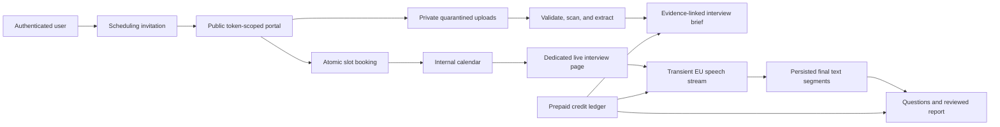

# Calendar, Scheduling, and Interview Intelligence Design

> **Status**: approved design
> **Date**: 2026-07-21
> **Scope**: internal calendar, candidate scheduling, candidate intake, interview preparation,
> live transcription, interview intelligence, and usage credits
> **Deferred**: Google Calendar and Microsoft Outlook synchronization, customer BYOK

> **Billing amendment (2026-07-21)**: the later approved
> [`Stripe billing platform design`](./2026-07-21-stripe-billing-platform-design.md) supersedes this
> document wherever it describes Stripe, subscriptions, commercial catalog lifecycle, credit
> storage/authorization, auto-recharge, tax, refunds, disputes, or reconciliation. Interview code
> retains only its rate cards and reserve/settle integration.

## 1. Context

BuilderHunt already supports authenticated personal organizations, tenant-scoped private data,
tracked builders, alerts, sourcing sprints, public-profile enrichment, an AI task registry, and
HTTP-triggered workers. It does not have a calendar, candidate-facing scheduling, private object
storage, live transcription, Stripe payments, or usage credits.

The feature program adds three connected product surfaces:

1. A user invites a candidate to choose an interview slot, submit a CV and supporting links, and
   receive a confirmed appointment without creating a BuilderHunt account.
2. Each user has a complete internal calendar that combines editable appointments with read-only
   projections of jobs, alert windows, and actual results.
3. During an interview, BuilderHunt can transcribe both sides when browser capabilities permit,
   surface contextual questions, and generate an evidence-linked report without storing audio or
   making hiring decisions.

## 2. Confirmed Product Decisions

- BuilderHunt's calendar is the canonical system of record. External calendars are optional
  adapters and cannot be required for core behavior.
- Candidate scheduling does not require a BuilderHunt account.
- The organizer defines availability, duration, buffers, booking horizon, and timezone. The
  candidate selects from derived free slots.
- BuilderHunt is an interview copilot used alongside an in-person meeting or an external call. It
  does not provide video conferencing.
- Job and alert entries are read-only calendar projections. Users configure or pause their source,
  not the projected entry.
- Calendars are private per user. An organization role, including administrator, does not grant
  automatic access to CVs, transcripts, briefs, or reports.
- Audio is transient and never stored by BuilderHunt. Only transcript text and derived artifacts
  are persisted.
- Transcription is optional. Declining it cannot prevent the interview itself.
- The feature does not use candidate data to train or improve models.
- Calendar and scheduling are subscription capabilities. Voice and sensitive AI consume prepaid
  usage credits and cannot create an uncovered provider liability.

## 3. Goals

- Deliver a useful standalone personal calendar with month, week, day, and agenda views.
- Make candidate booking reliable across timezones, recurrence, daylight-saving changes, and
  concurrent booking attempts.
- Provide a secure accountless candidate portal for booking, rescheduling, cancellation, uploads,
  links, and consent.
- Generate interview preparation and post-interview reports with claim-level source references.
- Provide resilient live transcription and contextual questions while degrading cleanly to manual
  notes.
- Preserve tenant isolation and private-per-user visibility throughout the feature.
- Keep provider cost bounded through reservation, metering, reconciliation, and hard usage limits.
- Make storage, speech-to-text, sensitive text AI, payments, and calendar sync replaceable behind
  internal contracts.

## 4. Non-goals

- Video or voice calling.
- An applicant tracking system or general HRIS.
- Authenticated/private-page crawling, CAPTCHA bypass, stealth crawling, or retrieval prohibited by
  the source policy. LinkedIn remains URL-only without official API access or written permission.
- Automated candidate ranking, hiring recommendations, personality analysis, emotion recognition,
  voice identification, or culture-fit scoring.
- A shared organization calendar by default.
- Google or Microsoft as the source of truth.
- Persisting audio, audio chunks, waveform data, or voice embeddings.
- Unlimited voice or AI usage under a flat subscription.
- Building a general-purpose background queue before the existing HTTP-worker model proves
  insufficient.

## 5. Recommended Architecture

Use a modular monolith inside the existing TanStack Start application. PostgreSQL remains the
transactional source of truth; Redis remains an optional optimization. External capabilities are
accessed through provider contracts.



### 5.1 Domain boundaries

- `calendar`: personal calendars, events, recurrence, occurrences, participants, reminders, and
  event queries.
- `scheduling`: availability rules, overrides, invitations, slot derivation, booking,
  rescheduling, cancellation, and conflict control.
- `candidate-intake`: accountless submission, links, private documents, scanning, extraction, and
  retention.
- `interview-prep`: evidence assembly, brief generation, editing, regeneration, and versions.
- `live-interview`: capture capability detection, consent, streaming transcription, segment
  persistence, speaker correction, markers, and notes.
- `interview-intelligence`: contextual question generation and post-interview reports.
- `calendar-projections`: read-only adapters for worker schedules, alert windows, job runs, and
  results.
- `calendar-integrations`: deferred Google and Microsoft adapters.
- `private-storage`: S3-compatible quarantine, clean-object lifecycle, signed upload/download, and
  deletion.
- `usage-credits`: grants, reservations, consumption, refunds, reconciliation, and payment events.

### 5.2 Provider contracts

- `PrivateObjectStorage`: Cloudflare R2 with an EU-jurisdiction bucket for the first production
  adapter.
- `TranscriptionProvider`: Deepgram EU for the first adapter; AssemblyAI is the planned fallback.
- `SensitiveAIProvider`: Azure OpenAI with a regional EU deployment. Global deployments are not
  allowed for candidate documents or transcripts.
- `PaymentsProvider`: Stripe for subscriptions and prepaid top-ups.
- `ExternalCalendarProvider`: no production adapter in the initial program.

The existing MiniMax client continues serving existing non-sensitive tasks. Candidate documents and
transcripts must not silently fall through to MiniMax. Sensitive tasks are disabled if the approved
EU provider is unavailable or unconfigured.

## 6. User Experience

### 6.1 Organizer invitation flow

1. From a tracked or shortlisted builder, the user selects `Invite to interview`.
2. The user enters the role, duration, valid date range, timezone, weekly availability, buffers,
   minimum notice, location or external meeting URL, and an optional message.
3. BuilderHunt creates a draft invitation and previews the candidate experience.
4. Sending the invitation creates an expiring capability and sends a no-referrer public link.
5. The organizer sees `sent`, `opened`, `booked`, `declined`, `expired`, or `revoked` status.
6. A booked invitation creates the internal calendar event and sends confirmation plus an `.ics`
   attachment to both parties.

The organizer can revoke an unbooked invitation. Booked appointments use explicit cancel and
reschedule actions so history is retained.

### 6.2 Candidate portal

The public portal requires no account. It allows only operations scoped to one invitation:

- inspect organizer, role, duration, timezone, modality, privacy notice, and valid booking window;
- choose a slot rendered in the candidate's detected or selected IANA timezone;
- provide name, email, CV, LinkedIn URL, personal website URL, other approved links, documents, and
  notes;
- separately accept the required versioned purposes for documents, approved public-web import,
  AI-assisted preparation/reporting, and transient live-audio transcription;
- book, decline, cancel, or reschedule according to the invitation policy.

The candidate never sees organization data, other candidates, raw availability rules, or the reason
a slot is unavailable.

### 6.3 Calendar

`/calendar` provides month, week, day, and agenda views using FullCalendar Standard. The default
view is responsive and keyboard accessible.

Four independently toggleable layers are shown:

- `Appointments`: editable user-created events and interviews.
- `Jobs`: read-only scheduled worker executions.
- `Alert windows`: estimated evaluation windows, visually marked as projections rather than
  guaranteed results.
- `Results`: actual job executions and alert results at their effective time.

Selecting an event opens a side panel with its state, participants, timezone, recurrence, links,
permitted documents, history, and currently valid actions. Selecting a projected item links to its
source configuration.

### 6.4 Interview preparation

Once candidate documents are clean and extracted, the organizer may generate a versioned brief:

- objective candidate summary;
- role-relevant experience and observable signals;
- missing information and contradictions;
- general, technical, and critical questions;
- rationale for each question;
- source references for every factual claim.

The organizer can edit the brief, regenerate one section, accept or reject suggestions, and mark a
version ready. AI never contacts the candidate.

### 6.5 Live interview

`/interviews/:interviewId/live` is a dedicated workspace containing:

- brief and candidate context;
- microphone and remote-audio diagnostics;
- persistent transcription status and consent indicator;
- incremental transcript grouped by estimated speaker;
- manual speaker correction;
- private notes and timestamped markers;
- topics covered and pending;
- contextual questions that can be used, saved, or dismissed;
- pause, reconnect, and finish controls.

After finishing, the user reviews an evidence-linked report before finalizing it. The report contains
summary, answers by topic, open questions, follow-ups, and transcript references. It contains no
score or hiring recommendation.

## 7. Capture and Transcription Design

### 7.1 Capture modes

- `in_person`: capture the microphone through `getUserMedia`.
- `remote_call`: the organizer uses current/previous desktop Chrome on macOS/Windows, keeps the
  BuilderHunt workspace separate from a Meet/Zoom/Teams web tab, and explicitly selects that meeting
  tab with audio through `getDisplayMedia`. Stop the required video track immediately and before
  provider connection; never transmit or retain video. Keep microphone and meeting-tab audio as
  separate provider channels when supported. The candidate can use any client supported by the
  meeting provider.

Screen-audio support varies by browser and selected surface. A preflight test can verify available
tracks, not whether both people will speak clearly. It must report one of:

- `microphone_and_shared_audio_available`;
- `microphone_only`;
- `audio_capture_unsupported`.

Remote transcription requires the first state. Microphone-only remote capture, Safari, Firefox,
mobile, native meeting apps, and unsupported sources use manual-only mode. Chromium Edge is beta.
Manual notes remain available in every state. A Chrome extension is deferred unless native-picker
telemetry justifies its installation and permission cost.

### 7.2 Audio lifecycle

- The browser obtains a 30-second Deepgram token from an authenticated BuilderHunt route.
- Audio streams directly to the EU speech endpoint.
- BuilderHunt does not create a `Blob`, use `MediaRecorder`, or expose an audio upload route.
- Interim transcript text is memory-only.
- Final segments are batched to BuilderHunt. Unacknowledged final text may be buffered in IndexedDB
  to survive a tab or network interruption; it is deleted after acknowledgement or session expiry.
- Stopping, consent withdrawal, logout, session expiry, or fatal failure closes provider and media
  tracks immediately.
- No audio key, file path, bucket, table, or backup artifact exists.

### 7.3 Speaker handling

Diarization labels are estimates, not identities. Persist `speaker_a`, `speaker_b`, or `unknown`
plus confidence. Let the organizer map labels to `interviewer` and `candidate` and correct segments.
Do not create voiceprints or perform biometric identification. The UI must explain that short,
overlapping, and noisy speech can be misattributed.

## 8. Data Model

All tenant-private tables contain `organization_id` and use tenant-preserving foreign keys. User
privacy is modeled explicitly with `owner_user_id`, participant rows, and resource-specific RLS.
Organization role is not sufficient to read an interview.

### 8.1 Calendar and scheduling tables

- `user_calendars`: `id`, `organization_id`, `owner_user_id`, `name`, `timezone`, `is_default`,
  `week_start`, `created_at`, `updated_at`.
- `calendar_events`: `id`, `organization_id`, `calendar_id`, `creator_user_id`, `type`, `title`,
  `description`, `starts_at`, `ends_at`, `timezone`, `all_day`, `busy`, `status`, `visibility`,
  `location_type`, `location_value`, `rrule`, `exdates`, `series_parent_id`, `source_type`,
  `source_id`, `version`, timestamps.
- `calendar_event_occurrences`: materialized recurrence instances with `event_id`,
  `recurrence_id`, effective start/end, cancellation state, and unique occurrence identity.
- `event_participants`: tenant user or external name/email, role, response, and response timestamp.
- `availability_rules`: owner, timezone, weekdays, local start/end, effective range, slot duration,
  buffers, minimum notice, and booking horizon.
- `availability_overrides`: owner, local date/range, `available` or `blocked`, and reason.
- `scheduling_invitations`: organizer, optional builder identity, role fields, duration, validity,
  policy, status, token hash, opened/booked timestamps, and booked event reference.
- `candidate_submissions`: invitation, name, normalized email, notes, consent receipt references,
  and submitted timestamp.

### 8.2 Document tables

- `candidate_documents`: submission, generated object key, original display name, detected media
  type, byte size, checksum, status, rejection code, retention expiry, and timestamps.
- `document_extractions`: document, parser and version, normalized plain text, page or section map,
  extraction status, content hash, and error code.
- `candidate_links`: submission, normalized URL, source/acquisition type, policy/import state,
  display label, and validation status.
- `candidate_web_imports`: final URL, source-policy/robots decision, response/content hashes,
  extraction version, bounded text/evidence map, status, error, and retention expiry.

Approved public personal/project websites are imported through the existing source registry,
robots, rate-limit, and SSRF-safe enrichment envelope. Raw HTML is discarded after deterministic
visible-text extraction. LinkedIn/X/Meta remain URL-only unless official API access or written crawl
permission is recorded.

### 8.3 Interview tables

- `interview_briefs`: event, version, status, structured content, evidence manifest, provider/model,
  prompt version, creator, timestamps, and retention expiry.
- `interview_sessions`: event, state, capture mode, language, provider, consent version, started,
  paused, finished, last heartbeat, and provider duration.
- `transcript_segments`: session, stable provider segment ID, sequence, speaker label, mapped role,
  text, start/end milliseconds, confidence, final flag, correction metadata, and retention expiry.
- `interview_suggestions`: session, question, rationale, evidence segment IDs, status, provider/model,
  and timestamps.
- `interview_reports`: session, version, status, structured report, evidence segment IDs,
  provider/model, prompt version, editor, and retention expiry.
- `privacy_consents`: invitation/session, subject type, purpose, policy version, granted/withdrawn
  timestamps, request correlation, and truncated network evidence.

### 8.4 Operations and billing tables

- `operational_schedules`: stable job key, display name, cron expression, timezone, owner scope,
  next run, enabled state, and projection metadata.
- `job_runs`: job key, scope, scheduled/started/finished times, result state, counters, and redacted
  error code.
- `usage_credit_grants`: organization, source, units granted, units remaining, effective/expiry
  times, payment reference, and status.
- `usage_credit_reservations`: organization, interview/session, estimated units, consumed units,
  state, and expiry.
- `usage_ledger_entries`: immutable debit, credit, reservation, release, refund, or adjustment with
  idempotency key, source, units, provider usage reference, actor, and timestamp.
- `provider_usage_records`: provider, external usage ID, session/task, measured duration/tokens,
  estimated cost, reconciliation state, and timestamps.

Credit balances are derived from the immutable ledger or maintained as a transactionally verified
projection. Authorization never trusts a client-provided balance.

## 9. State Machines

```text
Invitation:
draft -> sent -> opened -> booked
                    \-> declined | expired | revoked

Appointment:
scheduled -> confirmed -> in_progress -> completed
         \-> cancelled | rescheduled | no_show

Document:
pending_upload -> uploaded -> scanning -> extracting -> ready
                               \-> rejected | failed

Interview:
not_started -> consent_pending -> ready -> live -> processing -> review -> finalized
                                  \-> paused | failed | abandoned

Credit reservation:
pending -> reserved -> partially_consumed -> settled
                    \-> released | refunded | expired
```

Each transition is implemented once in a domain service. Routes request transitions and cannot
write state columns directly.

## 10. API Surface

### 10.1 Authenticated APIs

- `GET|POST /api/calendar/events`
- `GET|PATCH|DELETE /api/calendar/events/:eventId`
- `POST /api/calendar/events/:eventId/cancel`
- `GET|PUT /api/calendar/availability`
- `POST /api/calendar/availability/overrides`
- `GET /api/calendar/feed`
- `GET|POST /api/scheduling/invitations`
- `GET|PATCH /api/scheduling/invitations/:invitationId`
- `POST /api/scheduling/invitations/:invitationId/send`
- `POST /api/scheduling/invitations/:invitationId/revoke`
- `GET|POST /api/interviews/:interviewId/brief`
- `PATCH /api/interviews/:interviewId/brief/:version`
- `POST /api/interviews/:interviewId/session`
- `POST /api/interviews/:interviewId/transcription-token`
- `POST /api/interviews/:interviewId/segments`
- `POST /api/interviews/:interviewId/suggestions`
- `POST /api/interviews/:interviewId/finalize`
- `GET /api/usage/credits`
- `POST /api/usage/top-ups/checkout`

### 10.2 Public token-scoped APIs

- `POST /api/public/scheduling/:invitationId/session`
- `GET /api/public/scheduling/:invitationId`
- `GET /api/public/scheduling/:invitationId/slots`
- `POST /api/public/scheduling/:invitationId/book`
- `POST /api/public/scheduling/:invitationId/decline`
- `POST /api/public/scheduling/:invitationId/cancel`
- `POST /api/public/scheduling/:invitationId/reschedule`
- `POST /api/public/scheduling/:invitationId/withdraw`
- `POST /api/public/scheduling/:invitationId/links/:linkId/import`
- `POST /api/public/scheduling/:invitationId/uploads`
- `POST /api/public/scheduling/:invitationId/uploads/:documentId/complete`
- `POST /api/public/scheduling/:invitationId/consents`

The emailed token is a 256-bit random secret stored only as a hash. It is placed in the URL fragment,
exchanged once for a short-lived invitation-scoped `HttpOnly`, `Secure`, `SameSite=Lax` cookie, and
removed from browser history. Public pages send `Referrer-Policy: no-referrer` and do not load
third-party analytics.

## 11. Scheduling Correctness

- Store event instants as `timestamptz` and the original IANA timezone separately.
- Availability rules use local wall-clock time plus IANA timezone. Generate slots for the requested
  range, then convert valid instances to UTC.
- Explicitly handle nonexistent and repeated DST local times. Nonexistent times are omitted;
  repeated times are disambiguated and labeled.
- Expand recurring events into `calendar_event_occurrences` for the active read horizon. Expansion
  is deterministic and idempotent.
- Slot calculation subtracts busy occurrences, existing appointments, availability overrides,
  minimum notice, booking horizon, and buffers.
- Booking starts a transaction, acquires a transaction-scoped advisory lock derived from organizer
  and date, re-evaluates the chosen slot, and atomically writes appointment, participants,
  invitation state, and outbox email records.
- A lost race returns a generic `409 slot_unavailable` and refreshed alternatives.
- Event edits use optimistic `version`; stale updates return `409 event_changed`.

## 12. Private File Pipeline

- Accepted formats: PDF, DOCX, and plain text.
- Maximum size: 10 MB per document and 25 MB per invitation.
- Uploads use short-lived signed URLs to generated quarantine keys.
- Completion validates expected key, checksum, byte size, extension allowlist, detected media type,
  and magic bytes.
- ClamAV scans quarantined objects. Only clean objects move to the private clean prefix.
- Extraction uses deterministic parsers before AI sees content. Unsupported, encrypted, corrupt,
  or suspicious documents fail with a safe candidate-facing message.
- Downloads are authorized on every request and receive five-minute signed URLs.
- Original names are display metadata only and never become storage keys.
- Lifecycle deletion removes both quarantine and clean objects and records a redacted result.

## 13. AI Tasks and Guardrails

### 13.1 `interview-brief-generate`

Server-only, no cache. Input includes role context, approved public profile evidence, candidate links,
and extracted document sections. Output contains:

- `candidateSummary`;
- `relevantEvidence[]` with `claim`, `sourceIds[]`, and `confidence`;
- `informationGaps[]`;
- `contradictions[]`;
- `questionGroups[]` containing category, question, rationale, and evidence IDs.

### 13.2 `interview-followup-suggest`

Server-only, no cache, rate-limited to at most one generation every 30 seconds. Input is the brief,
covered topics, pending topics, and a bounded recent transcript window. Output contains a small set
of questions with rationale and transcript segment references. Suggestions are ephemeral unless
saved or used.

### 13.3 `interview-report-generate`

Server-only, no cache. Input includes the final transcript and organizer notes. Output contains
summary, answers by topic, open questions, follow-ups, and evidence segment IDs. It excludes score,
rank, personality, emotion, culture fit, and hire/reject language.

### 13.4 Shared safeguards

- Zod validates input and output at both registry and provider boundaries.
- Documents, links, profiles, and transcripts are wrapped as untrusted data and cannot override
  system instructions.
- Each factual claim requires evidence IDs. Unsupported claims fail validation.
- One bounded repair attempt is allowed. Persistent failure returns the deterministic manual
  template.
- Prompt version, provider, model, latency, tokens, and redacted result status are auditable.
- Full prompts, candidate content, and model responses are not written to logs.
- Sensitive tasks do not execute unless the provider, region, DPA status, and retention policy are
  explicitly approved in configuration.

## 14. Consent, Privacy, and Retention

Candidate-facing booking notices describe documents, approved public-web import, AI preparation/
reporting, and `transient live audio capture and stored transcription`, not generic recording or
product improvement. Each purpose has a separate unticked versioned control.

- Booking cannot complete until the terms/privacy acknowledgement and every required processing
  purpose are affirmatively accepted.
- Consent covers only disclosed purposes and remains withdrawable after booking. Withdrawal of
  transcription makes the appointment manual-only rather than cancelling it.
- The organizer verbally reminds both parties immediately before starting capture; stored candidate
  consent remains the authoritative booking receipt.
- A persistent indicator is shown while capture is active.
- Pause and stop are immediate. A verbal withdrawal requires the organizer to stop capture.
- Withdrawal stops future processing and offers the applicable deletion controls for existing
  artifacts.
- Candidate data is not used for model training, product training, or unrelated analytics.

Default retention:

- transcripts: 90 days after interview completion;
- candidate documents, briefs, and reports: 180 days after process closure;
- consent and minimal audit evidence: 24 months;
- transient IndexedDB text: acknowledgement or session-expiry deletion;
- audio: zero retention by design.

Organizations may choose shorter periods. Retention workers are idempotent and delete database,
object-storage, cache, and provider-side artifacts where applicable. Account and organization export
and deletion workflows include these resources.

Before production voice launch, complete a DPIA, execute DPAs with storage, speech, and AI providers,
verify regional endpoints and no-training controls, and update the privacy notice and processor list.

Because the AI tasks assist a recruitment workflow, complete and version an EU AI Act Article 6(3)
classification for each task before launch. A preparatory-task/non-high-risk conclusion must be
supported by intended-purpose, material-influence, UI, output, evidence, bias, traceability, and
human-oversight controls. Otherwise the sensitive-AI flag remains off until the applicable high-risk
provider/deployer obligations are satisfied. Every artifact is labelled as an AI draft; no AI path
may rank, score, shortlist, reject, advance, or write candidate status. Candidate disclosure,
organizer AI-literacy instructions, limitations, complaint/incident paths, and post-market monitoring
are required regardless of final classification.

## 15. Usage Credits and Unit Economics

Calendar and scheduling do not consume AI credits. Sensitive AI and speech cannot run without a
successful reservation.

### 15.1 Meter

Use `AI interview credit` as the user-facing unit:

- brief generation: 5 credits;
- live transcription: 1 credit per provider-billed minute;
- contextual questions: included while transcription is active;
- final report: 5 credits.

A 60-minute interview normally consumes 70 credits.

### 15.2 Initial commercial proposal

- Pro subscription at $19/month: 140 included credits.
- Pro Max subscription at $79/month: 700 included credits.
- Team subscription at $199/month: 2,100 organization-pooled credits.
- Starter 300 one-time pack: $15.
- Scale 1K one-time pack: $45.
- Max 5K one-time pack: $299, targeting approximately 70% gross margin at the conservative internal
  cost budget.

Pricing is configuration, not hardcoded domain logic. Finance can change catalog amounts without
changing historical ledger entries.

### 15.3 Enforcement

- Reserve brief credits before generation.
- Reserve an initial live allowance before issuing a transcription credential.
- Reconcile against provider duration and extend reservation incrementally.
- Warn at 80%, 90%, and ten remaining minutes.
- Stop only AI capture when available credit reaches zero; keep the interview workspace usable.
- Auto-recharge is opt-in and requires a user-configured monthly cap.
- Provider failure releases or refunds unused reservations.
- No negative credit balance is permitted.
- Usage authorization uses the synchronous internal ledger. Stripe meter events are an idempotent
  billing mirror, not the real-time authority.

Stripe implementation is a production launch dependency. Closed beta may use manually granted
credits. BYOK is deferred for high-volume customers and still requires a paid BuilderHunt platform
entitlement.

## 16. Security Model

- Default deny at route, repository, and RLS layers.
- Calendar owner and explicitly listed internal participants can read an event according to their
  participant role. Organization admins receive no implicit candidate-data access.
- Candidate capabilities authorize one invitation only and never create tenant database context
  from client-controlled organization IDs.
- Public responses are allowlisted DTOs and do not expose availability rules, conflict sources,
  internal IDs, candidate existence, or storage keys.
- CSRF protection applies to cookie-authenticated public and authenticated mutations.
- Rate limits combine capability, IP, user, and organization as applicable.
- Public-web imports reuse the existing source registry, honest user agent, RFC 9309 robots,
  per-hop SSRF validation, Redis host limits, bounded response/extraction, and hard-blocked-platform
  policy. Candidate consent does not override third-party access terms.
- Files and extracted text are treated as hostile. Rendering is plain text with safe link handling.
- Provider credentials, temporary tokens, signed URLs, payment data, and candidate content are
  redacted from logs.
- Security audits cover invitation creation/revocation, booking, consent, document access,
  transcription start/stop, sharing, export, deletion, credit adjustment, and billing events.

Required negative tests include unauthenticated access, tenant A against tenant B, uninvited member,
administrator without participation, spoofed organization, expired/replayed token, token leakage,
cross-invitation document ID, upload polyglot, XSS in transcript, prompt injection in CV, CSRF,
rate-limit bypass, stale event version, concurrent booking, duplicate Stripe webhook, and provider
usage replay.

## 17. Operational Calendar Projections

`GET /api/calendar/feed` returns a discriminated union of editable events and read-only projections.
It does not copy every future job into `calendar_events`.

- Job projections derive from `operational_schedules.next_run_at` and the requested date range.
- Alert projections derive from each alert's next evaluation time and cadence. They are labeled
  `estimated` and never claim a result will occur.
- Actual executions derive from `job_runs`.
- Actual alert matches derive from existing alert triggers.
- A projection contains `sourceType`, `sourceId`, `editable: false`, and a safe source route.

The read model keeps operational ownership separate from personal events and avoids users editing a
display artifact that would immediately diverge from its source.

## 18. External Calendar Synchronization Contract

External sync is deferred but the internal model reserves stable mapping surfaces:

- one connection per user and provider;
- encrypted OAuth credentials;
- external calendar allowlist;
- internal-to-external mapping with provider event ID and ETag/change key;
- incremental sync cursor/token;
- webhook/subscription identity and expiry;
- conflict state and last successful sync.

Google adapters must use sync tokens and renewable push channels. Microsoft adapters must use delta
queries and renewable change notifications. Webhooks are hints, not authoritative payloads; missed
notifications are repaired through incremental reconciliation. Provider deletion cannot delete an
internal event without applying the user's selected sync policy.

## 19. Error and Degradation Behavior

- Storage unavailable: booking remains available; document upload shows retry and does not create a
  fake successful submission.
- Scanner unavailable: document remains quarantined; no parsing or AI occurs.
- Sensitive AI unavailable: show deterministic brief/report templates and manual editing.
- Speech unavailable: preserve manual notes, retry safely, and release unused credits.
- Browser cannot capture remote audio: state `microphone_only` and require explicit continuation.
- Network interruption: reconnect provider with a new ephemeral token and flush acknowledged final
  text only once.
- Calendar projection source unavailable: show user events and mark the affected layer stale.
- Stripe unavailable: existing credits remain usable; top-up is unavailable. Never grant credit from
  an unverified client success page.
- Worker missed: recompute next execution from the schedule, show stale operational state, and alert
  operators.

## 20. Testing and Verification

### 20.1 Unit tests

- timezone and DST slot generation;
- RFC 5545 expansion and exclusions;
- conflict subtraction and buffers;
- every state transition;
- credit reserve/consume/release/refund invariants;
- AI schemas and prohibited-output checks;
- calendar projection adapters.

### 20.2 Database and security tests

- tenant A/B isolation and missing RLS context;
- private-owner and explicit-participant policies;
- admin-without-participation denial;
- advisory-lock concurrent booking;
- recurrence idempotency;
- immutable ledger and provider reconciliation;
- retention and deletion across relational and object data.

### 20.3 Integration and contract tests

- signed upload, checksum, scan, extraction, signed download, and deletion;
- email and `.ics` generation;
- Deepgram start, interim/final events, diarization, reconnect, and termination;
- Azure structured output, invalid output, timeout, and disabled configuration;
- Stripe checkout, signed webhook, replay, refund, and failed payment;
- worker authentication and idempotency.

### 20.4 End-to-end tests

- invite from a builder and book without an account;
- simultaneous candidates competing for one slot;
- cancel and reschedule;
- reject malicious, corrupt, encrypted, excessive, and fake-type documents;
- prove booking is blocked until all required purposes are accepted, then withdraw transcription
  without cancelling the appointment;
- in-person and remote capture;
- exhaust credits during a live session;
- finish, review, and finalize a report;
- export and delete candidate data.

### 20.5 Quality evaluation

Maintain a consented or synthetic bilingual evaluation set covering English, Spanish, accents,
noise, crosstalk, short utterances, and technical vocabulary. Measure transcription accuracy and
speaker attribution separately. AI evaluation requires claim-level evidence, no prohibited
classification, no instruction following from untrusted content, and human review.

## 21. Observability and SLOs

Target service levels:

- calendar range query p95 under 500 ms for a 90-day window;
- slot computation p95 under 750 ms;
- zero confirmed double bookings;
- visible interim transcript under two seconds when the provider is healthy;
- contextual suggestion under eight seconds;
- at least 99.9% of acknowledged final segments persisted exactly once;
- provider usage versus ledger variance below 1%;
- zero provider sessions without a prior credit reservation.

Record only internal correlation IDs, provider/model, duration, token/credit counters, estimated
cost, latency, state, retry count, and redacted error codes. Never record candidate files, URLs,
emails, transcripts, prompts, responses, capability tokens, or signed URLs.

## 22. Rollout

1. Internal calendar and manual events.
2. Availability, accountless invitation, booking, confirmation, and `.ics`.
3. Private storage, scan, approved public-web import, extraction, and candidate intake.
4. Stripe Checkout/Tax/Portal, internal ledger, top-ups, limits, refunds, and reconciliation.
5. Interview preparation.
6. Closed Chrome beta for in-person transcription.
7. Chrome meeting-tab capture with separate channels, contextual questions, and final reports.
8. Chromium Edge beta and explicit Safari/Firefox/mobile/native-app manual-only paths.
9. Job, alert-window, run, and result projections.
10. Separate follow-up programs for Google/Microsoft sync and BYOK.

Every phase is feature-flagged and independently reversible. Calendar and scheduling do not depend
on voice, sensitive AI, or payments after activation. Production voice release requires completed
DPA/DPIA work, browser capture validation, cost reconciliation, retention verification, and a real
30-minute bilingual interview smoke test.

## 23. Success Metrics

- Invitation-to-booking completion rate.
- Median time from invitation open to booking.
- Booking conflict and reschedule rates.
- Clean document processing success rate and time to ready brief.
- Brief edit rate and unsupported-claim rejection rate.
- Percentage of remote sessions with microphone and shared-audio tracks available.
- Transcript correction rate by language and capture mode.
- Suggested-question use/save/dismiss rate.
- Report finalization rate.
- Credits consumed, provider cost, revenue, gross margin, and reconciliation variance.
- Consent decline/withdrawal, deletion, and retention-worker success rates.

Metrics must not require storing candidate content or inferred candidate characteristics.

## 24. Definition of Done

The program is complete only when runtime evidence demonstrates:

- email invitation through accountless booking into the internal calendar;
- correct timezone and DST behavior;
- concurrent booking safety;
- scanned document through evidence-linked brief;
- a real interview of at least 30 minutes with both-party capture where supported;
- pause, reconnect, speaker correction, and finalization;
- reviewed report with traceable transcript evidence;
- exact credit reservation, metering, payment, refund, and provider reconciliation;
- automatic retention purge across database, object storage, cache, and provider artifacts;
- tenant and private-user isolation under direct negative tests;
- backup restoration of persisted non-audio artifacts;
- live operational dashboards and alerts.

## 25. Research Basis

- [RFC 5545: iCalendar recurrence](https://datatracker.ietf.org/doc/html/rfc5545)
- [FullCalendar Standard licensing](https://fullcalendar.io/pricing)
- [Google Calendar incremental synchronization](https://developers.google.com/workspace/calendar/api/guides/sync)
- [Google Calendar push notifications](https://developers.google.com/workspace/calendar/api/guides/push)
- [Microsoft Graph calendar delta queries](https://learn.microsoft.com/en-us/graph/delta-query-events)
- [Microsoft Graph change notifications](https://learn.microsoft.com/en-us/graph/change-notifications-overview)
- [MDN `getUserMedia`](https://developer.mozilla.org/en-US/docs/Web/API/MediaDevices/getUserMedia.)
- [MDN `getDisplayMedia`](https://developer.mozilla.org/en-US/docs/Web/API/MediaDevices/getDisplayMedia)
- [Chrome screen-sharing controls](https://developer.chrome.com/docs/web-platform/screen-sharing-controls)
- [Chrome `tabCapture`](https://developer.chrome.com/docs/extensions/reference/api/tabCapture)
- [Deepgram streaming diarization](https://developers.deepgram.com/docs/diarization/)
- [Deepgram multichannel streaming](https://developers.deepgram.com/docs/multichannel)
- [Deepgram token-based authentication](https://developers.deepgram.com/guides/fundamentals/token-based-authentication)
- [Deepgram EU endpoint](https://developers.deepgram.com/reference/custom-endpoints)
- [Deepgram pricing](https://deepgram.com/pricing)
- [AssemblyAI streaming diarization](https://www.assemblyai.com/docs/streaming/label-speakers-and-separate-channels)
- [AssemblyAI retention and training controls](https://www.assemblyai.com/docs/data-retention-and-model-training)
- [Cloudflare R2 EU jurisdiction](https://developers.cloudflare.com/r2/reference/data-location/)
- [Cloudflare R2 pricing](https://developers.cloudflare.com/r2/pricing/)
- [AWS presigned URL behavior](https://docs.aws.amazon.com/AmazonS3/latest/userguide/using-presigned-url.html)
- [OWASP file upload guidance](https://cheatsheetseries.owasp.org/cheatsheets/File_Upload_Cheat_Sheet.html)
- [OWASP SSRF prevention](https://cheatsheetseries.owasp.org/cheatsheets/Server_Side_Request_Forgery_Prevention_Cheat_Sheet.html)
- [RFC 9309 Robots Exclusion Protocol](https://www.rfc-editor.org/rfc/rfc9309.html)
- [LinkedIn crawling terms](https://www.linkedin.com/legal/crawling-terms)
- [Azure AI data privacy](https://learn.microsoft.com/en-us/azure/foundry/responsible-ai/openai/data-privacy)
- [Stripe usage-based billing](https://docs.stripe.com/billing/subscriptions/usage-based/how-it-works)
- [Stripe Checkout automatic tax](https://docs.stripe.com/tax/checkout)
- [Stripe Tax operating responsibilities](https://docs.stripe.com/tax/how-tax-works)
- [Stripe Customer Portal](https://docs.stripe.com/customer-management)
- [Stripe billing credits limitations](https://docs.stripe.com/billing/subscriptions/usage-based/billing-credits)
- [GDPR Article 5 principles](https://eur-lex.europa.eu/legal-content/EN/TXT/?qid=1653314624165&uri=CELEX%3A32016R0679)
- [EDPB automated decision-making guidance](https://www.edpb.europa.eu/documents/guideline/automated-decision-making-and-profiling_en)
- [European Commission AI Act high-risk review](https://digital-strategy.ec.europa.eu/en/library/report-review-prohibitions-and-high-risk-ai)
- [EU AI Act Regulation 2024/1689](https://eur-lex.europa.eu/legal-content/EN/TXT/?uri=CELEX%3A32024R1689)
- [Danish Data Protection Authority recording guidance](https://www.datatilsynet.dk/regler-og-vejledning/optagelser-og-overvaagning?Page=6)

## 26. Implementation Plan Decomposition

Keep the complete program in the single
`plans/implemented/44-calendar-scheduling-interview-intelligence/` directory, with `spec.md`, `plan.md`, and
`tasks.md` as its implementation contract. Inside that plan, preserve four independently
verifiable workstreams:

1. Calendar core: personal calendar, events, recurrence, availability primitives, reminders, and
   operational projections.
2. Interview scheduling: invitation lifecycle, accountless portal, atomic booking, private
   storage, candidate intake, email, and `.ics`.
3. Interview intelligence: sensitive AI provider, evidence-linked brief, live capture,
   transcription, contextual questions, report, consent, and retention.
4. Pricing and billing extension: Stripe foundation, prepaid usage credits, immutable ledger,
   top-ups, limits, refunds, and provider reconciliation. This updates the existing billing plan
   rather than creating a competing payment architecture.

Calendar core and the billing extension can begin independently. Interview scheduling depends on
the calendar event contract. Interview intelligence depends on scheduling plus the credit ledger
before any provider-backed production usage is enabled. Google/Microsoft sync and BYOK remain
separate future plans.
