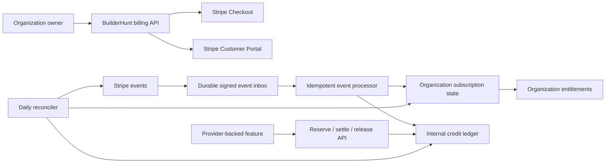

# Stripe Billing Platform Design

> **Status**: approved design
> **Date**: 2026-07-21
> **Scope**: organization subscriptions, one-time credit packs, tax, invoicing, payment recovery,
> refunds, disputes, credit authorization, reconciliation, and manual-plan migration
> **Currency at launch**: USD only

## 1. Context

BuilderHunt currently has organization-scoped entitlements, a manual plan-request workflow, and a
billing settings page. It has no Stripe SDK, hosted checkout, customer portal, recurring billing,
payment webhooks, payment reconciliation, or production credit ledger. The calendar/interview
program introduces provider-backed operations whose cost cannot be safely included as unlimited
usage in a flat subscription.

This design replaces the deferred, thin Stripe phase in `plans/pricing-and-billing/` with a reusable
billing platform. Stripe is the payment, invoice, tax-calculation, and payment-method provider.
BuilderHunt remains authoritative for tenant ownership, permissions, entitlements, and real-time
credit authorization.

## 2. Confirmed Product Decisions

- Every Stripe customer, subscription, invoice, credit balance, and payment belongs to an
  organization. A personal subscription belongs to the user's personal organization.
- An organization can have exactly one active base subscription and any number of successful
  one-time credit-pack purchases.
- Base tiers are Free, Pro, Pro Max, and Team. Paid tiers support monthly and annual billing.
- Annual billing is approximately 20% cheaper, but included credits still refill monthly.
- Upgrades take effect immediately after successful prorated payment. Downgrades and cancellations
  take effect at the paid billing period end.
- A failed renewal starts a seven-day grace period. Existing premium access continues during grace;
  after grace, new premium operations are blocked while data and export access remain available.
- Purchased credits remain preserved after a subscription failure but cannot be consumed without an
  active paid subscription. Included subscription credits are frozen after grace until payment
  recovers or they expire normally.
- Included credits expire at each monthly credit-window end without rollover. Purchased packs
  expire 12 months after purchase. Consumption uses the earliest-expiring eligible grant first.
- Only an organization with an active Pro, Pro Max, or Team subscription can purchase or consume
  credit packs. Reactivation restores access to purchased units that have not reached their original
  expiry; suspension and reactivation never extend that expiry.
- No public automatic trial launches with this system. Existing operator-granted trials and credits
  remain available. Stripe promotion codes are supported with explicit restrictions.
- Only an organization owner can create charges or mutate billing. Organization admins can inspect
  plans, invoices, usage, and balances but cannot subscribe, cancel, change payment methods, enable
  auto-recharge, or request a refund.
- Existing manual plans are never charged or migrated automatically. They remain valid until their
  current end date and can migrate voluntarily.
- Team includes 10 fixed seats at launch. Accepted members plus still-usable pending invitations
  consume the limit; the eleventh seat is blocked with a support contact. Additional-seat billing is
  deferred and no per-seat overage can be charged automatically.

## 3. Goals

- Make checkout, renewal, upgrade, downgrade, cancellation, tax, invoices, and payment recovery
  production-safe and self-service.
- Bound every provider-backed operation with a synchronous, non-negative internal credit balance.
- Make all financial writes idempotent, auditable, replayable, and reconcilable.
- Keep Stripe test and live data strictly separated and prevent client-controlled prices or tenant
  identifiers.
- Provide a stable billing API that calendar/interview and future paid features can consume without
  knowing Stripe details.
- Preserve all user data and legitimate purchased credits during payment incidents.

## 4. Non-goals

- Stripe Connect, marketplace payouts, multiple sellers, or revenue sharing.
- Multiple concurrent base subscriptions per organization.
- Usage-based Stripe invoices or Stripe Billing Credits as the authorization source.
- Customer wallets, stored monetary value, cash redemption, or transfer of credits between
  organizations.
- Public card trials at launch.
- Non-USD checkout at launch. EUR and DKK require separate immutable Price IDs and a later design.
- Automated tax registration, tax advice, or filing without an approved finance provider.

## 5. Architecture Decision

Use an internal billing control plane with Stripe as the external payment rail.

The rejected alternatives are:

1. Stripe-first entitlements and billing credits: fewer local tables, but asynchronous invoice
   semantics and preview credit capabilities cannot prevent real-time provider overspend.
2. A thin Checkout wrapper over the manual `plans` table: faster initially, but it cannot safely
   represent proration, annual monthly grants, refunds, disputes, reservations, or reconciliation.

Stripe-hosted Checkout minimizes the application's card-data surface and handles payment
authentication. Customer Portal is limited to payment methods, tax details, invoices, and receipts.
Plan changes use BuilderHunt endpoints so owner authorization, effective dates, proration previews,
and internal credit grants remain deterministic.

Launch payment methods are cards and card-backed wallets exposed by Checkout, including Apple Pay,
Google Pay, and Link when eligible. Bank debits, transfers, buy-now-pay-later, vouchers, and other
delayed-confirmation methods are disabled. Stripe's dynamic method selection is constrained to the
approved immediate card-based set. Subscriptions, packs, and auto-recharges never activate or grant
credits before the authoritative payment or invoice success event. Adding delayed methods requires
a separate state-machine, return, dispute, and reconciliation design.

## 6. Catalog and Commercial Rules

The server owns an immutable catalog. Clients send catalog keys, never amounts or Stripe IDs.

| Catalog key | Monthly | Annual | Monthly included credits |
| ----------- | ------: | -----: | -----------------------: |
| `pro`       |     $19 |   $182 |                      140 |
| `pro_max`   |     $79 |   $758 |                      700 |
| `team`      |    $199 | $1,910 |             2,100 pooled |

Team includes 10 seats in both intervals. The catalog has no additional-seat Price at launch and
Checkout cannot accept a seat quantity. Seat enforcement belongs to the organization entitlement
and uses the race-safe accepted-member plus usable-invitation count defined by `team-accounts`.

| Credit pack   | Price | Credits |    Expiry |
| ------------- | ----: | ------: | --------: |
| `starter_300` |   $15 |     300 | 12 months |
| `scale_1000`  |   $45 |   1,000 | 12 months |
| `max_5000`    |  $299 |   5,000 | 12 months |

Each tier and interval has an immutable Stripe Product/Price mapping. Pack purchases use separate
one-time Products/Prices. Historical Price objects are archived, never repurposed. An environment
startup check verifies currency, amount, interval, tax behavior, livemode, and metadata against the
server catalog before billing mutations are enabled.

Catalog price changes create a new internal catalog version and new immutable Stripe Prices. New
checkouts use the new version immediately. Existing subscriptions retain their contracted price
until the next eligible renewal and receive at least 30 days' notice before an increase, or any
longer period required by applicable law or contract. Annual subscribers retain the old price for
the rest of the paid annual term. Migration to the new Price is scheduled for renewal, audited, and
never applied retroactively; indefinite grandfathering is not promised.

Pack Checkout and pack-backed credit authorization both require an active paid entitlement. A Free
or payment-blocked organization can see its preserved balance and expiry dates but cannot purchase
or consume packs.

Promotion codes are accepted only in subscription Checkout at launch. Coupons must be restricted by
eligible product, redemption count, customer eligibility, and expiration. Packs are excluded to
protect their unit economics. Operator-granted promotional credits remain internal ledger grants and
cannot create a Stripe refund right.

## 7. Subscription Lifecycle

### 7.1 Creation

An owner requests a subscription Checkout Session. The server resolves the organization from the
session, acquires or creates its single Stripe Customer, verifies that no incompatible active
subscription exists, and creates Checkout with the selected server-side Price, automatic tax,
billing-address collection, tax-ID collection, and organization metadata. Success-page redirects
are informational; access changes only from verified Stripe state.

Checkout requires explicit acceptance of the versioned Terms and Privacy Policy and presents the
renewal interval, automatic-renewal behavior, cancellation/refund policy, credit expiry and
non-transferability, tax treatment, and Stripe-calculated total. BuilderHunt records the accepted
document versions, timestamp, organization, acting owner, Checkout Session, and minimal provider
evidence. Material commercial-policy changes require fresh acceptance before the next applicable
purchase or activation. Auto-recharge has a separate versioned consent because it authorizes future
variable off-session charges.

The initial `invoice.paid` activates entitlements and issues the first included-credit grant exactly
once. `checkout.session.completed` links objects and improves UX but never independently grants paid
access.

### 7.2 Renewals and annual monthly grants

Monthly included grants are independent of invoice frequency:

- Monthly subscriptions receive one grant after each paid renewal invoice.
- Annual subscriptions receive the first grant after the annual invoice is paid. An idempotent daily
  worker issues the next 11 grants on monthly anniversaries derived from the Stripe billing anchor.
- Anniversary calculation is calendar-based and clamps to the last valid day of short months.
- A grant has a unique `(subscription, credit_window_start, grant_type)` key and expires at the next
  monthly anniversary.
- No future annual grant is issued when the subscription is canceled, unpaid, disputed, or past the
  paid contract end.

### 7.3 Upgrades, downgrades, and cancellation

Before an upgrade, the server retrieves a Stripe invoice preview and displays the exact immediate
charge and tax. The update uses Stripe proration with immediate invoicing and pending-update
semantics; the tier changes only when payment succeeds. The current credit window receives
`ceil((new_allowance - old_allowance) * remaining_seconds / window_seconds)` additional credits,
expiring with that window. Future windows use the new tier.

A same-tier monthly-to-annual change is immediate after an invoice preview: Stripe credits unused
monthly time and charges the annual term, while the existing credit window continues without a
duplicate grant and future monthly anniversaries derive from the new annual anchor. Annual-to-
monthly changes wait until the annual period end. A combined higher-tier/annual change follows the
immediate paid-upgrade path; any combined lower-tier or annual-to-monthly change waits until period
end. Every preview states charge, tax, effective date, renewal date, and next credit refill.

Downgrades and cancellations are scheduled at the current Stripe billing-period end. For annual
customers this is the annual contract end, not the next monthly credit anniversary. Already issued
credits are not clawed back merely because a downgrade was scheduled. Cancellation preserves data,
exports, invoice history, and unexpired purchased packs.

A Team organization cannot schedule a downgrade to a one-seat tier while it has more than one
accepted member or any usable pending invitation. The preview names the blocking members and
invitations visible to the owner; the owner must remove members and cancel invitations in Team
settings before the server sends any Stripe update. The system never evicts members or deletes Team
data as a billing side effect. If Team access ends through non-payment instead, organization data
and membership records remain, only the owner retains workspace access, and other members are
suspended until Team is restored or the owner reduces the organization to one seat.

### 7.4 Failed payments

The first failed renewal records `grace_started_at` and `grace_ends_at = +7 days`. Stripe retry rules
are configured to complete within this product grace window. During grace, paid entitlements and
credits operate normally and the UI shows recovery actions. After grace, an internal worker marks
the organization `payment_blocked`, blocks new premium operations, and freezes unexpired included
grants. Purchased grants remain preserved but unusable. Successful recovery restores paid
entitlements, unfreezes still-valid included grants, and makes still-valid purchased grants usable
again. The system never deletes customer data for non-payment or extends grant expiry because of a
suspension.

## 8. Credit Ledger and Authorization

Credits are organization-scoped service units, not money. The ledger is append-only; corrections use
compensating entries. Grant state can be active, frozen, exhausted, expired, revoked, or disputed.

Feature code uses only these internal contracts:

- `checkEntitlement({ organizationId, feature })`
- `reserveCredits({ organizationId, operation, maximumUnits, idempotencyKey })`
- `extendReservation({ reservationId, additionalMaximumUnits, idempotencyKey })`
- `settleReservation({ reservationId, actualUnits, providerReference })`
- `releaseReservation({ reservationId, reason })`
- `refundUsage({ settlementId, units, reason, idempotencyKey })`

Reservation and grant allocation run in one transaction with row locking. They allocate by earliest
expiry, never allow negative available balance, and persist the exact grant slices reserved. A
provider call cannot start until reservation succeeds. Settlement consumes actual units and releases
the remainder. Failure releases the reservation. Long-running work extends before reaching its
limit; if extension fails, the paid provider operation stops while manual product functionality can
continue.

A valid reservation may hold allocated units past a grant's expiry only for the operation's
versioned maximum duration plus a small configured settlement grace. This prevents an authorized
live operation from stopping at a monthly boundary without turning reservations into rollover.
Settlement can consume the protected allocation; unused units released after their grant expiry
expire immediately and never return to available balance. Abandoned reservations time out under the
same rule. Maximum duration and heartbeat limits are server-owned per operation and cannot be
extended by client input.

Every operation defines a versioned rate card and a maximum reservation. Provider usage records
store quantities, provider request IDs, estimated cost, actual cost when available, and reconciliation
status. Auto-recharge is disabled by default, available only to an actively subscribed organization,
and owner-only. The owner chooses a catalog pack, a balance threshold, and a monthly spending cap up
to an absolute $1,000 maximum. The system permits at most three automatic charges in any rolling
24-hour window. Activation requires explicit consent that states the pack amount, trigger, potential
frequency, and cancellation method, and uses a payment method prepared for off-session use. Credits
are issued only after payment success. Authentication-required or failed charges pause
auto-recharge and return the owner to an on-session recovery flow; no failure retries can bypass the
daily or monthly caps.

Manual pack purchases and auto-recharges share an organization/customer risk window: at most three
successful pack charges or $1,000 total in any rolling 24 hours, whichever is reached first. Stripe
Radar and provider-requested 3DS remain enabled. Repeated failures, payment-method rotation, dispute
signals, or velocity violations block new purchases and create an operator review without blocking
data access. A higher-volume exception is time-bounded, operator-approved, audited, and never
bypasses payment-success-before-grant or the non-negative ledger invariant.

## 9. Data Model

All tenant-owned rows use server-resolved organization context, organization-preserving foreign
keys, RLS, and negative tenant A/B tests. Browser roles cannot mutate financial state directly.

- `billing_customers`: one Stripe Customer per organization and livemode.
- `billing_subscriptions`: current provider IDs, catalog tier/interval, status, paid period,
  scheduled change, grace, and synchronization timestamps.
- `billing_checkout_attempts`: requested catalog action, idempotency key, Checkout Session, status,
  and initiating owner.
- `billing_webhook_events`: unique Stripe event ID, API version, livemode, object reference,
  signature-verified receipt time, processing state, attempts, and redacted error.
- `billing_credit_grants`: source, original/remaining units, active and expiry timestamps, provider
  payment reference, and state.
- `billing_credit_reservations`: operation, maximum/settled units, expiry heartbeat, state, and
  idempotency key.
- `billing_credit_allocations`: reservation-to-grant slices.
- `billing_ledger_entries`: immutable grant, reserve, release, consume, expire, freeze, unfreeze,
  revoke, and adjustment entries.
- `billing_provider_usage`: feature operation, provider references, quantities, monetary estimates,
  and reconciliation state.
- `billing_refunds`: request, policy decision, Stripe refund, credit revocation, and outcome.
- `billing_reconciliation_runs`: window, counts, mismatches, repair actions, and operator result.

Stripe metadata carries opaque internal organization and checkout-attempt identifiers, never email,
CV, candidate, or other sensitive product data. Raw webhook payload retention is minimized and
access restricted; normalized facts and audit records are retained under the financial retention
policy.

## 10. Webhooks, Idempotency, and Consistency

`POST /api/webhooks/stripe` reads the raw body, verifies the Stripe signature, rejects livemode or
API-version mismatches, inserts the event into the durable inbox under a unique event ID, and returns
a fast `2xx`. Processing can be attempted immediately after receipt; an idempotent HTTP-triggered
worker replays pending or failed events using the repository's existing worker pattern.

Event delivery order is not trusted. Handlers retrieve current Stripe objects when required and
apply monotonic transitions based on provider timestamps and local invariants. Duplicate events are
successful no-ops. Every Stripe `POST` uses a stable operation-specific idempotency key and records
Stripe request IDs. The SDK, account, webhook destination, fixtures, and parser pin a tested Stripe
API version.

Required event families include Checkout completion/expiration, invoice paid/payment failed,
subscription created/updated/deleted, payment success/failure, refunds, and disputes. Unknown events
are retained and ignored safely. An operator replay endpoint accepts an event ID, is admin-only,
audited, and preserves handler idempotency.

## 11. Refunds and Disputes

- Subscription cancellation is prospective and does not automatically refund paid time. Legal or
  support exceptions require an audited operator decision.
- A full subscription-invoice refund ends the refunded paid period immediately and revokes all
  still-unused included credits sourced from that invoice. Consumed entries remain immutable and
  separately purchased packs are unaffected. A partial subscription refund requires support to set
  the revised service end; the system previews the corresponding entitlement and unused-credit
  revocation before confirmation.
- A fully unused pack can receive a full refund. Stripe refund creation and atomic revocation of its
  remaining grant are linked by an internal refund state machine.
- A partially used pack has no self-service refund. Support can approve a proportional refund and
  revoke only the corresponding unconsumed units.
- A dispute immediately freezes only grants linked to the disputed payment. Unrelated purchased
  grants remain intact. Winning the dispute unfreezes still-valid units; losing it revokes remaining
  linked units through compensating ledger entries.
- A dispute against a subscription invoice bypasses the failed-payment grace period: it immediately
  blocks new premium operations and freezes included credits linked to that invoice while preserving
  data, exports, invoices, and unrelated pack grants. A won dispute restores still-valid access and
  credits. A lost dispute ends the paid entitlement and revokes remaining linked included credits.
  The seven-day grace applies only to involuntary collection failure, never a chargeback.
- Refund creation, update, failure, and dispute deadlines produce operator alerts. No webhook can
  double-revoke credits.

Every subscription or pack refund uses an idempotent state machine linking the provider refund to
the entitlement and compensating-ledger effects. A partial provider/internal failure enters an
operator-visible repair state and blocks conflicting mutations; it never reports a completed refund
while leaving silent access or credit inconsistencies.

## 12. Tax, Currency, and Accounting

Launch uses USD Prices with consistent tax behavior. Checkout and subscriptions enable Stripe Tax,
collect the billing address and tax ID, and allow customer address updates. Stripe calculates tax
only where configured registrations permit collection. BuilderHunt's selling entity remains
responsible for deciding registrations, filing, and remittance; production launch requires finance
sign-off on selling entity, launch countries, product tax code, B2B/B2C treatment, invoice details,
and refund tax treatment.

All customer-facing catalog prices, charges, invoices, refunds, and credit-pack values use USD,
including the Denmark-only initial launch. BuilderHunt performs no display-time currency conversion.
Stripe owns payout-bank configuration and any settlement conversion; BuilderHunt stores only the
resulting currency, exchange rate, fees, and net settlement facts required for reconciliation and
margin reporting, never bank credentials.

Customer-facing USD prices are displayed as excluding applicable tax. Checkout supports both
consumer and business purchases: it collects billing address, legal business name when supplied,
and Tax/VAT ID. A purchaser without a valid business Tax ID is treated as a consumer; Stripe Tax
applies the configured business treatment, including reverse-charge handling where applicable, only
when the collected evidence supports it. A country cannot be enabled in production until the
selling entity's registration, collection, filing, and remittance decision for that country is
recorded and approved.

Seller identity is runtime configuration, never a source-code constant. A platform-admin-only
billing configuration surface stores versioned legal name, public business address, establishment
country, approved business/VAT identifiers, support email, statement descriptor, enabled customer
countries, tax registrations, and effective dates. Sensitive national personal identifiers are not
displayed on invoices, copied into repository documents, or used as a public business identifier.
Changes require recent authentication, validation, preview, audit, and reconciliation with the
provider-owned Stripe account settings; Stripe Dashboard fields that cannot safely be changed by the
application remain explicit operator steps. Historical invoices keep the seller snapshot effective
when they were issued.

The provisional launch seller is a Denmark-established individual, but production sales remain
blocked until the appropriate Danish business identity and VAT position are confirmed. Denmark and
other EU customer countries are separate launch allowlist entries. Enabling EU-wide B2C sales
requires a documented destination-VAT/OSS decision rather than assuming Danish treatment applies
uniformly across the EU.

The initial production customer-country allowlist contains Denmark only. Sandbox coverage includes
representative EU B2C and B2B cases, but those countries remain unable to complete a production
purchase. A platform admin can enable countries without a code deployment only after recording the
required business/VAT/OSS approval, Stripe Tax registration state, effective date, and successful
country-specific Checkout and invoice evidence.

Daily reconciliation compares Stripe Customers, subscriptions, invoices, payments, refunds, and
disputes with internal state. Mismatches create alerts and safe repair work; reconciliation never
fabricates a successful payment. Monthly exports cover gross sales, discounts, tax, refunds, fees,
net proceeds, outstanding invoices, and credit liabilities for accounting review.

## 13. Permissions and UX

The pricing page shows monthly/annual toggles, tax caveats, included credits, pack prices, expiry,
and clear separation between Pro Max and the Max 5K pack. Billing settings show current plan,
effective renewal/cancellation date, payment state, invoice history, credit balance by source and
expiry, usage history, and 30/7/1-day expiry warnings.

Owners can subscribe, preview and confirm changes, open Portal, buy packs, configure capped
auto-recharge, and submit eligible refund requests. Admins see read-only billing and usage data.
Members see only feature availability and an owner-contact action unless the product later approves
broader usage visibility.

An owner can set a verified billing email that differs from their account email. It receives
invoices, receipts, renewal notices, and payment-failure notices but gains no account, membership,
data access, or billing mutation authority. Critical renewal and failure notices are also sent to the
owner. Creating or changing the address requires recent owner authentication, email verification,
and an audit event; notifications never disclose more organization data than the financial message
requires.

Transferring organization ownership does not replace or remove the organization's Stripe Customer
or default payment method. The confirmation shows the masked payment method, subscription, next
charge date and expected pre-tax amount, and states explicitly that billing continues unchanged.
The outgoing owner can replace a personal method before transferring but is not forced to replace a
company method. On confirmation, the incoming owner immediately receives billing authority and the
outgoing owner loses it; both receive an audited notification with a billing-settings link. No full
card data is exposed and no charge is created by the transfer itself.

Requesting organization deletion with an active subscription immediately schedules cancellation so
no future renewal can occur, preserves access through the already-paid period, and schedules product
data deletion after that period. The owner can instead confirm immediate deletion after seeing that
access and all remaining credits will be forfeited without an automatic refund. Immediate deletion
cancels the subscription immediately and deletes product data under the privacy lifecycle, while
retaining only invoices, tax, payment, refund, dispute, and audit records required by the approved
financial retention policy. Canceling a delayed deletion never silently re-enables subscription
renewal; the owner must explicitly resubscribe.

Checkout return pages poll internal billing state and explain that confirmation can take a few
seconds. They never grant access from URL parameters. Grace, blocked-payment, authentication-needed,
scheduled-downgrade, expiring-credit, and checkout-unavailable states each have explicit UX.

## 14. Migration and Cross-Plan Ownership

The current manual entitlement path remains operational during rollout. Existing grants and plan
periods are imported as audited `legacy_manual` records. Customers can opt into Stripe; migration
creates Checkout but never charges or subscribes them silently. Successful activation ends the
overlapping manual entitlement atomically so access and credits are not duplicated.

The new `stripe-billing-platform` plan supersedes the future Stripe scope of
`pricing-and-billing`; delivered manual billing history remains documented there. It owns the Stripe
adapter, billing catalog, subscription lifecycle, credit ledger, refund policy, and reconciliation.
The calendar/interview plan retains feature-specific rate cards and reserve/settle calls but depends
on this platform instead of reimplementing Stripe.

Organization ownership is deliberately split rather than duplicated:

- `security-and-multitenancy` owns organization, membership, invitation, active-tenant, role, RLS,
  and entitlement foundations.
- `team-accounts` owns `/settings/team`, organization switching, member and invitation management,
  role changes, ownership transfer, seat visibility, and organization lifecycle UX.
- `stripe-billing-platform` owns charges and subscription state, reads the authoritative seat count,
  and exposes downgrade blockers that link the owner to `/settings/team`.

Team checkout and Team-to-single-seat downgrade release gates depend on the Team management
contracts. The Stripe plan must also reconcile `team-accounts` wording so billing mutations are
owner-only; admins remain read-only under the confirmed billing authorization policy.

## 15. Failure Handling and Operations

- Stripe unavailable: existing internal entitlements and credits continue; new checkout, plan
  changes, pack purchases, and auto-recharge are unavailable.
- Webhook delayed: return pages remain pending; reconciler eventually repairs state. No optimistic
  access grant occurs.
- Duplicate or out-of-order event: idempotent no-op or monotonic refresh from Stripe.
- Ledger contention: retry bounded transactions; deny rather than overspend if uncertainty remains.
- Reconciliation mismatch: freeze only the affected new financial mutation, alert operators, and
  preserve product data.
- Secret rotation: support overlapping webhook secrets during a bounded rotation window; keep live
  secrets in deployment secret storage and never logs.
- Emergency rollback: disable new billing mutations with a server flag while reads, data access,
  existing balances, and webhook ingestion remain active.

Operational dashboards track checkout conversion/failure, renewal recovery, grace and blocked
organizations, webhook age/failures, ledger invariant failures, unprocessed refunds/disputes,
auto-recharge failures, credit breakage, provider cost per credit, and reconciliation mismatches.

## 16. Verification and Acceptance

- Unit and property tests prove non-negative balances, earliest-expiry allocation, idempotency,
  proration grant math, calendar anniversary handling, and compensating entries.
- Repository/RLS tests prove tenant A cannot read or mutate tenant B billing data and non-owner
  roles cannot cause charges.
- Contract tests pin Stripe API fixtures and validate every catalog Price before mutation.
- Integration tests use Stripe sandbox objects, real signed webhook payloads, duplicate/reordered
  delivery, refunds, disputes, SCA recovery, and network retries.
- Stripe Test Clocks cover monthly and annual renewal, mid-cycle upgrade, scheduled downgrade,
  cancellation, failed payment, seven-day grace, recovery, and annual monthly credit grants.
- End-to-end tests cover owner and admin UX, Checkout/Portal returns, credit purchase, reserve/settle,
  auto-recharge recovery, and manual-plan migration.
- Production launch requires completed webhook replay, tax/finance, refund support, alerting,
  reconciliation, secret-rotation, backup/restore, and rollback runbooks.

## 17. Success Metrics

- Zero duplicate charges or duplicate credit grants in replay and production monitoring.
- Zero provider-backed operations started without sufficient reservation.
- 100% of Stripe events durably received or recovered by reconciliation.
- 100% of owner billing mutations audited with organization and provider request references.
- Reconciliation mismatches detected within 24 hours and critical webhook backlog within 5 minutes.
- Provider cost and gross margin measurable by tier, organization, feature, and credit source.

## 18. Primary References

- [Stripe Checkout subscriptions](https://docs.stripe.com/payments/checkout/build-subscriptions)
- [Changing subscription prices and proration](https://docs.stripe.com/billing/subscriptions/change-price)
- [Subscription pending updates](https://docs.stripe.com/billing/subscriptions/change)
- [Cancel subscriptions](https://docs.stripe.com/billing/subscriptions/cancel)
- [Subscription webhooks and status handling](https://docs.stripe.com/billing/subscriptions/webhooks)
- [Webhook signatures, retries, ordering, and versioning](https://docs.stripe.com/webhooks)
- [Idempotent requests](https://docs.stripe.com/api/idempotent_requests)
- [Customer Portal](https://docs.stripe.com/customer-management)
- [Checkout automatic tax](https://docs.stripe.com/tax/checkout)
- [Stripe Tax setup and registration responsibilities](https://docs.stripe.com/tax/set-up)
- [Promotion-code restrictions](https://docs.stripe.com/payments/checkout/discounts)
- [SetupIntents and off-session consent](https://docs.stripe.com/payments/setup-intents)
- [Refund lifecycle events](https://docs.stripe.com/refunds)
- [Dispute lifecycle](https://docs.stripe.com/disputes/how-disputes-work)
- [Billing Test Clocks](https://docs.stripe.com/billing/testing/test-clocks)
- [Stripe Billing Credits limitations](https://docs.stripe.com/billing/subscriptions/usage-based/billing-credits)
