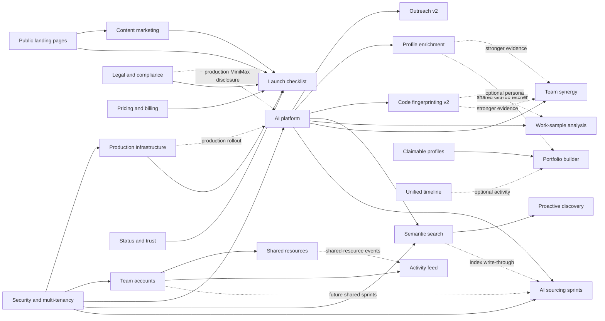

# BuilderHunt implementation roadmap

This directory is the implementation backlog for BuilderHunt. It contains 47 plan
records plus the shared planning policy in [`_meta/`](./_meta/). Each plan is a trio:
`spec.md` defines the outcome, `plan.md` defines the delivery sequence, and `tasks.md`
is the executable checklist.

## Read this first

1. [`_meta/app-reality.md`](./_meta/app-reality.md) is the source of truth for what is
   already shipped and which architectural constraints exist.
2. [`_meta/security-policy.md`](./_meta/security-policy.md) is binding for every plan that reads,
   persists, shares, exports, deletes, or sends private data.
3. [`_meta/ai-policy.md`](./_meta/ai-policy.md) is binding for every AI feature:
   Chrome built-in AI is the local-first default; MiniMax M3 is server-side for
   persisted, shared, background, embedding, and fallback work.
4. [`_meta/conventions.md`](./_meta/conventions.md) defines when a plan is ready for
   implementation.
5. Execute a plan's `tasks.md` from top to bottom. Re-check its dependency headers
   immediately before starting because statuses can change independently.

Status means:

- `implemented`: verified code already delivers the full scoped outcome.
- `partially-implemented`: useful code is live, and unchecked tasks are the honest gap.
- `pending`: implementation-ready, but no scoped production implementation exists.
- `blocked`: the plan is complete as a decision record, but implementation must wait
  for the dependency or external decision named in its spec.
- `superseded`: intentionally closed; its valid scope moved to another plan.

## Recommended build order

The order below optimizes for early product value, shared foundations, low migration
risk, and the smallest number of parallel schema changes. Plans within one wave may run
in parallel unless an explicit dependency says otherwise.

### Wave 0 — close production and truth gaps

Ship the small, already-understood gaps before adding AI infrastructure:

- [`security-and-multitenancy`](./security-and-multitenancy/spec.md): normalize global/public,
  account-subject, tenant-private, and operational data; adopt Better Auth organizations; separate
  runtime/migration database roles; add transaction-scoped tenant context, composite integrity,
  RLS, migration rehearsal, and tenant A/B gates. Its expand/backfill work may run alongside the
  non-schema truth fixes below, but RLS enforcement precedes every later private-data expansion.
- [`project-hygiene`](./project-hygiene/spec.md): remove fabricated `Math.random()`
  evidence and use real repository signals.
- [`hashnode-integration`](./hashnode-integration/spec.md): migrate the dead legacy API.
- [`gitlab-integration`](./gitlab-integration/spec.md),
  [`codeberg-integration`](./codeberg-integration/spec.md),
  [`huggingface-integration`](./huggingface-integration/spec.md),
  [`sourcehut-integration`](./sourcehut-integration/spec.md), and
  [`stack-overflow-integration`](./stack-overflow-integration/spec.md): close env,
  observability, and quota-reporting gaps.
- [`production-infrastructure`](./production-infrastructure/spec.md): backups,
  monitoring, cron authentication, and operational prerequisites for workers and AI.
- [`legal-and-compliance`](./legal-and-compliance/spec.md): finish hard deletion and
  disclose external AI processing before MiniMax receives production traffic.

Exit gate: no UI presents synthetic evidence as measured fact; backup restore and worker
authentication have runtime evidence; the privacy surface covers MiniMax; the web runtime uses a
non-owner role and tenant A/B plus direct-SQL RLS tests pass for every migrated private table.

### Wave 1 — shared AI platform

- [`ai-expansion`](./ai-expansion/spec.md) is the only provider integration layer.
- Build its task registry, Chrome capability/download UX, MiniMax server client,
  structured-output validation, Redis cache, budgets, kill switches, and audit-safe
  telemetry before any feature-specific AI endpoint.

Exit gate: one local-first task and one server-only task pass contract, fallback,
rate-limit, privacy, and provider-failure tests in a production-like runtime.

### Wave 2 — first AI value

These features reuse the shared platform and can be delivered independently:

- [`outreach-generator`](./outreach-generator/spec.md): lowest-risk interactive value;
  keep the shipped rule-based generator as the final fallback.
- [`ai-profile-enrichment`](./ai-profile-enrichment/spec.md): persisted MiniMax persona
  cards with provenance and a 30-day cache.
- [`code-fingerprinting`](./code-fingerprinting/spec.md): real repository evidence,
  persisted v2 artifacts, and the shipped heuristic v1 as fallback.
- [`semantic-search`](./semantic-search/spec.md): configured embeddings, pgvector, a global
  external-profile index, and cold-start fallback to federated search.

Exit gate: each task is plan-gated, schema-validated, budgeted, kill-switchable, and
usable when Chrome AI or MiniMax is unavailable according to its degradation ladder.

### Wave 3 — discovery and source coverage

- [`bluesky-integration`](./bluesky-integration/spec.md) can ship without credentials.
- [`producthunt-integration`](./producthunt-integration/spec.md) is token-gated.
- [`proactive-discovery`](./proactive-discovery/spec.md) follows semantic search and
  populates the global index using an idempotent HTTP-cron worker.
- [`unified-timeline`](./unified-timeline/spec.md) is non-AI core functionality; its
  optional summary task plugs into the AI platform.
- Keep [`devpost-integration`](./devpost-integration/spec.md) and
  [`indiehackers-integration`](./indiehackers-integration/spec.md) blocked until their
  explicit acquisition-policy decisions are resolved. Do not add brittle scraping to
  the live search request path.

### Wave 4 — teams and shared ownership

- [`security-and-multitenancy`](./security-and-multitenancy/spec.md) supplies organizations,
  multi-membership, active tenant context, invitations, RLS, and organization entitlements.
- [`team-accounts`](./team-accounts/spec.md) then supplies the Team settings/switcher/seat UX over
  that foundation; it does not create a competing organization model.
- [`shared-resources`](./shared-resources/spec.md) second: shared searches and builder
  lists against the organization authorization boundary.
- [`activity-feed`](./activity-feed/spec.md) last: append-only organization events over
  the mutations introduced by the first two plans.

Exit gate: cross-organization isolation, invitation lifecycle, owner-deletion guards,
seat limits, and audit-event redaction all pass integration tests.

### Wave 5 — advanced AI workflows

- [`work-sample`](./work-sample/spec.md) and
  [`team-synergy`](./team-synergy/spec.md) provide the Team-tier analysis promises.
- [`ai-sourcing-sprints`](./ai-sourcing-sprints/spec.md) composes federated search, the
  AI task registry, tracking, semantic-index write-through, and the worker pattern.
- [`portfolio-builder`](./portfolio-builder/spec.md) composes verified claims and
  optional enrichment/timeline artifacts into an explicitly published surface.
- [`technical-sandbox`](./technical-sandbox/spec.md) stays superseded by work-sample;
  never implement real-person roleplay.

### Wave 6 — launch and continuous quality

- Complete [`pricing-and-billing`](./pricing-and-billing/spec.md),
  [`public-landing-pages`](./public-landing-pages/spec.md),
  [`content-marketing`](./content-marketing/spec.md), and
  [`status-and-trust`](./status-and-trust/spec.md).
- Run [`waitlist-launch`](./waitlist-launch/spec.md) as the launch checklist; the product
  keeps open signup and does not add an artificial waitlist.
- Apply all five audits as release gates, not as a one-time cleanup:
  [`audit-accessibility`](./audit-accessibility/spec.md),
  [`audit-conversion`](./audit-conversion/spec.md),
  [`audit-performance-qa`](./audit-performance-qa/spec.md),
  [`audit-trust`](./audit-trust/spec.md), and
  [`audit-visual-system`](./audit-visual-system/spec.md).

[`onboarding-flow`](./onboarding-flow/spec.md) is already implemented.
[`rss-feeds`](./rss-feeds/spec.md), [`smart-alerts`](./smart-alerts/spec.md), and
[`claimable-profiles`](./claimable-profiles/spec.md) should close their remaining gaps in
the earliest wave where their touched surface is already being changed.

## Dependency graph

Solid arrows are hard sequencing dependencies. Dashed arrows are optional enhancements
or reuse paths and must not prevent the destination from working independently.

## Portfolio of plans

### Foundations and business

- [`security-and-multitenancy`](./security-and-multitenancy/spec.md)
- [`abuse-and-usage-integrity`](./abuse-and-usage-integrity/spec.md)
- [`production-infrastructure`](./production-infrastructure/spec.md)
- [`pricing-and-billing`](./pricing-and-billing/spec.md)
- [`legal-and-compliance`](./legal-and-compliance/spec.md)
- [`status-and-trust`](./status-and-trust/spec.md)
- [`public-landing-pages`](./public-landing-pages/spec.md)
- [`content-marketing`](./content-marketing/spec.md)
- [`waitlist-launch`](./waitlist-launch/spec.md)
- [`onboarding-flow`](./onboarding-flow/spec.md)

### AI and analysis

- [`ai-expansion`](./ai-expansion/spec.md)
- [`semantic-search`](./semantic-search/spec.md)
- [`ai-profile-enrichment`](./ai-profile-enrichment/spec.md)
- [`outreach-generator`](./outreach-generator/spec.md)
- [`code-fingerprinting`](./code-fingerprinting/spec.md)
- [`project-hygiene`](./project-hygiene/spec.md)
- [`work-sample`](./work-sample/spec.md)
- [`team-synergy`](./team-synergy/spec.md)
- [`technical-sandbox`](./technical-sandbox/spec.md) (superseded)

### Orchestration and publishing

- [`ai-sourcing-sprints`](./ai-sourcing-sprints/spec.md)
- [`proactive-discovery`](./proactive-discovery/spec.md)
- [`unified-timeline`](./unified-timeline/spec.md)
- [`portfolio-builder`](./portfolio-builder/spec.md)
- [`smart-alerts`](./smart-alerts/spec.md)
- [`claimable-profiles`](./claimable-profiles/spec.md)
- [`rss-feeds`](./rss-feeds/spec.md)

### Teams

- [`team-accounts`](./team-accounts/spec.md)
- [`shared-resources`](./shared-resources/spec.md)
- [`activity-feed`](./activity-feed/spec.md)

### Sources

- [`bluesky-integration`](./bluesky-integration/spec.md)
- [`producthunt-integration`](./producthunt-integration/spec.md)
- [`devpost-integration`](./devpost-integration/spec.md) (blocked)
- [`indiehackers-integration`](./indiehackers-integration/spec.md) (blocked)
- [`gitlab-integration`](./gitlab-integration/spec.md)
- [`codeberg-integration`](./codeberg-integration/spec.md)
- [`sourcehut-integration`](./sourcehut-integration/spec.md)
- [`hashnode-integration`](./hashnode-integration/spec.md)
- [`huggingface-integration`](./huggingface-integration/spec.md)
- [`lobsters-integration`](./lobsters-integration/spec.md)
- [`npm-registry-integration`](./npm-registry-integration/spec.md)
- [`stack-overflow-integration`](./stack-overflow-integration/spec.md)

### Release audits

- [`design-modernization`](./design-modernization/spec.md)
- [`audit-accessibility`](./audit-accessibility/spec.md)
- [`audit-conversion`](./audit-conversion/spec.md)
- [`audit-performance-qa`](./audit-performance-qa/spec.md)
- [`audit-trust`](./audit-trust/spec.md)
- [`audit-visual-system`](./audit-visual-system/spec.md)

## Global completion gate

Before a plan is marked `implemented`:

1. Every checked task points to code that exists; every unchecked task names exact files
   and a verification command.
2. Database migrations are forward-only and have a tested rollback or compatibility path.
3. `_meta/security-policy.md` is satisfied: data classification, non-owner runtime roles,
   server-resolved tenant context, composite tenant integrity, RLS, tenant A/B API and direct-SQL
   tests, migration rehearsal, and restore evidence exist for every affected private surface.
4. Authorization tests cover owner, organization member, non-member, and admin boundaries
   for every affected route.
5. AI tasks satisfy `_meta/ai-policy.md`, including Chrome/MiniMax fallback behavior,
   zod validation, budgets, privacy, prompt-injection defense, and kill switches.
6. Build, lint, type-check, tests, and the plan-specific runtime smoke test pass.
7. Production-facing features include observability, rollout, and rollback evidence.
8. The plan header and this roadmap are updated to match the verified runtime state.
