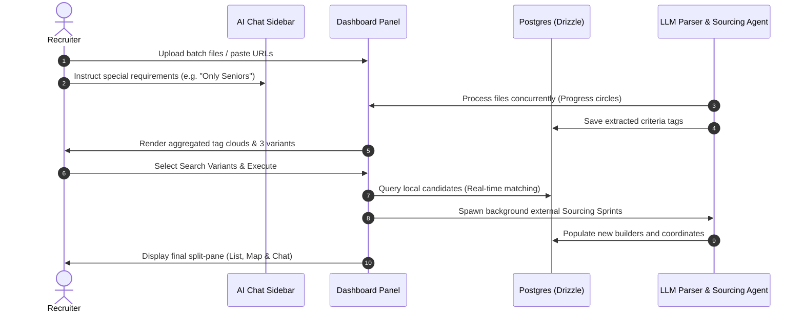
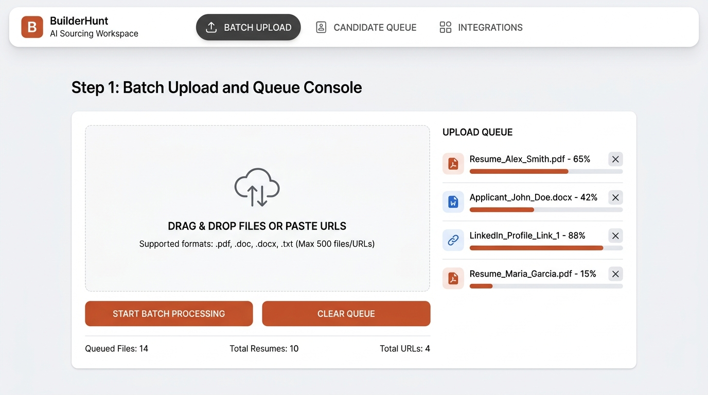
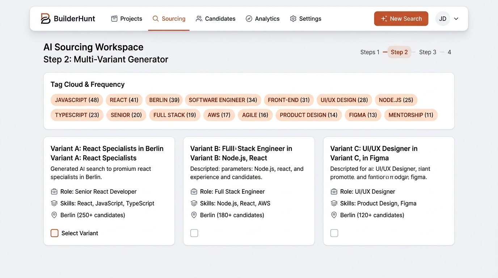
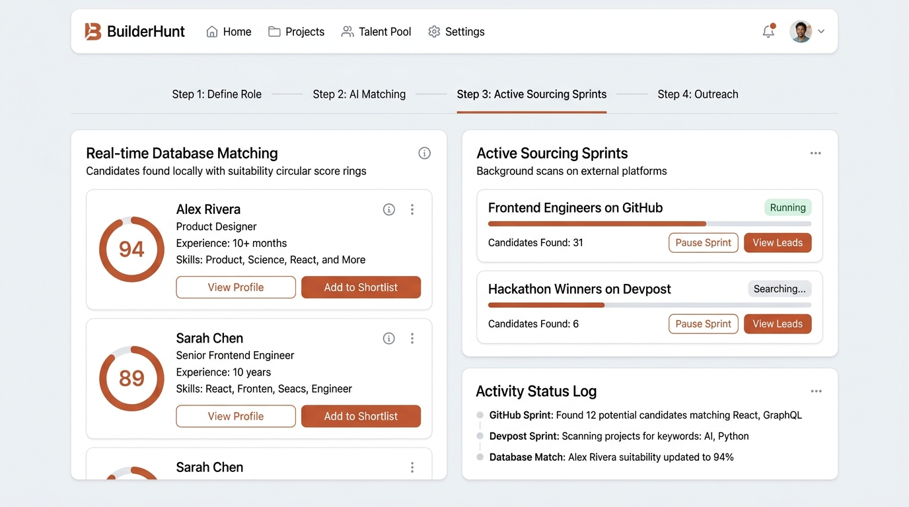
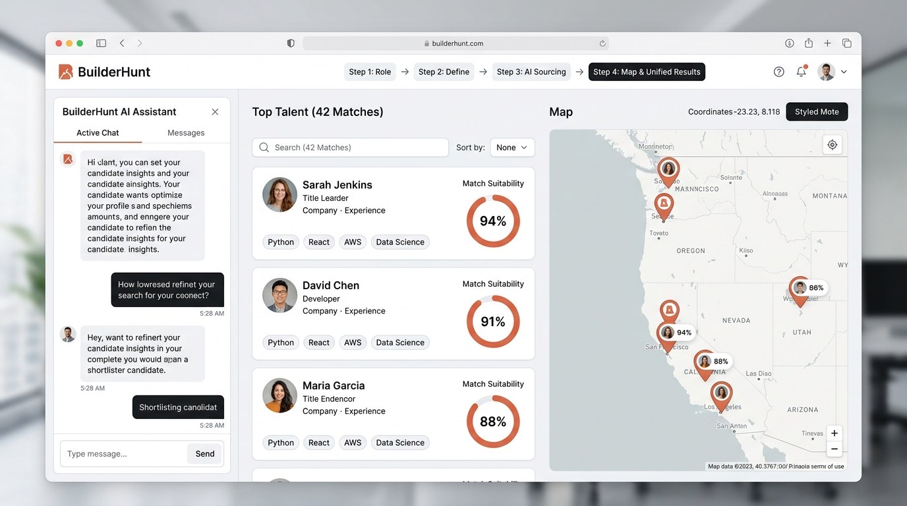

# Feature Specification: Unified AI Sourcing Workspace

This document defines the functional requirements, user flow sequence, architectural details, and visual design specifications for integrating the Unified AI Sourcing Workspace in **BuilderHunt**.

---

## 1. Executive Summary & Goals

### Problem Statement
Technical recruiters spend a significant portion of their workday juggling distinct sourcing tools: copying/pasting criteria, building boolean strings, cross-checking candidates on GitHub/LinkedIn, compiling shortlists, and trying to target specific geographical hubs. 

### Solution
The **Unified AI Sourcing Workspace** provides a cohesive, single-page interface that leverages LLMs to automate the entire lifecycle of sourcing:
1. **Ingest**: Batch file parser extracts requirements from CVs, Job Descriptions, and URLs.
2. **Decompose**: Aggregates extracted criteria and suggests targeted search variants.
3. **Execute**: Queries the local builder database in real-time and spawns background "Sourcing Sprints" (autonomous scraping agents) on external platforms (GitHub, GitLab, Devpost).
4. **Map & Refine**: Positions matching candidates on an interactive map (`@shadcn-map/map`) and allows natural language refinement via a state-bound chat sidebar (`@edd_remonts/ai-schadcn-chat`).

---

## 2. Sequential User Flow (Story Arc)

The workspace is a unified 4-step wizard interface located at `/sprints/workspace`. It preserves state across steps.



### Paso 1: Carga por Lotes y Consola de Espera (Batch Upload)
* **Description**: Recruiter uploads multiple resumes or JDs in PDF/Docx/Txt format or pastes a list of profile URLs.
* **AI Chat Sidebar (`@edd_remonts/ai-schadcn-chat`)**: Activated on the left. The recruiter can specify constraints (e.g. *"Ignore junior developers"*, *"Focus on European timezones"*).
* **Processing Console**: A grid displaying circular progress indicators representing the LLM processing and extracting content in parallel.
* **Visual Reference**:
  

### Paso 2: Generador de Variantes y Nube de Tags (Multi-Variant Generator)
* **Description**: Aggregates all extracted tags from all processed files.
* **Tag Cloud**: Displays tags categorized by *Skills*, *Locations*, *Experience*, and *Roles*, showing frequency numbers.
* **Search Variants**: AI proposes 3 distinct search profiles (e.g. *Variant A: React Specialists in Berlin*, *Variant B: Fullstack Engineers*).
* **Chat Integration**: The chat explains the rationale behind each variant. Recruiters can command: *"Create a new variant focusing on Rust"* to spawn a new card in the panel.
* **Visual Reference**:
  

### Paso 3: Ejecución de Sourcing Híbrido (Active Dual Sourcing)
* **Description**: Executes the search queries.
* **Real-time DB Match (Left)**: Queries the BuilderHunt postgres DB for existing matches immediately, showcasing candidates with match scores.
* **Active Sourcing Sprints (Right)**: Spawns background asynchronous scraping tasks looking at GitHub (repositories, code quality) and Devpost (hackathons).
* **Console Logs**: Displays logs of active workers (e.g. *"Scanned 25 GitHub profiles"*).
* **Visual Reference**:
  

### Paso 4: Mapa Interactivo y Dossier Unificado (Map & Unified Results)
* **Description**: The final unified page showing all candidates mapped geographically.
* **Interactive Map (`@shadcn-map/map`)**: Displays geographical markers for all candidates. Hovering over a card highlights its pin.
* **Shortlist & Suitability Scores**: Confident Serif Match scores (e.g., `94%`, `91%`) display suitability.
* **Chat Copilot**: Recruiter queries the results in natural language (e.g., *"Show me candidates who have built canvas libraries"*). The map and list filter dynamically based on chat output.
* **Visual Reference**:
  

---

## 3. Package Integration Specifications

### `@edd_remonts/ai-schadcn-chat` (AI Chat Assistant)
* **Sidebar Layout**: Fixed width `320px` on desktop, collapsible sidebar.
* **State Binding**:
  * Receives `currentStep` context.
  * Captures user text and passes it to the active LLM context.
  * Supports custom renderers for candidate recommendations inside chat bubbles.
* **Callbacks**:
  ```ts
  interface ChatCallbackProps {
    onApplyFilter: (filters: SearchFilters) => void;
    onHighlightCandidate: (candidateId: string) => void;
    onZoomToLocation: (lat: number, lng: number) => void;
  }
  ```

### `@shadcn-map/map` (Geographic Mapping)
* **Layout**: Full right-side panel in Step 4.
* **Map Engine**: Uses Leaflet/MapLibre under the hood styled with a customized warm dark-dev-tool theme or light-mode map coordinates.
* **Pins/Markers**:
  * Pins display the builder's profile picture or initials.
  * Tooltips display candidate name, role, and match score.
  * Clicking a pin pans the map and triggers `onHighlightCandidate` to scroll the candidate card on the left pane into view.

---

## 4. Technical Architecture & Database Schema

### Schema Extensions (`src/modules/db/schema.ts`)
```ts
import { pgTable, text, timestamp, integer, doublePrecision } from 'drizzle-orm/pg-core'
import { authUsers } from './auth-schema'
import { builders } from './builder-schema'

export const sourcingBatches = pgTable('sourcing_batches', {
  id: text('id').primaryKey(),
  userId: text('user_id').notNull().references(() => authUsers.id),
  status: text('status').default('processing'), // 'processing' | 'complete' | 'failed'
  createdAt: timestamp('created_at').defaultNow(),
  completedAt: timestamp('completed_at'),
})

export const sourcingSprints = pgTable('sourcing_sprints', {
  id: text('id').primaryKey(),
  batchId: text('batch_id').references(() => sourcingBatches.id, { onDelete: 'cascade' }),
  userId: text('user_id').notNull().references(() => authUsers.id),
  name: text('name').notNull(),
  prompt: text('prompt').notNull(),
  status: text('status').default('running'), // 'running' | 'completed' | 'failed'
  createdAt: timestamp('created_at').defaultNow(),
  completedAt: timestamp('completed_at'),
})

export const sprintResults = pgTable('sprint_results', {
  id: text('id').primaryKey(),
  sprintId: text('sprint_id').notNull().references(() => sourcingSprints.id, { onDelete: 'cascade' }),
  builderId: text('builder_id').notNull().references(() => builders.id),
  relevanceScore: integer('relevance_score').notNull(),
  aiReview: text('ai_review').notNull(),
  createdAt: timestamp('created_at').defaultNow(),
})
```

### LLM Processing Flow
1. **Ingestion & Text Extraction**:
   * Uses `@resvg/resvg-js` or other text extraction libs to parse PDFs/Word documents.
   * Extracts text, formats, and segments it.
2. **Gemini Flash Parallel Tag Extraction**:
   * Prompts Gemini to parse structured JSON criteria:
     ```json
     {
       "skills": ["React", "TypeScript", "WebGL"],
       "locations": ["Berlin", "Germany"],
       "experienceYears": 6,
       "roles": ["Senior Frontend Engineer"]
     }
     ```
3. **Aggegator & Search Variant Formulation**:
   * Aggregates parsed JSON criteria across the batch.
   * Feeds the aggregated JSON list to Gemini to suggest 3 optimized Boolean search parameters and Location boundaries.
