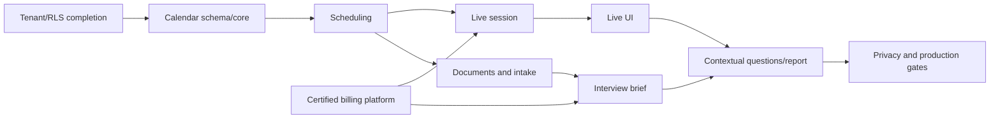

# Plan: Calendar, Scheduling, and Interview Intelligence

> **Status**: `pending`
> **Depends on**: [`security-and-multitenancy`](../security-and-multitenancy/spec.md),
> [`ai-expansion`](../ai-expansion/spec.md), and
> [`stripe-billing-platform`](../stripe-billing-platform/spec.md)
> **Blocks**: nothing
> **Reality check**: no calendar/scheduling/interview/storage implementation exists. The Stripe and
> credit platform (`stripe-billing-platform`) is now built and owns Stripe/ledger/checkout —
> this plan only registers rate cards and calls its reserve/settle contracts, never a second
> payment or ledger implementation. This
> plan must extend current tenant, AI, email, rate-limit, worker, entitlement, privacy, and dashboard
> patterns rather than creating parallel foundations. The worktree currently contains unrelated
> legal/security changes; implementation must preserve them and generate migrations from the then
> current Drizzle journal.

## Delivery strategy

Ship the program in vertical checkpoints. Calendar and manual scheduling must remain functional when
storage, payment, voice, or sensitive AI is disabled. Provider-backed operations stay behind feature
flags until their security, legal, runtime, and cost gates pass.

Estimated scope: 22-30 senior-engineer weeks plus product/legal review. Two engineers can reduce
elapsed time, but schema/RLS, booking correctness, live capture, and billing reconciliation remain
critical-path work and must not be parallelized without stable contracts.

## Phase 0 — Prerequisite gates and contracts

- Finish and verify canonical tenant cutover required by `security-and-multitenancy`: non-null tenant
  ownership, production runtime roles, RLS, tenant A/B tests, and restore rehearsal.
- Obtain Cloudflare R2 EU, Deepgram EU, and Azure regional EU accounts without adding secrets to git;
  consume the separately certified Stripe billing platform.
- Verify the billing dependency's catalog, tax, refund/dispute, reconciliation, seller-country, and
  live-canary gates instead of repeating those decisions here.
- Complete provider DPA/DPIA checklist and record approved region, retention, training, deletion,
  and subprocessor settings.
- Lock interview flags, rate-card keys, retention defaults, supported languages, upload/import
  limits, and Chrome desktop support matrix in pure shared configuration; import commercial catalog
  and credit contracts from billing.
- Approve the AI Act Article 6(3) classification method, candidate notices, human-oversight
  instructions, source registry, and legal basis for every mandatory booking purpose.
- Add dependencies only after checking license, maintenance, browser/server compatibility, and
  bundle impact.

Exit: foundations are documented, test credentials work locally, sensitive providers remain off by
default, and the implementation can proceed without inventing policy inside route handlers.

## Phase 1 — Pure contracts and first additive migration

- Implement the exact Zod/HTTP/persistence contracts from `spec.md`, state machines, transition
  guards, timezone/availability calculations, recurrence-scope operations, feed DTOs, credit
  arithmetic, and provider interfaces.
- Add calendar, availability, invitation, submission, participant, occurrence, reminder,
  notification-delivery, operational-schedule, and job-run tables.
- Add composite tenant keys, indexes, checks, typed constraints, explicit RLS, grants, and data
  classification documentation.
- Add repositories that accept `TenantTransaction` only.

Exit: migration applies/restores locally; pure tests cover DST and invalid transitions; web/worker
roles cannot cross tenants or query without context.

## Phase 2 — Calendar core vertical slice

- Implement event and availability services, recurrence materialization, `this|following|series`
  mutations, optimistic concurrency, search, reminder delivery, participant response, stable ICS
  updates/export, and range queries.
- Implement authenticated calendar/availability APIs.
- Add FullCalendar month/week/day/agenda UI, event editor/detail panel, keyboard/mobile fallback, and
  dashboard navigation.
- Add an authenticated recurrence/reminder worker following existing HTTP-worker conventions.

Exit: a real user can create/edit/move/recur/cancel/search/export events, choose recurrence scope,
receive idempotent reminders/participant updates, and inspect them across DST boundaries in the
running app with no external account.

## Phase 3 — Operational projections

- Register current alert, sprint, enrichment, discovery, embedding, legal, and recurrence/retention
  schedules in `operational_schedules`.
- Write redacted `job_runs` from every worker entry point.
- Add alert next-evaluation fields/cadence where current records are insufficient.
- Merge appointments, job projections, estimated alert windows, actual runs, and actual alert
  triggers into `GET /api/calendar/feed`.
- Add layer controls, stale indicators, honest estimate styling, and source links.

Exit: disabling projections still leaves personal calendar intact; projected entries are read-only
and cannot diverge through calendar edits.

## Phase 4 — Accountless scheduling vertical slice

- Implement invitation create/preview/send/open/revoke/decline/expire states.
- Implement fragment-token exchange into an invitation-scoped secure cookie.
- Implement public slot query with no conflict leakage.
- Implement mandatory versioned terms/privacy and purpose-specific decisions in candidate intake;
  reject booking unless every required consent receipt is present and unwithdrawn.
- Implement advisory-lock booking transaction, participants, email outbox, `.ics`, cancellation,
  rescheduling, consent receipt email, and post-booking withdrawal capability.
- Add organizer invitation UI and mobile public candidate portal.

Exit: email-to-booking runtime smoke succeeds without an account; a concurrent booking test produces
one confirmation and one generic conflict.

## Phase 5 — Private storage and candidate intake

- Add R2 EU adapter, signed upload/download, generated keys, checksum enforcement, and lifecycle
  deletion.
- Add ClamAV service/client and quarantine-to-clean workflow.
- Add PDF/DOCX/TXT deterministic extraction plus section/page references.
- Add document/extraction/link/web-import/consent tables, repositories, workers, APIs, and portal UI.
- Reuse `src/lib/enrichment` for source policy, honest-user-agent robots enforcement, SSRF-safe
  fetching, rate limits, bounded deterministic extraction, and provenance. Never introduce a
  second crawler or fetch hard-blocked LinkedIn/X/Meta sources without recorded authorization.

Exit: clean files and approved public websites extract with evidence IDs; unsafe files, denied
sources, robots failures, SSRF targets, active content, and oversized responses never reach AI.

## Phase 6 — Integrate the Stripe billing platform

- Wait for [`stripe-billing-platform`](../stripe-billing-platform/plan.md) through sandbox
  certification; do not create payment tables, Stripe routes, catalog mappings, or a second ledger.
- Register interview-specific versioned rate cards and maximum reservations with the platform.
- Use `checkEntitlement`, `reserveCredits`, `extendReservation`, `settleReservation`,
  `releaseReservation`, and `refundUsage` at every brief/transcription/report provider boundary.
- Render the platform's read-only credit summary and owner billing links in interview surfaces.
- Attach provider request IDs, duration/tokens, estimated/actual cost, and settlement evidence for
  platform reconciliation; interview code never grants or adjusts credits directly.

Exit: fake-provider integration proves no interview provider request starts without a reservation,
duplicate/retry settlement is safe, failures release correctly, and provider capture stops at the
hard limit while manual interview functionality continues.

## Phase 7 — Sensitive AI and interview brief

- Add an Azure regional EU client separate from MiniMax, with independent kill switch and no
  fallback to existing providers.
- Register `interview-brief-generate` with strict input/output schemas, evidence enforcement, no
  cache, credit reservation, and deterministic fallback.
- Add versioned brief tables/repository/service/API and organizer editor.
- Add prompt-injection, unsupported-claim, provider-timeout, invalid-output, and budget tests.

Exit: a clean submission generates a traceable editable brief; disabled/failing AI produces a
usable template and correct credit release.

## Phase 8 — Live session persistence and provider token

- Add interview session, transcript segment, suggestion, report, and consent tables/RLS.
- Implement session start/pause/resume/finish/abandon transitions and heartbeat recovery.
- Add 30-second Deepgram token issuance and explicit EU WebSocket configuration gated by participant
  access, stored unwithdrawn booking consent, feature flag, entitlement, and credit reservation.
- Implement idempotent final-segment batch persistence and provider-duration metering.

Exit: contract tests prove no token without credits/consent, segment replay is exactly-once, and no
schema/API/storage path can accept audio.

## Phase 9 — Live capture UI

- Add dedicated interview route and workspace.
- Implement Chrome desktop/version preflight. For remote calls accept only a separate meeting tab
  with tab audio, immediately stop the mandatory video track, preserve mic/tab as separate channels,
  and send audio only. Add provider WebSocket, interim/final rendering, IndexedDB recovery, speaker
  correction, markers, manual notes, and persistent/withdrawable consent state.
- Implement pause, stop, withdrawal, reconnect, page-unload cleanup, remaining-credit warnings, and
  zero-credit degradation.
- Gate v1 remote capture to current/previous desktop Chrome on macOS/Windows; beta-test Chromium
  Edge and explicitly route Safari/Firefox/mobile/native meeting apps to manual-only mode.

Exit: a 30-minute real bilingual in-person and Chrome-tab remote smoke passes; DevTools/network/
storage inspection finds no audio/video artifact and withdrawal stops provider traffic within ten
seconds.

## Phase 10 — Contextual questions and final report

- Register `interview-followup-suggest` and `interview-report-generate` with prohibited-output and
  evidence validators.
- Build bounded transcript-window/topic-state orchestration and 30-second suggestion throttling.
- Add use/save/dismiss controls, report processing/review/finalize UI, versioning, and deterministic
  fallback.
- Prevent finalization until evidence references resolve or the user explicitly removes unsupported
  content.

Exit: live suggestions and final report remain evidence-linked, editable, and free of scoring or
hiring recommendations.

## Phase 11 — Privacy, retention, export, and deletion

- Update privacy notice, consent versioning, processor list, and candidate-facing text after legal
  review.
- Add interview artifacts to account/organization export and deletion workflows.
- Implement idempotent retention worker across PostgreSQL, R2, Redis, provider artifacts, and stale
  reservations.
- Add consent withdrawal and subject-access paths without exposing tenant data.
- Verify backups do not contain audio and restored private artifacts retain correct access controls.
- Complete the versioned AI Act classification record, candidate transparency, intended-purpose/
  limitations documentation, organizer AI-literacy/human-oversight instructions, bias/prohibited-
  output evaluation, complaint/incident path, and post-market monitoring before enabling AI.

Exit: seeded expired fixtures purge end-to-end; export/delete runtime tests pass; retention failures
are visible and retryable.

## Phase 12 — Hardening and production rollout

- Complete unit, repository, RLS, migration, contract, E2E, accessibility, browser, load, cost, and
  recovery suites.
- Add redacted dashboards and alerts for booking conflicts, document backlog, provider errors,
  transcript persistence, ledger variance, retention failures, and stale schedules.
- Run dependency/license/security audit and threat-model review.
- Enable internal calendar, then scheduling, then documents/brief, then closed voice beta through
  independent flags.
- Remove a flag only after its runtime, legal, privacy, and cost exit criteria pass.

Exit: all Definition-of-Done checks from `spec.md` have saved evidence and the rollback runbook is
tested.

## Dependencies and critical path



Calendar projections can follow calendar core independently. The billing platform can proceed in
parallel; provider-backed interview phases wait for its stable authorization contract.

## Release flags

- `CALENDAR_ENABLED`
- `SCHEDULING_ENABLED`
- `CANDIDATE_UPLOADS_ENABLED`
- `CANDIDATE_WEB_IMPORT_ENABLED`
- `SENSITIVE_AI_ENABLED`
- `INTERVIEW_TRANSCRIPTION_ENABLED`
- `INTERVIEW_CONTEXTUAL_QUESTIONS_ENABLED`
- `STRIPE_BILLING_ENABLED`
- `CALENDAR_OPERATIONAL_LAYERS_ENABLED`

Server flags are authoritative. Client config exposes only safe booleans. Turning off a flag blocks
new actions but preserves authorized read/export/delete access.

## Verification gates

Every phase runs the relevant subset; final release runs all:

```bash
pnpm lint
pnpm type-check
pnpm test
pnpm build
pnpm exec drizzle-kit check
pnpm test:migrations:local
pnpm test:rls:local
pnpm security:boundaries
pnpm security:dependencies
```

Add Playwright commands/scripts during Phase 2 and run calendar, scheduling, upload, billing, and
interview projects against the real local stack. Build/lint alone never satisfy a phase exit.

## Risks

| Risk                                          | Likelihood |   Impact | Mitigation                                                                                                  |
| --------------------------------------------- | ---------: | -------: | ----------------------------------------------------------------------------------------------------------- |
| Browser cannot capture remote-party audio     |       High |     High | capability preflight, shared-tab instructions, Chrome beta, microphone/manual fallback, never overclaim     |
| Required video track leaks screen pixels      |        Low | Critical | browser-tab-only selection, stop video immediately, audio-only provider client, byte-level tests            |
| Diarization misattributes speech              |       High |   Medium | estimate labels, unknown state, manual correction, separate accuracy metric, no biometric identity          |
| Concurrent booking double-books organizer     |     Medium |     High | advisory lock, in-transaction slot recompute, optimistic event version, race tests                          |
| Recurrence/DST produces wrong occurrence      |     Medium |     High | Temporal/RRule pure layer, DST fixtures, materialized occurrence idempotency                                |
| Malicious upload reaches parser/model         |     Medium |     High | quarantine, byte/type/checksum validation, ClamAV, clean-only extraction, hostile-content prompt boundaries |
| Public URL import causes SSRF/ToS breach      |     Medium | Critical | shared safeFetch/source registry, robots fail-closed, per-hop validation, hard-blocked platforms            |
| Sensitive data leaves approved region         |        Low | Critical | separate provider, explicit regional endpoint, kill switch, DPA config gate, no MiniMax fallback            |
| Provider spend exceeds revenue                |     Medium | Critical | prepaid reservation, no negative balances, hard stop, configurable catalog, reconciliation/alerts           |
| Billing dependency grants/settles incorrectly |     Medium |     High | platform contract tests, idempotent operation keys, fake-provider integration, certification gate           |
| Recruitment AI is misclassified               |     Medium | Critical | Article 6(3) record, legal review, human-only decisions, high-risk fallback gate, monitoring                |
| Admin role leaks private interview            |     Medium | Critical | owner/participant columns, explicit RLS, admin-negative tests, no organization visibility mode              |
| Retention deletes too early/late              |     Medium |     High | explicit expiry, dry-run metrics, idempotent worker, legal review, backup/provider checks                   |
| Scope delays core calendar                    |       High |   Medium | vertical phases, feature flags, calendar independence, voice/billing cannot block manual calendar release   |
| FullCalendar/provider/library drift           |     Medium |   Medium | adapters, lockfile, contract tests, no Premium dependency, version review before install                    |

## Rollback

- Migrations are additive and forward-only. Disable flags before any compensating migration.
- Calendar UI/API rollback leaves tables intact; no data deletion.
- Projection rollback disables only read-model adapters.
- Scheduling rollback revokes new invitation creation while honoring existing booked events and
  cancellation links.
- Upload rollback stops signed URLs; quarantined objects remain inaccessible until cleanup.
- Sensitive AI rollback switches to deterministic templates and releases reservations.
- Transcription rollback prevents new tokens, closes active sessions gracefully, and preserves
  already acknowledged transcript text for authorized review/deletion.
- Billing rollback is owned by the billing platform; interviews stop new provider work while manual
  calendar/interview functionality and already persisted authorized data remain available.
- Retention rollback pauses deletion worker and alerts operators; it never restores purged content.

## Post-program follow-ups

- Google Calendar two-way adapter using sync tokens and renewable push channels.
- Microsoft Outlook adapter using delta queries and renewable change notifications.
- BYOK for high-volume customers with encrypted provider credentials and platform entitlement.
- Additional transcription provider after the first production accuracy/cost review.
- Team-shared interview workflows only after an explicit product/privacy design; do not infer them
  from organization membership.
