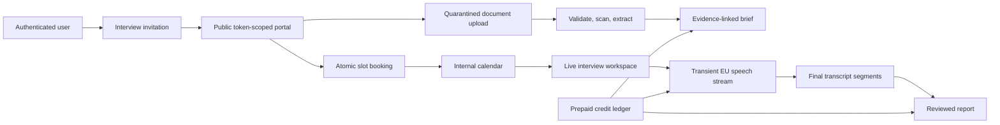

# Calendar, Scheduling, and Interview Intelligence

> **Status**: `pending`
> **Depends on**: [`security-and-multitenancy`](../security-and-multitenancy/spec.md) for
> completed canonical tenant cutover/RLS and [`ai-expansion`](../ai-expansion/spec.md) for the
> existing AI task registry, budgets, kill switches, and structured-output validation
> **Blocks**: nothing
> **Reality check**: BuilderHunt has no calendar, availability, accountless candidate scheduling,
> private object storage, Stripe integration, usage ledger, live audio capture, transcription, or
> interview pages. Reusable foundations exist in `src/shared/lib/auth/tenant-principal.ts`,
> `src/shared/lib/db/tenant-context.ts`, `src/shared/lib/ai/`, `src/shared/lib/rate-limit.ts`,
> `src/shared/lib/email.ts`, and the HTTP-worker routes under `src/routes/api/admin/`. The current
> [`pricing-and-billing`](../pricing-and-billing/spec.md) plan explicitly assumes manual billing and
> no processor; this program supersedes that assumption only for Stripe subscriptions/top-ups and
> prepaid interview usage.

## Source design

The approved research and design is
[`docs/superpowers/specs/2026-07-21-calendar-scheduling-interview-intelligence-design.md`](../../docs/superpowers/specs/2026-07-21-calendar-scheduling-interview-intelligence-design.md).
This spec is the implementation contract. If prose differs, this file and `tasks.md` govern.

## Problem

BuilderHunt helps users discover and assess builders but stops before the interview workflow. Users
must move candidates into unrelated scheduling, storage, calendar, note-taking, transcription, and
billing tools. The result loses candidate context, creates manual work, and makes alerts/workers
invisible as time-based system activity.

Unlimited voice/AI cannot be bundled into the existing $19 Pro subscription. A 60-minute interview
costs approximately $0.78-$0.98 in external services before normal platform overhead. One user
running 100 interviews could therefore create materially more provider cost than subscription
revenue.

## Goal

Deliver one coherent program with four independently shippable capabilities:

1. A complete internal personal calendar that remains useful without external providers.
2. Accountless candidate scheduling against organizer-controlled availability.
3. Private candidate intake, evidence-linked interview preparation, optional live transcription,
   contextual questions, and a reviewed final report.
4. Prepaid usage credits with hard enforcement, Stripe top-ups, refunds, and provider-cost
   reconciliation.

The internal calendar is always canonical. Google Calendar, Microsoft Outlook, and customer BYOK
are deliberately deferred adapters.

## Non-goals

- Video conferencing, PSTN calling, screen recording, or stored audio.
- A general ATS, HRIS, payroll, offer, or employee-management system.
- LinkedIn scraping or server fetching arbitrary candidate websites in v1.
- Automated candidate scores, ranks, hire/reject recommendations, personality inference, emotion
  recognition, voice identification, or culture-fit analysis.
- Organization-wide visibility by default; owner/admin roles do not imply candidate-data access.
- A generic distributed queue. Background work follows the existing authenticated idempotent
  HTTP-worker pattern.
- FullCalendar Premium resource/timeline views.
- Google/Microsoft sync or BYOK in this implementation program.

## Confirmed product decisions

- Calendar records are owned by one user inside one organization.
- The organizer defines availability, duration, buffers, notice, horizon, timezone, and modality;
  the candidate chooses a derived free slot.
- Candidates use an expiring public capability and never need an account.
- BuilderHunt operates beside an in-person interview or external meeting URL.
- Jobs and alert windows are read-only calendar projections; results show actual execution time.
- Audio is streamed transiently to an EU endpoint and never stored by BuilderHunt.
- Document processing consent and live transcription consent are separate and versioned.
- Declining transcription cannot prevent the interview.
- Candidate data is never used to train or improve models.
- Calendar/scheduling do not consume credits. Provider-backed preparation, transcription, and
  reports do.

## User stories

### Organizer

1. As a user, I can create, edit, move, resize, recur, cancel, and inspect private calendar events.
2. As a user, I can define weekly availability and date-specific exceptions in my timezone.
3. As a user viewing a tracked builder, I can create and send an interview invitation.
4. As a user, I can see invitation open/book/decline/expire/revoke state without exposing other
   candidates.
5. As a user, I receive a confirmed event only when a slot is atomically revalidated and booked.
6. As a user, I can review clean candidate documents and an evidence-linked interview brief.
7. As a user, I can conduct an interview with manual notes even when voice or AI is unavailable.
8. As a user, I can optionally capture microphone and supported shared-call audio, see a live
   transcript, correct speakers, and use contextual questions.
9. As a user, I review and edit the final report before it becomes final.
10. As a user, I can see remaining credits, exact consumption, low-balance warnings, and top up
    without a surprise bill.

### Candidate

1. As a candidate, I can open an invitation, choose a timezone, and book without registering.
2. As a candidate, I can upload a CV/documents, add approved links, and see explicit processing
   purposes.
3. As a candidate, I can decline, cancel, or reschedule within the organizer's policy.
4. As a candidate, I can decline or withdraw live transcription without losing the interview.
5. As a candidate, I receive email confirmation and a standards-compliant `.ics` file.

### Operator

1. As an operator, I can disable storage, sensitive AI, transcription, or payments independently.
2. As an operator, I can reconcile provider duration/tokens against the immutable credit ledger.
3. As an operator, I can see redacted latency, error, cost, worker, and retention metrics.
4. As an operator, I can prove tenant isolation, deletion, provider-region, and no-audio-storage
   behavior.

## Architecture

Use a modular monolith inside the existing TanStack Start deployment.



### Domain modules

- `src/lib/calendar/`: server services, recurrence expansion, projections, and reminders.
- `src/lib/scheduling/`: invitation, slots, booking, capabilities, and document processing.
- `src/lib/storage/`: storage contract, R2 adapter, ClamAV stream client, and extraction.
- `src/lib/interviews/`: brief/report orchestration, live sessions, sensitive provider, and
  transcription contracts.
- `src/lib/payments/`: Stripe catalog/checkout/webhook and provider reconciliation.
- `src/shared/lib/calendar.ts`, `scheduling.ts`, `interviews.ts`, `usage-credits.ts`: pure schemas,
  state machines, and calculations shared with UI/tests.
- `src/shared/lib/repositories/{calendar,scheduling,interviews,usage-credits}.ts`: tenant-only
  persistence accepting a transaction, never the global database.
- `src/modules/{calendar,scheduling,interviews}/`: feature UI.

### Provider contracts

- Private storage: Cloudflare R2, private Standard bucket, EU jurisdiction, S3-compatible adapter.
- Speech-to-text: Deepgram EU first, AssemblyAI-compatible contract later.
- Sensitive text AI: Azure OpenAI regional EU deployment. Never silently fall back to MiniMax.
- Payments: Stripe subscriptions plus one-time top-ups; internal ledger remains authorization
  authority.
- Calendar UI: FullCalendar Standard with day-grid, time-grid, list, interaction, and RRule plugins.

## Data classification and ownership

| Resource                              | Class                                            | Canonical owner                      | Read policy                                                                          |
| ------------------------------------- | ------------------------------------------------ | ------------------------------------ | ------------------------------------------------------------------------------------ |
| User calendar, events, availability   | Tenant private                                   | `organization_id` + `owner_user_id`  | owner; explicitly authorized participant where applicable                            |
| Invitation and candidate submission   | Tenant private                                   | organizer calendar owner             | owner and explicitly added internal interview participants                           |
| Candidate document/extraction         | Tenant private                                   | invitation owner                     | owner/explicit participants; public capability can upload its own submission only    |
| Brief, transcript, suggestion, report | Tenant private                                   | interview owner                      | owner/explicit participants only                                                     |
| Consent evidence                      | Account/candidate subject within tenant workflow | consent subject + invitation/session | subject-capability operations and authorized owner privacy workflow                  |
| Operational schedule/run              | System operational                               | stable job identity                  | redacted projection to applicable user; operator detail only                         |
| Credit grant/ledger/provider usage    | Tenant private financial                         | organization entitlement             | authorized members see balance; owner/admin payment actions; operator reconciliation |

Every tenant relation includes `organization_id` in its foreign key. Creator or participant user IDs
never replace tenant ownership. Authorization fields are typed columns, not JSON.

## Data model

### Calendar and scheduling

- `user_calendars`: personal settings and IANA timezone; unique default per organization/user.
- `calendar_events`: canonical one-off or recurring event, UTC instants plus original timezone,
  busy flag, visibility, source mapping, optimistic `version`, and soft lifecycle state.
- `calendar_event_occurrences`: deterministic materialization for range reads, conflict checks, and
  reminders; unique `(organization_id, event_id, recurrence_id)`.
- `event_participants`: internal user or external contact, participant role, response, and explicit
  access semantics.
- `availability_rules`: effective range, weekdays, local wall-clock interval, slot duration,
  buffers, minimum notice, and booking horizon.
- `availability_overrides`: local date/range marked available or blocked.
- `scheduling_invitations`: organizer, optional tracked builder identity, role context, duration,
  validity/policy, status, capability hash, and booked event reference.
- `candidate_submissions`: name, normalized email, notes, and submitted timestamp.
- `candidate_links`: normalized URL, supported type, label, and validation state.

### Documents and interviews

- `candidate_documents`: generated object key, original display name, detected media type, checksum,
  bytes, scan/extraction status, rejection code, and retention expiry.
- `document_extractions`: parser/version, content hash, normalized plain text, section/page map, and
  safe error code.
- `interview_briefs`: event, version, status, validated structured content, evidence manifest,
  provider/model/prompt version, editor, and expiry.
- `interview_sessions`: event, state, capture mode, language, provider, consent version, heartbeat,
  and provider-billed duration.
- `transcript_segments`: stable provider segment ID, sequence, speaker estimate/mapping, final text,
  timestamps, confidence, correction metadata, and expiry.
- `interview_suggestions`: question, rationale, evidence segment IDs, used/saved/dismissed state.
- `interview_reports`: versioned validated report plus evidence segment IDs and expiry.
- `privacy_consents`: purpose, policy version, grant/withdraw timestamps, subject, and minimal
  request evidence.

### Operations and usage

- `operational_schedules`: stable job key, cron expression/timezone, scope, next run, and enabled
  state.
- `job_runs`: scheduled/actual times, state, counters, duration, and redacted error code.
- `usage_credit_grants`: source, granted/remaining units, effective/expiry dates, payment reference,
  and state.
- `usage_credit_reservations`: interview/session estimate, consumed units, state, and expiry.
- `usage_ledger_entries`: immutable credit/debit/reserve/release/refund/adjustment entries with unique
  idempotency key.
- `provider_usage_records`: external usage reference, duration/tokens, estimated cost, and
  reconciliation state.
- `stripe_customers`, `stripe_subscriptions`, and `stripe_events`: encrypted/minimized mapping and
  idempotent webhook receipt state; Stripe objects do not replace organization entitlements.

Exact columns, indexes, constraints, composite foreign keys, and RLS policies are enumerated in
`tasks.md` before migration generation.

## State contracts

```text
Invitation: draft -> sent -> opened -> booked
                          -> declined | expired | revoked

Appointment: scheduled -> confirmed -> in_progress -> completed
                       -> cancelled | rescheduled | no_show

Document: pending_upload -> uploaded -> scanning -> extracting -> ready
                                      -> rejected | failed

Interview: not_started -> consent_pending -> ready -> live -> processing -> review -> finalized
                                               -> paused | failed | abandoned

Credit reservation: pending -> reserved -> partially_consumed -> settled
                                      -> released | refunded | expired
```

Only domain transition functions change state. Routes cannot update state columns directly.

## Scheduling correctness

- Persist instants as `timestamptz` and preserve IANA timezone separately.
- Availability uses local wall-clock values plus IANA timezone.
- Omit nonexistent DST times and label/disambiguate repeated times.
- Subtract busy occurrences, confirmed appointments, overrides, buffers, minimum notice, and
  booking horizon before returning slots.
- Return opaque availability only; never reveal the event causing a conflict.
- Booking acquires a transaction advisory lock derived from organizer/date, recomputes the slot,
  and atomically creates event/participant, marks invitation booked, and writes email outbox rows.
- A race loser receives `409 slot_unavailable` and refreshed alternatives.
- Event mutation uses optimistic `version`; stale writes return `409 event_changed`.

## Public capability security

- Generate 256 random bits; store only SHA-256 hash and expiry/revocation state.
- Put the secret in the emailed URL fragment, exchange once through
  `POST /api/public/scheduling/:invitationId/session`, call `history.replaceState`, and issue a
  short-lived `HttpOnly`, `Secure`, `SameSite=Lax`, invitation-scoped cookie.
- Public pages use `Referrer-Policy: no-referrer`, no third-party analytics, and strict CSP.
- The capability permits only allowlisted read/update operations for one invitation/submission.
- Rate limits combine invitation, IP, operation, and organization-derived server scope.
- Responses are non-enumerating and never reveal organization IDs, internal conflicts, object keys,
  or candidate-account existence.

## Private file contract

- Formats: PDF, DOCX, and TXT.
- Limits: 10 MB each, 25 MB total per invitation.
- Upload directly to generated quarantine keys with short-lived signed requests and checksum.
- Validate extension, expected key, actual bytes, detected media type, magic bytes, and checksum.
- Stream every object through ClamAV before moving/copying to the clean private prefix.
- Parse clean PDF/DOCX/TXT deterministically; never send raw binary to the LLM.
- Reject encrypted, corrupt, suspicious, mismatched, or unsupported files with safe error codes.
- Authorize every download and issue a five-minute signed URL.
- Original filename is display metadata only.
- v1 stores candidate URLs but does not fetch LinkedIn or arbitrary websites.

## AI task contracts

All three tasks are `server-only`, `cacheTtlSeconds: null`, Pro/Team gated, Zod validated, and routed
only through `SensitiveAIProvider`.

### `interview-brief-generate`

Input: role context, approved public profile evidence, normalized candidate links, and extracted
document sections. Output:

```ts
{
  candidateSummary: string
  relevantEvidence: Array<{ claim: string; sourceIds: string[]; confidence: "low" | "medium" | "high" }>
  informationGaps: string[]
  contradictions: Array<{ description: string; sourceIds: string[] }>
  questionGroups: Array<{
    category: "general" | "technical" | "critical"
    question: string
    rationale: string
    sourceIds: string[]
  }>
}
```

Credit cost: 5.

### `interview-followup-suggest`

Input: ready brief, covered/pending topics, and a bounded recent transcript window. At most one call
per 30 seconds. Output: at most three questions with rationale and transcript segment IDs. Ephemeral
unless explicitly saved or used. Included while paid transcription is active.

### `interview-report-generate`

Input: final transcript plus organizer notes. Output: summary, answers by topic, open questions,
follow-ups, and evidence segment IDs. Prohibited fields/language include score, rank, personality,
emotion, culture fit, and hire/reject recommendation. Credit cost: 5.

External data is wrapped as untrusted. Every factual claim requires source IDs. One bounded repair
attempt is allowed; persistent failure returns a deterministic editable template. Sensitive tasks
do not fall through to MiniMax or browser AI.

## Live capture contract

- `in_person`: microphone via `getUserMedia`.
- `remote_call`: microphone plus optional tab/window audio via `getDisplayMedia`, mixed with Web
  Audio.
- Preflight reports `microphone_and_shared_audio_available`, `microphone_only`, or
  `audio_capture_unsupported`. Track availability does not claim speech quality.
- Browser obtains a short-lived Deepgram EU token only after consent, entitlement, and credit
  reservation checks.
- No `MediaRecorder`, audio Blob, audio upload endpoint, audio object key, or audio database column.
- Interim transcript is memory-only. Final segments are persisted idempotently.
- Unacknowledged final text may use session-expiring IndexedDB; delete after acknowledgement.
- Diarization labels are estimates (`speaker_a`, `speaker_b`, `unknown`), never biometric identity.
- Pause/stop/withdrawal closes provider and all media tracks immediately.
- Manual notes remain functional through every capture/provider failure.

## Calendar projection contract

`GET /api/calendar/feed` returns a discriminated union:

- editable internal events;
- read-only projected job executions from `operational_schedules`;
- read-only estimated alert windows from next evaluation time/cadence;
- actual job runs from `job_runs`;
- actual alert matches from existing alert triggers.

Projection DTOs contain `sourceType`, `sourceId`, `editable: false`, estimate/actual state, and a safe
source route. They are not copied into `calendar_events` and cannot be dragged or edited.

## Usage credits and pricing

User-facing meter: `AI interview credit`.

- Brief: 5 credits.
- Live transcription: 1 credit per provider-billed minute.
- Contextual questions: included during active paid transcription.
- Final report: 5 credits.
- Typical 60-minute interview: 70 credits.

Initial configurable catalog:

- Pro $19/month: 140 credits.
- 300-credit top-up: $15.
- 1,000-credit top-up: $45.
- 5,000-credit beta top-up: $199; use approximately $299 when enforcing a conservative 70% gross
  margin at the internal $1.25/60-minute-interview cost budget.

Enforcement:

- Reserve credits before provider access.
- Never allow a negative balance.
- Extend live reservation incrementally and warn at 80%, 90%, and ten remaining minutes.
- Stop only provider-backed capture at zero; keep manual interview functionality.
- Auto-recharge is opt-in with user-defined monthly cap.
- Release/refund unconsumed reservation on provider failure.
- Internal ledger authorizes synchronously. Stripe receives idempotent billing events and cannot
  grant credit from a client redirect.
- Provider records reconcile duration/tokens/cost; variance must remain below 1%.

Closed beta may use operator-granted credits. Public provider-backed launch requires verified Stripe
checkout/webhooks and the internal ledger.

## Consent, privacy, and retention

- Candidate notice says `live audio capture and transcription`, not generic recording or product
  improvement.
- Document processing and live transcription have separate purpose/version records.
- Transcription refusal does not block booking or interview attendance.
- Organizer reconfirms the notice immediately before capture.
- Persistent indicator, pause, stop, and withdrawal are always visible.
- Candidate data is not used for model or product training.
- No audio is retained.

Defaults:

- transcript segments: 90 days after interview completion;
- documents, extraction text, briefs, and reports: 180 days after process closure;
- consent and minimal redacted audit evidence: 24 months;
- unacknowledged IndexedDB text: acknowledgement or session-expiry deletion.

Organizations may select shorter periods. The retention worker deletes database rows, object data,
cache entries, IndexedDB-on-next-visit markers, and provider artifacts where the provider exposes a
deletion API. Data export/deletion and privacy pages include these resources.

Production voice launch requires completed DPIA, signed DPAs, verified EU endpoints/no-training
controls, updated privacy notice/processor list, and legal review of the exact consent basis and
retention periods. The product design is privacy-preserving but does not substitute for legal advice.

## Billing and plan gating

- Calendar/manual events: available according to the final product catalog, no interview credits.
- Candidate scheduling and intake: Pro/Team initially; exact free trial allowance is configuration.
- Sensitive brief/transcription/report: Pro/Team plus sufficient credits.
- Payment/top-up actions: organization owner/admin only.
- Private interview read access: owner and explicitly added participants only, regardless of plan or
  organization role.
- Downgrade never deletes calendar/interview data; it blocks new paid operations and preserves
  export/deletion.

Update `PLAN_PRICING`, organization entitlements, `/pricing`, and billing settings together. Do not
leave marketing promises without server enforcement.

## Error behavior

- R2 down: booking works; upload remains retryable and never appears complete.
- ClamAV down: file remains quarantined; extraction/AI do not run.
- Azure down/disabled: deterministic editable brief/report template.
- Deepgram down: manual notes continue; unused credits release.
- Unsupported shared audio: explicit microphone-only state and confirmation.
- Network loss: safe provider reconnect and exactly-once final-segment persistence.
- Projection source down: personal events render; affected layer is marked stale.
- Stripe down: existing credits remain usable; checkout/top-up is unavailable.
- Duplicate/out-of-order Stripe webhook: idempotent no-op or monotonic transition.
- Missed worker: stale marker and operator alert; next execution recomputed from schedule.

## Accessibility and responsive behavior

- Calendar grid has agenda fallback, keyboard creation/navigation, visible focus, and semantic event
  detail dialog.
- Candidate portal is mobile-first and never requires drag/drop.
- Color is not the only distinction between appointment/job/estimate/result.
- Live controls expose textual state and screen-reader announcements without reading every interim
  token.
- Timer, credit warning, consent state, pause, and stop remain visible at 320 px width.
- Reduced-motion and high-contrast preferences are respected.

## Success metrics

- Invitation open-to-book completion and median booking time.
- Zero confirmed double bookings.
- Document processing success/time and brief unsupported-claim rejection.
- Percentage of remote sessions with microphone plus shared-audio tracks available.
- Transcript correction rate segmented by language/capture mode, without candidate identity
  profiling.
- Suggested-question save/use/dismiss rate.
- Report review/finalization rate.
- Credit consumption, cost, revenue, gross margin, and reconciliation variance.
- Consent decline/withdrawal, deletion, and retention-worker success.

## Acceptance criteria

- A user can manage a useful internal calendar with one-off and recurring private events without any
  external calendar account.
- Jobs, alert windows, runs, and results converge in the calendar with honest read-only semantics.
- Candidate booking works end-to-end without an account, across timezone/DST boundaries, and cannot
  double-book under concurrency.
- Documents remain private, are scanned before parsing, and generate an editable evidence-linked
  brief or deterministic fallback.
- A real 30-minute bilingual interview can capture both available tracks in supported Chrome,
  persist final text exactly once, pause/reconnect, correct speakers, and finalize an evidence-linked
  report.
- Safari/Firefox/unsupported capture degrades explicitly to microphone/manual notes.
- No code path stores audio or routes sensitive candidate data to MiniMax.
- Credits reserve before provider access, never go negative, refund failures, reconcile below 1%,
  and stop AI—not the interview—at zero.
- Tenant A, unrelated tenant member, and organization admin without participation cannot read,
  mutate, infer, download, or share another user's interview data.
- Export, deletion, expiry, and retention purge database/object/provider artifacts.
- Static checks, migrations, direct RLS tests, contract tests, unit tests, E2E tests, and runtime
  smoke tests pass.

## Research basis

- [RFC 5545](https://datatracker.ietf.org/doc/html/rfc5545)
- [FullCalendar Standard licensing](https://fullcalendar.io/pricing)
- [MDN getUserMedia](https://developer.mozilla.org/en-US/docs/Web/API/MediaDevices/getUserMedia.)
- [MDN getDisplayMedia](https://developer.mozilla.org/en-US/docs/Web/API/MediaDevices/getDisplayMedia)
- [Deepgram diarization](https://developers.deepgram.com/docs/diarization/)
- [Deepgram EU endpoint](https://developers.deepgram.com/reference/custom-endpoints)
- [Deepgram pricing](https://deepgram.com/pricing)
- [Cloudflare R2 EU jurisdiction](https://developers.cloudflare.com/r2/reference/data-location/)
- [Cloudflare R2 pricing](https://developers.cloudflare.com/r2/pricing/)
- [OWASP File Upload Cheat Sheet](https://cheatsheetseries.owasp.org/cheatsheets/File_Upload_Cheat_Sheet.html)
- [Azure AI data privacy](https://learn.microsoft.com/en-us/azure/foundry/responsible-ai/openai/data-privacy)
- [Stripe usage billing](https://docs.stripe.com/billing/subscriptions/usage-based/how-it-works)
- [GDPR Article 5](https://eur-lex.europa.eu/legal-content/EN/TXT/?qid=1653314624165&uri=CELEX%3A32016R0679)
- [EDPB automated-decision guidance](https://www.edpb.europa.eu/documents/guideline/automated-decision-making-and-profiling_en)
- [Danish recording guidance](https://www.datatilsynet.dk/regler-og-vejledning/optagelser-og-overvaagning?Page=6)
