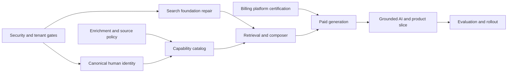

# Plan: Solutions Intelligence

> **Status**: `implemented`
> **Depends on**: [`security-and-multitenancy`](../01-security-and-multitenancy/spec.md),
> [`ai-expansion`](../21-ai-expansion/spec.md),
> [`stripe-billing-platform`](../30-stripe-billing-platform/spec.md), and
> [`stealth-scraping`](../42-stealth-scraping/spec.md)
> **Blocks**: nothing
> **Implementation authorized**: yes — maintainer decision, 2026-08-01. Supersedes the earlier
> "no; this document is planning output only" header. See
> [`tasks.md`](./tasks.md) for the three Phase 0 gates that decision resolved (source-register
> sign-off moved to `plans/phase-5`, synthetic gold set with a human CRUD path, real providers in
> use).

## Delivery strategy

Deliver the feature through evidence-gated vertical slices. Establish identity, source policy,
catalog contracts, credits, and offline evaluation before exposing generated advice. Keep ordinary
builder search operational throughout the additive migration.

Estimated scope: 18-24 senior-engineer weeks plus product, privacy/legal, and catalog-review work.
Two engineers can overlap source adapters, evaluation fixtures, and UI after the contracts stabilize,
but identity migration, tenant security, billing, and ranking evaluation remain release gates.

## Phase 0 — Lock prerequisites and measurements

- Verify security/multitenancy, AI task, billing credit, and public enrichment dependencies.
- Record the current search/semantic defects as blocking tests.
- Create the 60-brief gold set, relevance judgments, hard constraints, latency corpus, and cost
  benchmark before selecting a reranker or changing rate-card pricing.
- Approve the initial source register and v1 domain exclusions.

Exit: no production provider or scraping flag is enabled; dependency evidence, benchmark inputs, and
release thresholds are reviewable.

## Phase 1 — Pure contracts and feature shell

- Define strict schemas for briefs, components, capabilities, evidence, compatibility edges, source
  policy, routes, estimates, feedback, and versioned rate cards.
- Add the premium dashboard route, locked Free state, ephemeral brief editor, interpretation preview,
  ranking controls, and deterministic fixture results.
- Define module-specific flags and kill switches with safe production defaults.

Exit: UX and contracts can be tested without an LLM, external source, database mutation, or credit
charge.

## Phase 2 — Repair shared search foundations

- Align embedding dimensions and make entity type/source/filter/page semantics explicit.
- Isolate connector failures and report source-level status.
- Implement normalized lexical/vector fusion and truthful pagination.
- Replace username-only deduplication with source-aware candidate identity.
- Add regression and load tests around current builder search before extending it.

Exit: existing search retains behavior, one connector cannot fail all results, and semantic filters
are proven end to end.

## Phase 3 — Canonical human identity

- Add canonical human profiles and evidence-bearing source-account links.
- Reuse and extend current builder identity and snapshot records.
- Persist approved public source observations during ingestion.
- Build deterministic link signals, a review queue for probabilistic candidates, reversible merges,
  field-level provenance, and collision tooling.
- Dual-read and dual-write organization tracking and public DTOs before cutover.

Exit: one person can safely consolidate multiple source accounts without losing provenance, and
username collisions never auto-merge.

## Phase 4 — Capability catalog and source registry

- Add versioned catalog, capability, evidence, compatibility, and source-policy persistence.
- Build narrow global-public read repositories and authenticated worker mutation surfaces.
- Seed generic human roles and an approved minimum catalog of agents, models, MCP tools, and
  services from official or licensed metadata.
- Extend enrichment for reviewed public crawl/scrape sources with content hashing, refresh,
  deletion, and source kill switches.

Exit: every searchable fact has source, evidence level, observation date, and refresh policy; a
source can be disabled without disabling the catalog.

## Phase 5 — Hybrid retrieval and deterministic composition

- Index humans, roles, and AI/tool components using a shared versioned embedding projection.
- Implement structured filters, PostgreSQL full-text retrieval, pgvector retrieval, reciprocal-rank
  fusion, evidence/freshness features, and bounded candidate limits.
- Implement compatibility traversal, capability coverage, hard rejection, estimate ranges, human
  review placement, route diversification, and trace output.
- Evaluate without a reranker; add one only if segmented metrics justify its latency and cost.

Exit: deterministic tests build valid Human, AI, and Hybrid graphs and reject incompatible,
unsupported, stale, or prohibited routes without an LLM.

## Phase 6 — Billing integration

- Wait for the billing platform's sandbox certification; create no local ledger or Stripe surface.
- Register `solutions.generate.v1` and `solutions.regenerate.v1`.
- Gate interpretation and live generation by paid entitlement, displayed maximum charge, and
  explicit user confirmation.
- Reserve before provider calls, settle usable output exactly once, release failed output, attach
  provider usage, and expose platform-owned balance/top-up actions according to organization role.
- Certify the fixed rate card against measured provider cost and target margin.

Exit: no live provider request begins without a valid reservation; insufficient, duplicate,
timeout, partial, and reconciliation cases are proven.

## Phase 7 — Brief interpretation and grounded explanation

- Register bounded AI tasks for brief interpretation and route explanation.
- Validate output schemas and reject prompt instructions found in source content.
- Limit explanations to composer facts and resolvable evidence references.
- Ask a single clarification only when a deterministic materiality policy requires it.
- Add deterministic degradation when AI is disabled or invalid.

Exit: the LLM cannot create components, compatibility, evidence, entitlement, or constraints, and
every displayed claim resolves to the run trace.

## Phase 8 — Complete premium product slice

- Connect the premium UX to interpretation, confirmation, credit reservation, retrieval,
  composition, and result rendering.
- Add explicit structured-brief save, immutable run history, comparison, safe outbound links, and
  feedback reasons.
- Add accessibility, responsive behavior, loading/source-status states, cancellation, and retry
  with stable idempotency.
- Keep transient chat out of persistence and analytics.

Exit: a paid test organization can produce, compare, save, and revisit a solution; Free and
insufficient-credit organizations cannot invoke providers.

## Phase 9 — Evaluation, operations, and rollout

- Run offline quality, adversarial, performance, cost, source-outage, identity-collision, tenant,
  and billing-reconciliation suites.
- Add dashboards for source freshness, route validity, latency, provider cost, credit settlement,
  user-selected route, and kill-switch state without sensitive brief content.
- Complete source/privacy/security review and incident/runbook exercises.
- Roll out staff-only, closed beta, paid beta, then general availability behind independent flags.

Exit: every acceptance gate in `spec.md` has dated evidence and disabling Solutions leaves ordinary
search and saved data intact.

## Dependency order

## Rollback boundary

All schema changes are additive until the canonical-human cutover is verified. Each provider,
scraping, interpretation, explanation, and paid-generation capability has an independent flag.
Rollback disables new writes and provider calls, preserves saved briefs/runs and credit audit
records, and returns users to ordinary builder search. Historical credit settlements are never
rewritten.
