# UI Coverage and Navigation Completion

> **Status**: `implemented`
> **Depends on**: the implemented portions of [`shared-resources`](../28-shared-resources/spec.md), [`activity-feed`](../29-activity-feed/spec.md), [`status-and-trust`](../47-status-and-trust/spec.md), [`calendar-scheduling-interview-intelligence`](../44-calendar-scheduling-interview-intelligence/spec.md), and [`stealth-scraping`](../42-stealth-scraping/spec.md)
> **Blocks**: nothing
> **Reality check**: BuilderHunt has 66 user-facing routes, 181 API routes, and 29 registered dashboard destinations. Most Phase 1 features have UI, but several shipped routes are absent from navigation, several APIs have no usable surface, and the calendar UI implements only a small subset of its checked Phase 1 task. The canonical navigation is `src/modules/dashboard/ui/shell/nav-config.ts`.

## Problem

Phase 1 shipped features faster than the information architecture was reconciled. The result is
not primarily a lack of pages. It is a coverage and connectivity problem:

1. Complete pages are hidden from the primary navigation.
2. Core journeys stop at external links instead of entering BuilderHunt's internal workspace.
3. Some APIs exist without any user or operator surface.
4. Some checked plan tasks describe UI that is not present in `src/`.
5. A few links use route IDs or obsolete paths instead of generated public paths.
6. Public navigation exposes important routes only in the footer, especially on mobile.
7. Several backend-complete flows are only partially surfaced: rescheduling, interview sharing,
   shortlist management, profile analytics, exports, and operational event recovery.
8. Some screens overstate reality by rendering hard-coded health or export capabilities that the
   backend does not currently provide.

This plan closes those gaps without redesigning the product or duplicating feature-domain logic.

## Audit method and evidence

The audit compared:

- all 54 directories in `plans/phase-1/`;
- the generated route graph in `src/routeTree.gen.ts`;
- every non-API route under `src/routes/`;
- dashboard navigation in `src/modules/dashboard/ui/shell/nav-config.ts`;
- public navigation in `src/shared/components/Header.tsx` and `Footer.tsx`;
- feature components under `src/modules/`;
- literal internal links, route IDs, and API consumers;
- the running public app at `http://localhost:3011/`.

The public runtime loaded successfully and exposed Home, Explore, Blog, Pricing, Status,
Changelog, Roadmap, Security, and legal routes. Authenticated browser verification was blocked by
the local fixture: the default admin sign-in failed, and `pnpm db:seed:admin` returned PostgreSQL
`42501 permission denied for table auth_users` because it used the non-owner `DATABASE_URL`.
Authenticated findings below therefore use source, generated-route, unit-test, and E2E evidence.
The implementation of this plan must repair the fixture path or use the disposable E2E harness
before claiming browser completion.

## Findings

### A. Existing UI that is not reachable from primary navigation

| Priority | Feature | Evidence | Gap |
|---|---|---|---|
| P0 | Shortlists | `src/routes/_dashboard/lists/index.tsx`, `src/routes/_dashboard/lists/$listId.tsx` | `/lists` is absent from `NAV_AREAS`. |
| P0 | Team activity | `src/routes/_dashboard/team/activity.tsx` | `/team/activity` is absent from `NAV_AREAS`; it is only reachable from a widget when the widget has rows. |
| P1 | Public Explore, Pricing, Blog, and Trust | `src/shared/components/Header.tsx` | Desktop header contains home-page anchors only; mobile hides them and has no public navigation drawer. Most product routes are footer-only. |
| P1 | Claimed-profile portfolio settings | `src/routes/_dashboard/me/index.tsx` | The surface exists, but there is no contextual account sub-navigation separating profile, portfolio, provenance, and privacy controls. |

### B. Broken or misleading navigation

| Priority | Location | Current behavior | Required behavior |
|---|---|---|---|
| P0 | `src/modules/builder-profile/components/AddToListMenu.tsx` | Links to nonexistent `/dashboard/lists`. | Link to `/lists`. |
| P0 | `src/modules/dashboard/components/ListsPage.tsx` | Navigates to route ID `/_dashboard/lists/$listId` by bypassing types. | Use generated public path `/lists/$listId`. |
| P0 | `src/modules/dashboard/components/ListDetailPage.tsx` | Back action navigates to `/_dashboard/lists`; list rows have no builder link. | Use `/lists`; make each row open `/builder/$builderId`. |
| P0 | Search result cards | Primary `View` opens the external source profile. | Make BuilderHunt workspace the primary action; keep source profile as a secondary external action. |
| P0 | Alert and sprint result cards | They can track, but do not continue to the internal builder workspace. A legacy alert link uses the public `/builders/$builderId` route. | After tracking, use the returned organization-builder ID to open `/builder/$builderId`. |
| P0 | Recommendations | `RecommendationsSection` opens the external provider directly. | Track-and-open the internal workspace, with external source as secondary. |
| P0 | Exports | Tracked builder rows open only `profileUrl`, despite carrying an organization-builder ID. | Open the internal workspace first and retain the source profile as a secondary action. |
| P1 | Context continuity | Search, alert, sprint, and shortlist origins are lost when opening a builder. | Carry a safe `from` value and render a contextual back link. |
| P1 | Team activity | The full page navigates back to `/_dashboard`; events show truncated user IDs and inert targets. | Use `/dashboard`, human actor labels, and tenant-safe contextual target links. |
| P1 | Calendar projections | Alert projections link to `/dashboard/alerts`; operational projections render POST worker API routes as GET anchors. | Link to `/alerts` and `/admin/operations?job=…`; never expose a worker API route as navigation. |
| P1 | Privacy emails | Export/deletion emails link to `/dashboard/settings/privacy`. | Generate `/settings/privacy` URLs and test every server-generated first-party URL. |
| P1 | Dynamic details | Builder, list, sprint, interview, and live-interview routes have only area-level breadcrumbs. | Add entity-aware parent/back breadcrumbs without leaking private labels. |
| P1 | Public status | Copy says “Subscribe via changelog” despite a real `/api/status/subscribe` endpoint. | Render a status subscription form and unsubscribe result state. |

### C. Shipped backend capability with no UI

| Priority | Phase 1 owner | Capability | Existing backend | Missing UI |
|---|---|---|---|---|
| P0 | 44 Calendar | Availability policy | `/api/calendar/availability`, `/overrides` | Weekly availability, timezone, buffers, notice, horizon, overrides, and default reminders editor. |
| P0 | 44 Calendar | Calendar notifications | `/api/calendar/notifications` | Notification drawer, unread badge, mark-read, and event navigation. |
| P0 | 44 Calendar | Calendar export | `/api/calendar/export.ics` | Bounded date-range export action and privacy explanation. |
| P0 | 42 Enrichment | Verified-subject provenance | `/api/me/builder/$builderId/evidence-provenance` | Claimant-facing provenance viewer. |
| P0 | 42 Enrichment | Restrict processing | `/api/me/builder/$builderId/restrict-processing` | Claimant-facing confirmation flow and post-restriction state. |
| P0 | 44 Scheduling | Atomic rescheduling | `/api/public/scheduling/$invitationId/reschedule` | Candidate reschedule flow that preserves the current booking until replacement succeeds. |
| P0 | 44 Interviews | Material-access management | `PATCH /api/interviews/$interviewId/participants/$participantId` | Owner panel to grant/revoke brief, report, and transcript access separately from attendance. |
| P1 | 44 Scheduling | Invitation management | `GET /api/scheduling/invitations` and draft/send/revoke endpoints | Central invitation inbox with filters, draft resume/preview/send, revoke, and destination links. |
| P1 | 44 Interviews | Shared interviews | participant material grants exist | Tenant-safe “Shared with me” projection and list; UUID knowledge must not be the discovery mechanism. |
| P1 | 36 Claims | Privacy-preserving profile analytics | `GET/POST /api/builders/$builderId/views` | Consent-aware view recording and verified-owner aggregate/30-day chart with no viewer identities. |
| P1 | 36 Claims | Platform claim revocation | `/api/admin/builder-claims/$claimId/revoke` | Admin claims list/detail/revoke surface. |
| P1 | 47 Status | Incident subscriptions | `/api/status/subscribe` and `status_subscribers` | Public subscribe form, success state, validation, and unsubscribe result page/state. |
| P1 | 34 Alerts | Test an alert | `/api/alerts/test-trigger` | “Send test” action with delivery/result feedback. |
| P1 | 44 Operations | Worker schedules and run history | `operational_schedules`, `job_runs`, and 10 registered jobs | Admin operations page with health, next run, last run, counters, pause/resume, and guarded manual run. |
| P1 | 09–19, 22, 23, 42 | Source and indexing health | source connectors, discovery, embeddings, Devpost and enrichment workers | Read-only integration status page: enabled/dormant, credential present, quota, last success/error, and indexed counts. |
| P1 | 21 AI | AI task availability and budgets | `/api/ai/config`, task registry, budgets, kill switches | Admin AI health panel; no secret editing. |
| P1 | 30 Billing | Reconcile, replay, accounting export, risk exceptions, worker | existing `/api/admin/billing/*` endpoints | Guarded actions and drill-down from the read-only billing operations dashboard. |
| P1 | 30 Billing | Webhook/dead-letter discovery | replay endpoint accepts a known event ID | Bounded event list/detail projection so operators can find failed events before replaying them. |
| P1 | 52 Trust | Removal-state operations metrics | removal workflow repositories and audit data | Redacted counts by state/source and aging, without subject identity or request content. |
| P2 | 51 Conversion | Conversion metrics | `/api/admin/metrics/conversion` | Conversion funnel section in Admin Metrics. |

### D. UI that exists but is materially incomplete

#### Calendar

`plans/implemented/44-calendar-scheduling-interview-intelligence/tasks.md` checks a task that names:

- `CalendarView.tsx`
- `EventEditor.tsx`
- `EventDetails.tsx`
- `AvailabilityEditor.tsx`
- `CalendarAgenda.tsx`
- `CalendarNotifications.tsx`

None exists. Only `CalendarPage.tsx`, `CalendarLayers.tsx`, and `ProjectionDetails.tsx` are present.
The current page provides one month grid, a basic create form, layer toggles, projection details,
and deletion. It does not provide:

- week, day, list, or accessible mobile agenda views;
- today action, timezone selection, or search;
- event detail/edit, drag/resize, all-day, location, meeting URL, busy/free, participants, or
  recurrence controls;
- recurrence-scope selection;
- availability and default-reminder settings;
- notification drawer;
- ICS export UI;
- optimistic version-conflict recovery.

This is the largest P0 UI gap because the supporting contracts and APIs already exist.

#### Solutions

`src/modules/solutions/components/SolutionsPage.tsx` is a polished demo shell, but Phase 1 plan 43
still has all implementation tasks open. The page must not look production-capable while it is
returning demo lanes. Until plan 43's canonical-human, projection, composer, billing, and grounded
route tasks ship, the UI must clearly label preview/demo state and expose prerequisite status.
After those dependencies ship, the same route becomes the real workflow rather than gaining a
second competing route.

#### Portfolio

Core owner settings and public publication exist. Two approved optional adapters are still open in
plan 37:

- AI persona, with explicit owner opt-in;
- public timeline, with explicit owner opt-in.

The UI must add these controls only after their adapters exist, and must continue to omit absent or
invalid data rather than render placeholders.

#### Billing operations

`BillingOperationsPage.tsx` is intentionally read-only and already shows aggregate health, but the
supporting admin endpoints now exceed that original scope. Operators cannot reconcile, replay a
dead-letter event, inspect/manage risk exceptions, run the worker, or download accounting output
from the app. These controls need step-up confirmation, audit events, idempotency, and bounded
output; they must not expose Stripe payloads or secrets.

#### Scheduling and interviews

The candidate portal currently implements “choose another time” as cancel-then-book even though an
atomic reschedule endpoint exists. A conflict can therefore destroy the old booking without
obtaining the new slot. Organizer invitations are only manageable inside a builder workspace, so a
draft cannot be resumed after refresh from a central destination. Interview owners can grant
sensitive-material access through an API, but there is no permission UI, and granted colleagues
have no “Shared with me” discovery surface. These are workflow and privacy gaps, not optional
polish.

#### Shortlists and activity

Shortlist metadata is read-only and the list endpoint has no update operation. Name, description,
and visibility need an authorized edit flow with an explicit visibility-change warning. Activity
events expose target keys but render truncated actor IDs and no links. The server must derive an
allowlisted human actor label and target route; deleted or unauthorized targets remain plain text.

#### Status truthfulness

The status response includes database, Redis, and memory checks, but the page renders only some of
them plus hard-coded Search/API “OK” rows. Runtime verification showed a degraded overall state
while every visible component claimed to be healthy. The UI must render every real returned check
and no fabricated check. If Search/API health is desired, the server must measure it.

#### Export truthfulness

Home and structured metadata promise CSV and JSON exports for any shortlist, saved search, or note
collection. The implemented endpoint exports only CSV for all tracked builders, and the UI exposes
only that action. Either deliver a scoped Export Center for tracked builders, a chosen shortlist,
saved-search results, and note collections in CSV/JSON, or immediately narrow all public and
structured claims to the capability that actually ships. Marketing claims cannot lead delivery.

#### Source presentation

Source labels, badges, icons, and URL construction are duplicated across Search, Recommendations,
result cards, and Builder Profile. The recommendation mapping omits Devpost, Product Hunt, and
Bluesky and can fall back to `#`. One exhaustive registry, typed from `SOURCE_NAMES`, must own safe
source presentation and tracking availability; adding a source without UI metadata must fail CI.

### E. Phase 1 features that already have sufficient UI

The plan must not rebuild these:

- legal pages, consent banner, TOS modal, data export, and account deletion;
- onboarding;
- source selection pills and source metadata in search;
- semantic-search toggle and paid-state handling;
- recommendations (surface exists; its source mapping and internal continuation are incomplete);
- persona card, code fingerprint, team fit, hygiene, work sample, timeline, outreach copilot, and
  evidence review on the internal builder page;
- organization switcher, members, invitations, ownership transfer, and organization deletion;
- saved-search visibility, public radar sharing, RSS copy, Feedly/Inoreader links;
- billing settings, checkout return, credits, auto-recharge, refunds and disputes;
- active sessions, abuse warning, and abuse console;
- alert inbox/configuration;
- sourcing sprint list, wizard, dossier, and refinement;
- scheduling invitation composer, candidate booking, interview list, brief, and live interview
  workspace (atomic reschedule, invitation recovery, sharing, and participant permissions remain
  incomplete);
- public landing, Explore, Blog, Pricing, Status, Changelog, Roadmap, Security, and legal routes;
- admin users, content, incidents, plan requests, abuse, billing summary, refunds, and disputes.

## Goal

Every implemented feature has:

1. an intentional user-facing or operator-facing surface, or an explicit documented reason for
   remaining API/cron-only;
2. at least one stable navigation path from the feature that precedes it in the user journey;
3. a stable path back to its origin or parent;
4. honest unavailable/demo states when backend prerequisites are not implemented;
5. role-, tenant-, plan-, and privacy-aware action visibility;
6. desktop, mobile, keyboard, loading, empty, error, stale, and success states;
7. E2E coverage through the real app and database roles.

## Information architecture

### Authenticated navigation

- **Home**
  - Overview
  - Search builders
  - Sprints
  - Inbox
- **Discover**
  - Search
  - Solutions
- **Pipeline**
  - Sprints
  - New sprint
  - Shortlists
  - Calendar
  - Interviews
  - Invitations
- **Signals**
  - Inbox
  - Exports
- **Workspace**
  - Account
  - Team
  - Team activity
  - Billing
  - Privacy
  - Security
  - Status
- **Admin**
  - Metrics
  - Operations
  - Integrations
  - Users
  - Claims
  - Plan requests
  - Incidents
  - Abuse console
  - Billing ops
  - Refunds
  - Disputes
  - Content
  - Changelog
  - Roadmap

### Core product journey

```mermaid
flowchart LR
    Search["Search / Recommendations"] --> Builder["Builder workspace"]
    Alerts["Alert match"] --> Builder
    Sprint["Sprint result"] --> Builder
    List["Shortlist member"] --> Builder
    Export["Export row"] --> Builder
    Builder --> Track["Track"]
    Builder --> Shortlist["Add to shortlist"]
    Builder --> Outreach["Outreach"]
    Builder --> Invite["Invite to interview"]
    Builder --> WorkSample["Analyze work sample"]
    Invite --> Calendar["Calendar"]
    Invite --> InvitationHub["Invitation hub"]
    Calendar --> Interview["Interview brief / live workspace"]
    Interview --> Shared["Shared with me"]
    Shortlist --> Activity["Team activity"]
```

The internal builder workspace is the product hub. External provider profiles remain available,
but are never the only or primary continuation from an authenticated BuilderHunt result.

## Roles and security

- Tenant members can access only their organization's private routes and resources.
- Creator-only and organization-shared list/search behavior continues to use `can()`.
- Verified-subject provenance and restriction controls require the existing verified-claim check.
- Platform operations, integrations, AI health, billing controls, and claims management require
  platform-admin authorization, not organization admin.
- Manual worker runs use a server-owned allowlist keyed by `OPERATIONAL_SCHEDULES`; the browser
  never submits an arbitrary route.
- Destructive or externally visible admin actions require an explicit confirmation dialog and
  step-up authentication where the underlying endpoint supports it.
- No UI reads, renders, or edits secrets. Integration status exposes booleans and redacted
  identifiers only.
- Public status subscription remains anti-enumerating and rate-limited.
- Interview attendance never implies access to brief, report, or transcript; each material grant is
  explicit, owner-controlled, audited, and tenant-scoped.
- Profile analytics expose aggregates only, apply the existing consent/eligibility rules, and never
  expose viewer identity.

## Non-goals

- Replacing the dashboard shell or visual language.
- Adding OAuth, external calendar sync, ATS integrations, or a new queue.
- Exposing infrastructure commands, SQL, cron secrets, API keys, raw provider payloads, or logs.
- Reimplementing Phase 1 domain services in React.
- Making Solutions appear complete before plan 43's backend is complete.
- Adding UI to irreversible production operations such as database migration, restore, or
  PostgreSQL cutover.
- Moving public profile removal, legal signing, or deploy controls into the app.

## Success metrics

- Every authenticated leaf route is reachable from `NAV_AREAS` or from a documented contextual
  parent route.
- No client navigation target contains `/_dashboard` or obsolete `/dashboard/lists`.
- Search, recommendation, alert, sprint, and shortlist journeys can reach `/builder/$builderId`
  without manually editing the URL.
- Export rows can reach the builder workspace, and every public export claim matches a tested
  downloadable scope and format.
- Calendar satisfies the complete UI behavior in Phase 1 plan 44.
- Candidate rescheduling is atomic; invitation drafts are recoverable; owners can manage material
  access; granted colleagues can discover only interviews shared with them.
- Status subscription can be completed from `/status`.
- Every visible status component corresponds to a real server check, and degraded overall status
  always has a visible explanation.
- Verified claimants can inspect provenance and restrict processing from `/me`.
- Verified owners can see privacy-preserving profile-view aggregates.
- Platform admins can inspect every registered operational job and connector without seeing
  secrets.
- Route-graph, navigation, accessibility, responsive, and core-journey E2E tests pass twice
  consecutively.

## Phase 1 UI coverage matrix

This matrix is the audit ledger for all 54 Phase 1 folders. “No product UI” is intentional only
when the capability is infrastructure, migration, hygiene, or a release gate; it is not evidence
that the phase was skipped.

| Phase | Capability | Current UI disposition | Required action |
|---|---|---|---|
| 01 | Security and multitenancy | Cross-cutting authorization, no standalone UI | Preserve role/tenant negative tests and route visibility rules. |
| 02 | Production infrastructure | No product UI | Keep deploy, backup, and infrastructure operations out of the app. |
| 03 | PostgreSQL upgrade | No product UI | Keep migration/cutover outside product UI. |
| 04 | Legal and compliance | Legal/privacy surfaces exist | Fix generated privacy email URLs and retain consent/export/deletion coverage. |
| 05 | Project hygiene | No product UI | Enforce through repository and CI gates. |
| 06 | Design modernization | Existing design system | Reuse it; add visual regression for new surfaces. |
| 07 | Responsive design | Existing responsive shell | Add 320 px and keyboard gates for every new surface. |
| 08 | Onboarding | Sufficient | Reuse; verify navigation into Search and workspace. |
| 09 | GitLab | Search/source UI exists | Use the canonical source registry and Integration health. |
| 10 | Codeberg | Search/source UI exists | Use the canonical source registry and Integration health. |
| 11 | SourceHut | Search/source UI exists | Use the canonical source registry and Integration health. |
| 12 | npm | Search/source UI exists | Use the canonical source registry and Integration health. |
| 13 | Hugging Face | Search/source UI exists | Use the canonical source registry and Integration health. |
| 14 | Stack Overflow | Search/source UI exists | Use the canonical source registry and Integration health. |
| 15 | Lobsters | Search/source UI exists | Use the canonical source registry and Integration health. |
| 16 | Hashnode | Search/source UI exists | Use the canonical source registry and Integration health. |
| 17 | Bluesky | Partially mapped in result UI | Add exhaustive label/badge/safe URL metadata and health state. |
| 18 | Product Hunt | Dormant connector, incomplete result mapping | Render an honest dormant reason; never create dead `#` links. |
| 19 | Devpost | Dark/incomplete connector, incomplete result mapping | Render honest availability and exhaustive result metadata. |
| 20 | Indie Hackers | Explicitly skipped | No UI until a future plan revives the connector. |
| 21 | AI expansion | User features exist; operator health absent | Add redacted Admin AI health and budget/kill-switch visibility. |
| 22 | Semantic search | Toggle and paid states exist | Retain UI; add Integration health and paid-state consistency. |
| 23 | Proactive discovery | Recommendations exist | Replace external-only/dead source continuations with track-and-open. |
| 24 | AI profile enrichment | Persona UI exists | Retain; do not invent a UI for deferred automatic refresh. |
| 25 | Code fingerprinting | Sufficient builder panel | Reuse and regression-test. |
| 26 | Outreach generator | Sufficient builder panel | Reuse and regression-test. |
| 27 | Team accounts | Member/invite/settings UI exists | Reuse; improve human actor attribution in activity. |
| 28 | Shared resources | Routes exist but are hidden/incomplete | Add navigation, builder links, metadata/visibility editing, and contextual empty states. |
| 29 | Activity feed | Widget/page exist but are hidden/inert | Add navigation, human actors, target links, and fix the dashboard route. |
| 30 | Stripe billing | Customer UI exists; operator recovery incomplete | Add event discovery/replay, guarded actions, and canonical organization entitlement context. |
| 31 | Pricing and billing | Superseded by 30 | Do not create a second billing UI. |
| 32 | Abuse and integrity | User/admin surfaces exist | Reuse and retain authorization gates. |
| 33 | Unified timeline | Sufficient internal UI | Reuse; optional public adapter remains owner opt-in. |
| 34 | Smart alerts | UI exists but test/link flows incomplete | Add Send test and internal builder continuation. |
| 35 | RSS feeds | Sufficient | Reuse copy and reader links. |
| 36 | Claimable profiles | Claim UI exists; analytics/admin gaps | Add view recording, owner aggregates, and Admin Claims. |
| 37 | Portfolio builder | Core publication exists | Add only the approved opt-in persona/timeline adapters. |
| 38 | Work sample | Sufficient builder panel | Reuse and regression-test. |
| 39 | Technical sandbox | Superseded | Do not create a duplicate surface. |
| 40 | Team synergy | Sufficient builder panel | Reuse and regression-test. |
| 41 | AI sourcing sprints | UI exists; result continuation incomplete | Add internal builder workspace action and origin continuity. |
| 42 | Stealth scraping | Backend/worker exists; subject and operator UI absent | Add provenance/restrict controls and redacted Integration/Operations health. |
| 43 | Solutions intelligence | Demo UI precedes unfinished backend | Label preview now; bind the same route only after real prerequisites ship. |
| 44 | Calendar/scheduling/interviews | Broad but materially incomplete UI | Complete Calendar, atomic reschedule, invitation hub, permissions, and Shared with me. |
| 45 | Public landing pages | Routes exist; header navigation incomplete | Add desktop groupings and an accessible mobile drawer. |
| 46 | Content marketing | Public/admin content UI exists | Reuse; add public preview links where safe. |
| 47 | Status and trust | UI exists but subscription/check truth is incomplete | Render real checks, subscribe/unsubscribe states, and incident continuity. |
| 48 | Accessibility audit | Release gate | Apply to all new routes, dialogs, tables, and calendar interactions. |
| 49 | Performance QA | Release gate | Budget lazy calendar/admin bundles and bounded queries. |
| 50 | Visual-system audit | Release gate | Add stable visual snapshots; do not redesign the app. |
| 51 | Conversion audit | Metrics API exists; UI absent; export claims diverge | Add conversion UI and make export marketing exactly match product behavior. |
| 52 | Trust audit | Subject controls and removal metrics incomplete | Add claimant controls and redacted removal-state operations metrics. |
| 53 | Exhaustive local E2E | No product UI; test assumptions reveal gaps | Cover worker, billing-event, interview-sharing, export, and route-integrity journeys. |
| 54 | Waitlist launch | Launch operations, no new product UI | Use existing content/admin surfaces; do not add deploy controls. |
