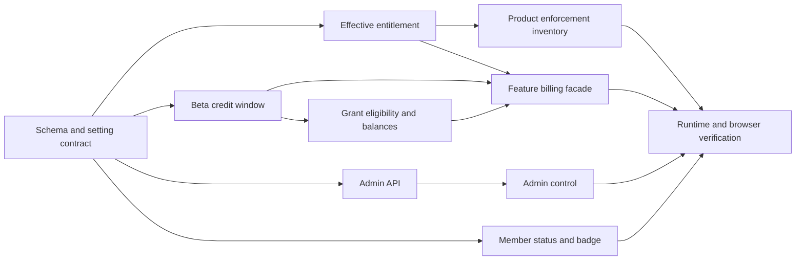

# Beta Mode — Global Pro Max Access and Credits Implementation Plan

> **Status**: `implemented`
> **Depends on**: [`01-security-and-multitenancy`](../01-security-and-multitenancy/spec.md),
> [`30-stripe-billing-platform`](../30-stripe-billing-platform/spec.md)
> **Blocks**: nothing
> **Reality check**: beta mode is a single-row `platform_beta_mode` table read through one seam,
> `getBetaModeState`, and applied by `applyBetaModeEntitlement`, which raises only `tier` and
> `paidActionsAllowed` and leaves seats, status and `paymentBlocked` untouched. Grants are minted
> only when `rateCard.maxUnits > 0`, carry a `beta-mode:` source reference, and are excluded from
> every balance unless the caller passes the active reference — `coalesce` on that comparison is
> load-bearing, because `NULL LIKE 'beta-mode:%'` is NULL and a legacy grant with a null
> reference would otherwise vanish from every balance.

> **For agentic workers:** REQUIRED SUB-SKILL: use `executing-plans` to implement
> [`tasks.md`](./tasks.md) task-by-task. Use subagents only when the active repository instructions
> explicitly allow delegation. Every task ends with a focused test and review gate.

**Goal:** Add one reversible platform-admin switch that gives every authenticated organization Pro
Max product capabilities and a real 700-credit monthly beta allowance without mutating billing
provenance.

**Architecture:** A dedicated singleton setting supplies an authoritative, fail-closed beta state.
A central effective-entitlement resolver overlays product access while raw billing reads stay
unchanged. Metered operations provision one promotional ledger grant per organization/UTC month and
pass a shared beta-grant eligibility predicate into reservation and balance queries, so disable is
immediate without deleting ledger history.

**Tech stack:** TypeScript, TanStack Start/Router, React, Drizzle ORM, PostgreSQL 16+, Better Auth,
Zod, Vitest, Playwright.

## Global constraints

- Repository files, comments, tests, audit actions, and UI copy are English.
- Generate the migration from the current Drizzle journal head; plan 55 currently reserves `0163`.
  Never edit, rename, or reuse an applied migration.
- `organization_entitlements` and Stripe rows are raw billing truth and are never rewritten by beta
  mode.
- Team and Pro Max are feature-equivalent through the existing `tierMeetsMinimum`; do not create a
  second rank table.
- Seats, tenant authorization, payment blocks, abuse enforcement, rate limits, and rate-card costs
  are not overridden.
- Beta credits use the existing append-only ledger and are additive to paid/purchased credits.
- Authoritative enforcement reads the setting inside the request transaction. Only display status
  may use the five-second process cache.
- Disable excludes beta grants from allocation and balance immediately; it does not delete or
  rewrite grants or ledger entries.
- All API mutations use explicit desired state and optimistic concurrency, never a blind toggle.

---

## File map and ownership

### New files

| File | Responsibility |
|---|---|
| generated `drizzle/*_platform_beta_mode.sql` and matching snapshot | Singleton setting, seed, grants, and migration history |
| `src/shared/lib/billing/beta-mode.ts` | Setting DTO, direct read, five-second display cache, optimistic write, cache invalidation |
| `src/shared/lib/billing/beta-credits.ts` | UTC window derivation, claimable allowance, advisory lock, idempotent 700-unit grant |
| `src/routes/api/admin/billing/beta-mode.ts` | Platform-admin GET/PUT contract and audit event |
| `src/routes/api/beta-mode.ts` | Minimal authenticated member status endpoint |
| `src/modules/admin/billing/BetaModeControl.tsx` | Admin state, confirmation, conflict recovery, and error UX |
| `src/modules/dashboard/hooks/useBetaModeStatus.ts` | Member status fetch with abort/unmount safety |
| corresponding unit/integration/e2e tests | Contract, race, security, UI, and full journey proof |

### Existing files with focused changes

| File/group | Change |
|---|---|
| `src/shared/lib/db/schema.ts` | Add `platformBetaMode` Drizzle table only |
| `src/shared/lib/repositories/entitlements.ts` | Add pure overlay and effective read; preserve raw read |
| `src/shared/lib/billing/feature-authorization.ts` | Use effective tier, provision beta credits, pass grant scope |
| `src/shared/lib/repositories/billing-ledger.ts` | Add shared SQL predicate for beta-grant eligibility |
| `src/shared/lib/billing/reservations.ts`, `credits.ts` | Thread active beta source reference through allocation/balance |
| `src/shared/lib/repositories/billing.ts`, `billing/contracts.ts` | Keep raw billing provenance; add labeled effective tier/capabilities/limits and spendable balance |
| `src/shared/lib/billing/auto-recharge.ts` and `src/modules/solutions/server/billing-state.ts` | Use effective balance including claimable beta units |
| product entitlement call sites listed in `tasks.md` | Switch product limits to the effective resolver |
| admin billing route and dashboard shell/menu | Mount the control and pass the member badge state as props |

## Dependency graph

## Delivery sequence

### Phase 1 — Persist and mutate one typed setting

Generate the next migration and add the singleton table, seed, and grants in the same change as the
Drizzle definition and real migration tests. Follow the established global-setting precedent in
`public_surface_indexing`: no tenant RLS, read-only app/worker access, platform write access, and no
delete grant.

Implement `beta-mode.ts` with three read shapes. The tenant transaction read is authoritative,
takes a shared transaction advisory lock, and throws a typed availability error before provider
work if PostgreSQL fails; it never continues an aborted transaction. The platform read is direct for admin state. The
cached read exists only for the member badge, has a five-second TTL, and degrades to disabled. The
platform write locks the row, checks `expectedRevision`, performs a same-state no-op or one
revisioned update, and invalidates the process cache after commit.

The admin route validates an exact body, requires recent authentication for PUT, returns 409 with
current state on a stale revision, counts organizations once for audit context, and uses the existing
`auditPlatformAdminAction` shape. It does not invent a second telemetry system.

**Gate:** migration integrity/replay, role-grant test, beta setting unit tests, admin route unit tests,
type checking.

### Phase 2 — Establish one effective-entitlement boundary

Add a pure `applyBetaModeEntitlement` and an I/O wrapper. The pure function is where all semantics
are pinned: free/pro rise to Pro Max, Pro Max/Team retain their tier, raw tier and seat limit are
preserved, and payment blocks still deny paid actions.

Update `checkEntitlement` to consume the effective resolver. Preserve current flag-off behavior,
including `unknown_feature`, `no_subscription`, and `tier_too_low` regression cases. Then replace
only product-enforcement reads at the inventoried call sites. Billing summaries keep their raw tier,
status, period, and seats but project effective product capability/limits separately. Do not change
organization lifecycle, seat enforcement, checkout, Stripe projection, dunning, refunds, or
operator grants.

**Gate:** resolver matrix tests, feature-authorization regression tests, focused route tests for
alerts/queries/builders/search/sprints/AI, and an `rg` inventory review showing every remaining raw
read is intentionally billing/seat/provenance scoped.

### Phase 3 — Create and constrain real beta credits

Implement pure UTC window derivation first. A window key includes organization id and month because
`billing_credit_grants.monthly_window_key` is globally unique. The source reference is exactly
`beta-mode:YYYY-MM`; the expiry is the next UTC month boundary.

`ensureBetaMonthlyCreditGrant` takes a transaction advisory lock for organization/month before
calling `grantCredits`. The grant uses `source: 'promotional'`, 700 units, deterministic
idempotency/monthly-window keys, and the existing credit-write role. A concurrent integration test
must race two first reservations against real PostgreSQL and assert one grant/ledger entry.

Extend the active-grant SQL predicate with an explicit beta scope. Non-beta grants always remain
eligible. Beta grants are eligible only when their source reference exactly equals the active
month's reference. Thread that scope through reservation and extension, spendable balance, tenant
billing DTO, auto-recharge, and the Solutions balance adapter. Keep raw worker/dunning/admin reads
available for expiry, reconciliation, and audit.

Expose the unpersisted current-month allowance as claimable balance when no beta grant exists yet.
This keeps read-only action DTOs accurate without turning GET into a financial write; the first
reservation remains the only provisioning boundary.

Read beta state once inside `feature-authorization.reserveCredits`. For a non-zero operation:
authorize, provision, then reserve with that same state snapshot. Zero-unit operations do not create
a grant. `extendReservation` performs a fresh authoritative read and applies the current grant
scope before allocating more units. Provider work still starts only after reservation succeeds and
must stop if an extension is refused.

**Gate:** UTC edge tests, duplicate/race integration test, allocation order tests, off/on/off balance
tests, pack/subscription preservation tests, and existing billing/abuse suites.

### Phase 4 — Add narrow operator and member UX

Place `BetaModeControl` above `BillingOperationsPage` on `/admin/billing`. Confirmation copy must
state the organization scope, Pro Max capabilities, additive 700 monthly beta credits, preserved
billing/seat state, and the effect of disabling. A 409 reloads authoritative state and tells the
admin another operator changed it; generic failures keep the current screen state and permit retry.

Expose only `{ enabled, revision }` from authenticated `GET /api/beta-mode`. A dedicated hook loads
that status once per dashboard mount and cancels on unmount. Pass `betaModeEnabled` through the
shell; `UserMenu` remains presentational and never imports a server database module. Render a text
badge in the menu, not an icon-only mystery state or a toast requiring local transition history.

**Gate:** route auth/method tests, component pending/error/conflict tests, menu accessibility test,
and desktop/mobile browser checks.

### Phase 5 — Verify rollout and rollback with real behavior

Run the complete static, migration, security, billing, route-method, and e2e gates from `tasks.md`.
The browser journey uses two sessions (platform admin and free tenant): prove denial before enable,
access and one ledger grant after enable, unchanged raw tier/seat values, immediate exclusion after
disable, same-month remainder restoration after re-enable, and monthly-boundary rollover with an
injected clock at the service layer.

Write `docs/operations/beta-mode-runbook.md` with the admin route, enable/disable checklist,
observability queries that redact tenant data, expected audit actions, failure symptoms, and the
reviewed emergency SQL fallback. Ship disabled; enabling production is a separate outward-facing
operator action and requires confirmation at execution time.

## Commit and review boundaries

1. `feat(db): add platform beta mode setting`
2. `feat(admin): add revisioned beta mode API`
3. `feat(entitlements): add beta access overlay`
4. `feat(billing): add monthly beta credit grants`
5. `feat(billing): exclude inactive beta grants from spend`
6. `feat(admin): add beta mode control`
7. `feat(ui): show authenticated beta status`
8. `test(beta): certify enable disable and rollover`
9. `docs(beta): add operations runbook`

The implementer may combine adjacent commits when repository policy prefers fewer commits, but each
review boundary must still pass its focused gate. Do not stage unrelated dirty-worktree changes.

## Risks and mitigations

| Risk | Mitigation | Proof |
|---|---|---|
| UI says Pro Max while provider work still requires Stripe | Central effective resolver replaces the subscription-only check | feature authorization + browser journey |
| A disabled beta grant remains spendable by a paid org | Shared SQL eligibility predicate, used by reserve, extend, and balance | off-state reservation integration test |
| Read-only action state reports zero before lazy provisioning | Add claimable current-window units without writing from GET | Solutions state + first-reservation test |
| Two first requests mint 1,400 credits | Transaction advisory lock plus ledger idempotency | real PostgreSQL concurrency race |
| An in-flight old-state reservation commits after disable returns | Shared/exclusive transaction advisory lock; admin update waits without app UPDATE privilege | lock-order integration test and post-commit e2e |
| Beta changes seat or billing truth | Raw/effective split; seat/billing call sites stay raw | DTO and seat regression tests |
| Paid value is lost to force an exact 700 total | Promotional grant is additive; no paid grant mutation | ledger source assertions |
| Re-enable resets consumed credits | Same UTC-month grant is reused; no generation reset | off/on same-month remainder test |
| Migration collides with plan 55 or 59 | Generate from then-current head, never reserve a number | migration integrity gate |
| Client bundle imports Node/Postgres code | Member endpoint + presentational props; no server import in UI | production build/client-boundary test |

## Rollback order

1. Disable through the authenticated admin PUT and verify revision/audit response.
2. Confirm a free tenant is denied and beta units are excluded while paid/pack units remain.
3. If code rollback is needed, revert UI and enforcement commits while leaving the additive table
   and append-only ledger history in place.
4. Never edit the applied migration or delete ledger entries. A later reviewed contraction migration
   may remove the table only after no deployed version reads it and every beta grant has expired.
