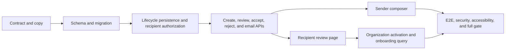

# Personalized organization invitations — Delivery Plan

> **Status**: `implemented`
> **Depends on**: [`27-team-accounts`](../../implemented/27-team-accounts/spec.md)
> **Blocks**: nothing
> **Reality check**: implementation extends the current organization lifecycle, invitation
> routes, Team settings page, email sender, and `/onboarding/search` route. It does not create a
> second organization service, call the search federation from the invitation page, or depend on
> pending phase-2 segmentation or beta-mode work. Generate the migration from the then-current
> Drizzle head; `0162` is the head at review time. The plan is canonical position `59`, after the
> already-existing UI plans and the independently scoped beta-mode plan.

## Delivery invariants

1. **Authenticate before validation or disclosure.** The public route remains a sign-in
   trampoline. Only a verified matching email receives a review DTO.
2. **One context model.** Intent values, labels, copy, normalization, and suggested queries live
   in one client-safe module shared by API, email, sender preview, recipient review, and
   onboarding handoff.
3. **Static preview, real behavior.** Preview cards describe real product capabilities without
   live provider calls, fake people, or pre-membership entitlement promises.
4. **Atomic transaction preserved.** Membership acceptance remains one conditional
   `acceptInvitationRecord(invitationId, userId)` transaction, extended to report a lost race;
   organization activation follows a committed membership and has an explicit partial-success
   response.
5. **Every state transition is race-safe.** Accept and decline update only pending rows; resend
   keeps its fresh-ID behavior; the existing unique pending-invitation index remains authoritative.
6. **Migration artifacts are atomic.** Schema, generated SQL/snapshot/journal, integrity manifest,
   and migration test land together.

## Dependency flow

## Phase 0 — Pin contracts and regression boundaries

### Outcome

The implementation has a single typed personalization model and tests first capture the
security and compatibility properties that later phases must preserve.

### Implementation

- Create `src/shared/lib/organizations/invitation-personalization.ts` with
  `INVITATION_INTENTS`, `InvitationIntent`, strict Zod input normalization, UI labels, three
  capability bullets per intent, email lead copy, and `INVITATION_SUGGESTED_QUERY`.
- Treat missing intent as `other`; trim role title, turn empty into `null`, and reject more than
  120 characters.
- Add focused unit tests for every intent, normalization boundary, complete `Record` maps, and
  stable non-empty suggested queries.
- Extend lifecycle tests before production code so wrong email, unverified email, non-pending
  state, expiry, and fabricated ID are indistinguishable for review/reject as they already are
  for accept.

### Exit gate

The new pure-module tests pass and the lifecycle security tests fail only on the intentionally
missing review/reject implementation.

## Phase 1 — Add nullable persistence safely

### Outcome

Every invitation can carry `invitationIntent` and `roleTitle`, with database constraints and
legacy-null compatibility.

### Implementation

- Add the two columns and checks to `organizationInvitations` in
  `src/shared/lib/db/schema.ts`.
- Run `pnpm exec drizzle-kit generate --name invitation_personalization` after confirming the current head
  in `drizzle/meta/_journal.json`. Do not name or edit an existing migration.
- Inspect the generated SQL for exactly the additive columns and constraints; no drops,
  renames, unrelated indexes, policy changes, or grants are expected.
- Regenerate `drizzle/migration-hashes.json` with the repository integrity writer, then verify it
  cleanly. Run the migration twice against the disposable local migration verifier and confirm
  legacy rows read as null.

### Exit gate

Migration integrity, local migration replay, schema tests, and type checking pass. Existing RLS
and grants are unchanged because columns inherit the table's current policies and privileges.

## Phase 2 — Extend the lifecycle without widening trust

### Outcome

Creation, duplicate handling, resend, review, accept, and decline all carry the new data through
one lifecycle boundary.

### Implementation

- Extend `InvitationRecord`, lifecycle dependency inputs, and database projections with
  `invitationIntent: InvitationIntent | null` and `roleTitle: string | null`.
- Persist normalized data on create. Preserve it when resend mints a fresh invitation. When a
  duplicate pending insert loses the unique-index race, return the winning row unchanged and do
  not resend or overwrite its context. Return a `deduplicated` marker so the UI cannot claim a
  new invitation or context was sent.
- Factor the recipient eligibility predicate used by review, accept, and reject: authenticated,
  verified matching email, pending status, and future expiry. Keep the external error exactly
  `OrganizationLifecycleError('This invitation is no longer valid', 403)` for every failure.
- Add `reviewInvitation` and `rejectInvitation`. The latter delegates to a dependency that updates
  only `status = 'pending'`; zero affected rows are an invalid/raced invitation, never success.
- Preserve `acceptInvitationRecord`'s two inputs and transaction boundary, but make it report
  whether the pending row was transitioned. A false result becomes the generic invalid response.
  Return the normalized intent-derived suggested query alongside `organizationId` only after a
  committed acceptance.
- Audit allowed and denied review/reject operations without email, title, query, or raw invite ID
  in details. Existing audit target IDs remain permitted as opaque identifiers.

### Exit gate

Lifecycle unit tests cover all transitions, legacy nulls, resend copying, duplicate winner
semantics, and accept-vs-reject races. Existing invitation lifecycle tests remain green.

## Phase 3 — Expose narrow HTTP and email contracts

### Outcome

The UI can create personalized invitations, retrieve a safe recipient review, accept with a
truthful activation result, and decline.

### Implementation

- Extend the strict authenticated create-body schema with optional `intent` and `roleTitle`.
  Continue deriving organization and inviter from the principal/session.
- Include `deduplicated: false` for a newly sent invitation and `true` when the pending unique
  index winner is returned. The sender must receive a truthful no-new-email notice for the latter.
- Add a review route with `GET` only and a reject route with `POST` only. Serialize only the
  allowlisted `InvitationReviewDto`; use the lifecycle's generic invalid response.
- Extend the accept response with `activeOrganization` and `suggestedQuery`. After acceptance,
  call the existing organization switch lifecycle operation. Catch switch failure separately so
  accepted membership returns `200` with `activeOrganization: false` rather than a false 500.
- Update organization invitation email input and HTML. Reuse shared intent copy, escape every
  variable, retain the E2E outbox and dev-link paths, and keep link/recipient logging prohibited.
- Update method-allowlist and route-coverage expectations for both new route files.

### Exit gate

API tests prove auth-before-validation, field bounds, allowlisted responses, generic failures,
race behavior, activation partial success, and zero cross-account disclosure. Email unit/outbox
tests cover all intents and hostile text escaping.

## Phase 4 — Build the sender experience

### Outcome

Authorized Team settings users compose and review a personalized invitation without losing any
current seat, permission, mutation, or dev-link behavior.

### Implementation

- Create `TeamInvitationComposer` in the existing dashboard module and a reusable
  `InvitationValuePreview` under shared components.
- Use the repository `Dialog`, `Input`, `Select`, `Button`, and form-label primitives. Implement
  details/review steps, required intent, optional bounded role title, back/edit, pending state,
  double-submit prevention, error focus, Escape handling, and trigger focus restoration.
- Change `TeamSettingsPageProps.onInvite` from positional arguments to a typed input object and
  update `src/routes/_dashboard/settings/team.tsx` to send the extended body.
- Preserve permission gating (`organization:invite`), full-seat disablement, page refresh,
  invitation list, resend/cancel behavior, and the dev-only manual link.
- Render only shared static capabilities; assert the component never fetches search or provider
  routes.

### Exit gate

Component tests cover keyboard and validation behavior, all intent previews, a successful
payload, server error retention, and double-submit prevention. Existing Team settings tests pass.

## Phase 5 — Build recipient review and onboarding handoff

### Outcome

A verified matching recipient can make an informed accept/decline decision and, after a successful
organization activation, starts the existing search onboarding with a suggested query.

### Implementation

- Keep the current session-hydration guard and sign-in redirect in
  `OrganizationInvitationPage`. Once signed in, fetch the review DTO and render the shared value
  preview with organization/role context.
- Add explicit loading, retryable network error, generic invalid, accept-pending, accepted,
  activation-fallback, reject-confirmation, reject-pending, and rejected states. Never auto-accept
  or auto-redirect before a user action.
- On accepted + active organization, navigate to `/onboarding/search` with the server-returned
  query in validated search params. On accepted + inactive organization, navigate to dashboard
  after showing truthful accepted/fallback copy; do not retry acceptance.
- Add optional `q` validation to `src/routes/onboarding/search.tsx` and initialize the editable
  input from it. Do not auto-run or persist the search.
- Keep invitation paths out of indexing and ensure the page has no external images, provider
  calls, or entitlement reads.

### Exit gate

Unit and E2E tests cover signed-out return, wrong account, legacy intent, accept, decline,
activation fallback, onboarding prefill, replay, mobile viewport, keyboard operation, and generic
anti-enumeration copy.

## Phase 6 — Integrated verification and closure

### Outcome

The feature is proven in the real local stack and the plan records reproducible evidence.

### Implementation

- Run targeted unit/API suites with at least 11 workers, then the relevant Playwright specs with
  11 workers.
- Run migration integrity, local migration replay, RLS verification, route-method/coverage checks,
  tenant-boundary checks, type checking, and lint.
- Exercise the sender → email/outbox link → signed-out sign-in return → review → accept → active
  organization → onboarding-prefill path manually in the browser. Also exercise wrong-account,
  decline, legacy-null, and activation-fallback states.
- Record commands, results, screenshots, and any environmental limitations in
  `docs/operations/personalized-invitations-verification.md`.
- Finish with a fresh, completely green `pnpm ci:local`; then update all three status headers and
  checkboxes with dated evidence.

### Exit gate

All acceptance criteria in `spec.md` have cited evidence and the repository's complete local gate
is green.

## Risk register

| Risk                                                       | Prevention                                                                                          | Proof                                          |
| ---------------------------------------------------------- | --------------------------------------------------------------------------------------------------- | ---------------------------------------------- |
| Invitation URL leaks organization context                  | Redirect signed-out users; authorize review by verified matching email; generic 403                 | API/E2E wrong-account and fabricated-ID matrix |
| Sender context becomes a user profile claim                | Name it invitation intent; never persist to user preferences; label title as sender-provided        | Contract and UI copy tests                     |
| Public page causes provider cost or person-data disclosure | Static capability copy; no search endpoint or external media                                        | Fetch-spy unit test and E2E request assertion  |
| Accept succeeds but organization switch fails              | Separate partial-success result; dashboard fallback; never retry accept                             | Lifecycle/route test with switch failure       |
| Accept/reject race yields two outcomes                     | Conditional pending-state updates; generic loser response                                           | Concurrent API test                            |
| Deduplicated create looks newly sent                       | Explicit response marker and sender notice; winning row stays unchanged                             | API/component/E2E duplicate tests              |
| Resend loses personalization                               | Copy fields into fresh record and email                                                             | Lifecycle + API resend test                    |
| Free text creates injection or oversized rows              | Trim/max in Zod and DB; React escaping; explicit HTML escaping                                      | boundary and hostile-input email tests         |
| Migration collides with parallel work                      | Generate from current journal head; never reserve a number or edit applied files                    | integrity + migration replay gates             |
| Tier copy becomes false                                    | No tier/beta numbers before membership                                                              | snapshot/copy assertions                       |
| Existing automation breaks on test IDs/routes              | Preserve current accept test ID and sign-in redirect; update existing E2E expectations deliberately | existing auth/team suites                      |

## Rollback

1. Revert recipient UI and routes to the existing generic accept page. Personalized rows remain
   harmless and nullable.
2. Revert sender UI/API extensions; legacy callers still create invitations, normalized by the
   lifecycle fallback.
3. Leave the additive columns and applied migration in place. Do not edit or delete a shipped
   migration; remove columns only through a separately reviewed contraction migration after code
   no longer reads them.
4. If onboarding handoff is faulty, return successful acceptance to `/dashboard`; this is the
   current known-good behavior.
5. If decline has a defect, hide the UI and disable the reject route while preserving existing
   pending invitations. Acceptance remains independent.

## Commit sequence

1. `feat(invitations): define personalization contract`
2. `feat(db): persist invitation personalization`
3. `feat(invitations): extend lifecycle and recipient APIs`
4. `feat(email): personalize organization invitations`
5. `feat(team): add reviewed invitation composer`
6. `feat(auth): add secure invitation review and decline`
7. `feat(onboarding): prefill accepted invitation search`
8. `test(invitations): verify personalized flow end to end`

Each commit must leave type checking and its targeted tests green. Migration artifacts stay in one
commit and are never split across branches.
