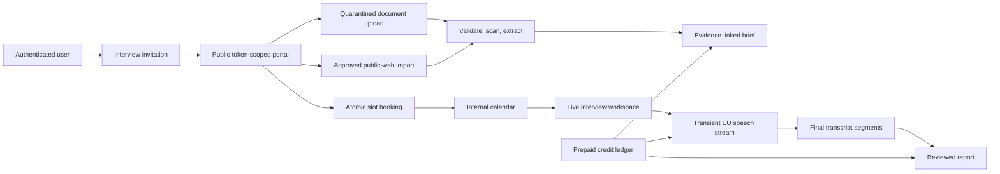

# Calendar, Scheduling, and Interview Intelligence

> **Status**: `implemented`
> **Depends on**: [`security-and-multitenancy`](../01-security-and-multitenancy/spec.md) for
> completed canonical tenant cutover/RLS, [`ai-expansion`](../21-ai-expansion/spec.md) for the
> existing AI task registry, budgets, kill switches, and structured-output validation, and
> [`stripe-billing-platform`](../30-stripe-billing-platform/spec.md) for subscriptions, credits,
> payment lifecycle, and real-time provider-cost authorization
> **Blocks**: nothing
> **Reality check**: BuilderHunt has no calendar, availability, accountless candidate scheduling,
> private object storage, live audio capture, transcription, or
> interview pages. Reusable foundations exist in `src/shared/lib/auth/tenant-principal.ts`,
> `src/shared/lib/db/tenant-context.ts`, `src/shared/lib/ai/`, `src/shared/lib/rate-limit.ts`,
> `src/shared/lib/email.ts`, and the HTTP-worker routes under `src/routes/api/admin/`. The
> [`stripe-billing-platform`](../30-stripe-billing-platform/spec.md) plan is now built (real Stripe
> adapter framework, credit ledger, reservations, checkout, dunning, refunds, disputes,
> reconciliation) and owns the Stripe and credit platform. This program defines interview rate
> cards and consumes its generic authorization contracts; it must not create a second payment or
> ledger implementation.

## Source design

The approved research and design is
[`docs/superpowers/specs/2026-07-21-calendar-scheduling-interview-intelligence-design.md`](../../../../docs/superpowers/specs/2026-07-21-calendar-scheduling-interview-intelligence-design.md).
This spec is the implementation contract. If prose differs, this file and `tasks.md` govern.

## Problem

BuilderHunt helps users discover and assess builders but stops before the interview workflow. Users
must move candidates into unrelated scheduling, storage, calendar, note-taking, transcription, and
billing tools. The result loses candidate context, creates manual work, and makes alerts/workers
invisible as time-based system activity.

Unlimited voice/AI cannot be bundled into the existing $19 Pro subscription. A 60-minute interview
costs approximately $0.78-$0.98 in external services before normal platform overhead. One user
running 100 interviews could therefore create materially more provider cost than subscription
revenue.

## Goal

Deliver one coherent program with four independently shippable capabilities:

1. A complete internal personal calendar that remains useful without external providers.
2. Accountless candidate scheduling against organizer-controlled availability.
3. Private candidate intake, evidence-linked interview preparation, consented live transcription,
   contextual questions, and a reviewed final report.
4. Prepaid usage credits with hard enforcement, Stripe top-ups, refunds, and provider-cost
   reconciliation.

The internal calendar is always canonical. Google Calendar, Microsoft Outlook, and customer BYOK
are deliberately deferred adapters.

## Non-goals

- Video conferencing, PSTN calling, screen recording, or stored audio.
- A general ATS, HRIS, payroll, offer, or employee-management system.
- Authenticated/private-page crawling, CAPTCHA bypass, stealth crawling, or automated retrieval
  from a platform whose terms or source policy prohibit it. LinkedIn remains URL-only unless an
  official API or written crawl permission is recorded.
- Automated candidate scores, ranks, hire/reject recommendations, personality inference, emotion
  recognition, voice identification, or culture-fit analysis.
- Organization-wide visibility by default; owner/admin roles do not imply candidate-data access.
- A generic distributed queue. Background work follows the existing authenticated idempotent
  HTTP-worker pattern.
- FullCalendar Premium resource/timeline views.
- Google/Microsoft sync or BYOK in this implementation program.

## Confirmed product decisions

- Calendar records are owned by one user inside one organization.
- The organizer defines availability, duration, buffers, notice, horizon, timezone, and modality;
  the candidate chooses a derived free slot.
- Candidates use an expiring public capability and never need an account.
- BuilderHunt operates beside an in-person interview or external meeting URL.
- Jobs and alert windows are read-only calendar projections; results show actual execution time.
- Audio is streamed transiently to an EU endpoint and never stored by BuilderHunt.
- Booking requires affirmative acceptance of the current terms/privacy notice and separate,
  unticked, versioned consent for candidate-document processing, approved public-web import,
  AI-assisted interview preparation/reporting, and transient live-audio transcription. The public
  portal cannot confirm a slot until every required purpose is accepted.
- Consent authorizes only the purposes disclosed at booking; it is not blanket permission for
  unrelated processing. Withdrawal remains available after booking and stops future affected
  processing. Withdrawing live transcription changes the appointment to manual-only rather than
  cancelling it.
- Approved public personal/project websites are imported through the existing enrichment safety
  envelope. LinkedIn/X/Meta content is not fetched without source-level authorization even when a
  candidate submitted the URL.
- Candidate data is never used to train or improve models.
- Calendar/scheduling do not consume credits. Provider-backed preparation, transcription, and
  reports do.

## User stories

### Organizer

1. As a user, I can create, edit, move, resize, recur, cancel, and inspect private calendar events.
2. As a user, I can define weekly availability and date-specific exceptions in my timezone.
3. As a user viewing a tracked builder, I can create and send an interview invitation.
4. As a user, I can see invitation open/book/decline/expire/revoke state without exposing other
   candidates.
5. As a user, I receive a confirmed event only when a slot is atomically revalidated and booked.
6. As a user, I can review clean candidate documents and an evidence-linked interview brief.
7. As a user, I can conduct an interview with manual notes even when voice or AI is unavailable.
8. As a user, I can optionally capture microphone and supported shared-call audio, see a live
   transcript, correct speakers, and use contextual questions.
9. As a user, I review and edit the final report before it becomes final.
10. As a user, I can see remaining credits, exact consumption, low-balance warnings, and top up
    without a surprise bill.

### Candidate

1. As a candidate, I can open an invitation, choose a timezone, and book without registering.
2. As a candidate, I can upload a CV/documents, add public links, preview every required processing
   purpose, and explicitly accept them while booking.
3. As a candidate, I can decline, cancel, or reschedule within the organizer's policy.
4. As a candidate, I can withdraw a previously granted processing purpose after booking;
   withdrawing transcription makes the interview manual-only without losing the appointment.
5. As a candidate, I receive email confirmation and a standards-compliant `.ics` file.

### Operator

1. As an operator, I can disable storage, sensitive AI, transcription, or payments independently.
2. As an operator, I can reconcile provider duration/tokens against the immutable credit ledger.
3. As an operator, I can see redacted latency, error, cost, worker, and retention metrics.
4. As an operator, I can prove tenant isolation, deletion, provider-region, and no-audio-storage
   behavior.

## Architecture

Use a modular monolith inside the existing TanStack Start deployment.



### Domain modules

- `src/lib/calendar/`: server services, recurrence expansion, projections, and reminders.
- `src/lib/scheduling/`: invitation, slots, booking, capabilities, and document processing.
- `src/lib/enrichment/`: reused source-policy, robots, and SSRF-safe public-web import; no parallel
  crawler is introduced.
- `src/lib/storage/`: storage contract, R2 adapter, ClamAV stream client, and extraction.
- `src/lib/interviews/`: brief/report orchestration, live sessions, sensitive provider, and
  transcription contracts.
- `src/modules/interviews/billing.ts`: interview-only rate-card estimates and calls to the billing
  platform's feature-authorization contracts; no payment or ledger implementation.
- `src/shared/lib/calendar.ts`, `scheduling.ts`, `interviews.ts`: pure schemas, state machines, and
  calculations shared with UI/tests.
- `src/shared/lib/repositories/{calendar,scheduling,interviews}.ts`: tenant-only persistence
  accepting a transaction, never the global database.
- `src/modules/{calendar,scheduling,interviews}/`: feature UI.

### Provider contracts

- Private storage: Cloudflare R2, private Standard bucket, EU jurisdiction, S3-compatible adapter.
- Speech-to-text: Deepgram EU first, AssemblyAI-compatible contract later.
- Sensitive text AI: an **EU-processed provider behind `SensitiveAIProvider`**, selected by
  `SENSITIVE_AI_PROVIDER`. Primary is **Mistral (La Plateforme, France)** with a pinned dated
  model; the previously specified Azure OpenAI EU deployment is retained as the fallback.
  Never silently fall back to MiniMax.
  Provisioning changed this on 2026-07-26: with Azure, EU-ness is a per-deployment property
  `env.ts` cannot see, so a Global Standard deployment passes validation while processing
  outside the EU. Mistral makes EU the default and the US endpoint an explicit opt-in, so the
  guard can be exact rather than a hostname heuristic. Rationale, cost comparison and the
  counter-arguments: `docs/operations/interview-provider-register.md` §4.
- Billing dependency: [`stripe-billing-platform`](../30-stripe-billing-platform/spec.md) owns Stripe,
  subscriptions, packs, ledger, tax, refunds, disputes, and reconciliation.
- Calendar UI: FullCalendar Standard with day-grid, time-grid, list, interaction, and RRule plugins.

## Data classification and ownership

| Resource                              | Class                                            | Canonical owner                      | Read policy                                                                     |
| ------------------------------------- | ------------------------------------------------ | ------------------------------------ | ------------------------------------------------------------------------------- |
| User calendar, events, availability   | Tenant private                                   | `organization_id` + `owner_user_id`  | owner; explicitly authorized participant where applicable                       |
| Invitation and candidate submission   | Tenant private                                   | organizer calendar owner             | owner and explicitly added internal interview participants                      |
| Candidate document/web extraction     | Tenant private                                   | invitation owner                     | owner/explicit participants; public capability can submit its own evidence only |
| Brief, transcript, suggestion, report | Tenant private                                   | interview owner                      | owner/explicit participants only                                                |
| Consent evidence                      | Account/candidate subject within tenant workflow | consent subject + invitation/session | subject-capability operations and authorized owner privacy workflow             |
| Operational schedule/run              | System operational                               | stable job identity                  | redacted projection to applicable user; operator detail only                    |
| Credit grant/ledger/provider usage    | Tenant private financial                         | organization entitlement             | owner/admin read; owner-only payment actions; operator reconciliation           |

Every tenant relation includes `organization_id` in its foreign key. Creator or participant user IDs
never replace tenant ownership. Authorization fields are typed columns, not JSON.

## Data model

### Calendar and scheduling

- `user_calendars`: personal settings and IANA timezone; unique default per organization/user.
- `calendar_events`: canonical one-off or recurring event, UTC instants plus original timezone,
  busy flag, visibility, source mapping, optimistic `version`, and soft lifecycle state.
- `calendar_event_occurrences`: deterministic materialization for range reads, conflict checks, and
  reminders; unique `(organization_id, event_id, recurrence_id)`.
- `calendar_event_reminders`: event/occurrence-relative offset, channel, recipient, state, next
  attempt, attempts, and unique delivery key.
- `calendar_notification_deliveries`: idempotent reminder/invitation/reschedule/cancellation
  delivery/read state with redacted provider reference.
- `event_participants`: internal user or external contact, participant role, response, and explicit
  access semantics.
- `availability_rules`: effective range, weekdays, local wall-clock interval, slot duration,
  buffers, minimum notice, and booking horizon.
- `availability_overrides`: local date/range marked available or blocked.
- `scheduling_invitations`: organizer, optional tracked builder identity, role context, duration,
  validity/policy, status, capability hash, and booked event reference.
- `candidate_submissions`: name, normalized email, notes, and submitted timestamp.
- `candidate_links`: normalized URL, source type, acquisition mode, label, candidate authorization
  attestation/version, policy decision, import state, and validation state.
- `candidate_web_imports`: final URL, source-policy version, robots result, fetched/content hashes,
  media type, HTTP validators, extraction version, bounded text, evidence map, status/error, and
  retention expiry. Response HTML is transient and is never rendered or retained.

### Documents and interviews

- `candidate_documents`: generated object key, original display name, detected media type, checksum,
  bytes, scan/extraction status, rejection code, and retention expiry.
- `document_extractions`: parser/version, content hash, normalized plain text, section/page map, and
  safe error code.
- `interview_briefs`: event, version, status, validated structured content, evidence manifest,
  provider/model/prompt version, editor, and expiry.
- `interview_sessions`: event, state, capture mode, language, provider, consent version, heartbeat,
  and provider-billed duration.
- `transcript_segments`: stable provider segment ID, sequence, speaker estimate/mapping, final text,
  timestamps, confidence, correction metadata, and expiry.
- `interview_suggestions`: question, rationale, evidence segment IDs, used/saved/dismissed state.
- `interview_reports`: versioned validated report plus evidence segment IDs and expiry.
- `privacy_consents`: purpose, policy version, grant/withdraw timestamps, subject, and minimal
  request evidence.

### Operations and usage

- `operational_schedules`: stable job key, cron expression/timezone, scope, next run, and enabled
  state.
- `job_runs`: scheduled/actual times, state, counters, duration, and redacted error code.
- Interview provider usage attaches external duration/token/request evidence to the billing
  platform's reservation and provider-usage records. All credit, ledger, Stripe, refund, and
  reconciliation persistence is defined and migrated by the billing platform.

The normative column dictionary, indexes, constraints, composite foreign keys, and RLS policies are
defined below and must be copied into Drizzle without route-level invention.

### Normative persistence contract

Conventions for every new tenant table: `id uuid primary key default gen_random_uuid()`,
`organization_id text not null`, `created_at timestamptz not null default now()`, and
`updated_at timestamptz not null default now()` unless the table is declared append-only. Every
tenant parent exposes `unique (organization_id,id)`; every tenant child references that pair.
User references are `text` FKs to `auth_users.id`. State/type values are `text` plus named checks,
not PostgreSQL enums. Money is integer minor units; credits and durations are non-negative
integers. Structured AI content is validated JSONB; authorization never lives in JSONB.

| Table                              | Required table-specific columns and invariants                                                                                                                                                                                                                                                                                                                                                                                                                                                                           |
| ---------------------------------- | ------------------------------------------------------------------------------------------------------------------------------------------------------------------------------------------------------------------------------------------------------------------------------------------------------------------------------------------------------------------------------------------------------------------------------------------------------------------------------------------------------------------------ |
| `user_calendars`                   | `owner_user_id text`, `name text`, `timezone text`, `is_default boolean default false`, `color text`, `default_reminder_offsets integer[]`, `default_reminder_channels text[]`; unique default per `(organization_id,owner_user_id)`                                                                                                                                                                                                                                                                                     |
| `calendar_events`                  | `calendar_id uuid`, `owner_user_id text`, `type text`, `status text`, `title text`, `description text null`, `location text null`, `meeting_url text null`, `starts_at/ends_at timestamptz`, `timezone text`, `all_day boolean`, `busy boolean`, `visibility text default 'private'`, `rrule text null`, `recurrence_until timestamptz null`, `version integer default 1`, `source_type/source_id text null`, `cancelled_at timestamptz null`; `ends_at > starts_at`, private-only visibility, source pair null together |
| `calendar_event_occurrences`       | `event_id uuid`, `recurrence_id text`, `starts_at/ends_at timestamptz`, `status text`, `materialization_version integer`; unique event/recurrence ID and range indexes                                                                                                                                                                                                                                                                                                                                                   |
| `event_participants`               | `event_id uuid`, exactly one of `user_id text` or `external_email text`, `display_name text null`, `role text`, `response text`, `access_granted boolean`, `responded_at timestamptz null`; unique participant identity per event                                                                                                                                                                                                                                                                                        |
| `calendar_event_reminders`         | `event_id uuid`, `participant_id uuid null`, `channel text`, `offset_minutes integer`, `enabled boolean`, `next_fire_at timestamptz null`, `state text`, `attempts integer`, `last_error_code text null`; unique event/participant/channel/offset                                                                                                                                                                                                                                                                        |
| `calendar_notification_deliveries` | `event_id uuid`, `reminder_id uuid null`, `kind text`, `recipient_user_id text null`, `external_recipient_hash text null`, `idempotency_key text unique`, `provider_reference text null`, `state text`, `attempted_at/delivered_at/read_at timestamptz null`, `error_code text null`; exactly one recipient form                                                                                                                                                                                                         |
| `availability_rules`               | `owner_user_id text`, `timezone text`, `weekdays integer[]`, `local_start/local_end time`, `effective_from/effective_until date null`, `slot_minutes/buffer_before_minutes/buffer_after_minutes/min_notice_minutes/horizon_days integer`, `enabled boolean`; bounded positive checks and no overnight rule                                                                                                                                                                                                               |
| `availability_overrides`           | `owner_user_id text`, `local_date date`, `local_start/local_end time null`, `kind text`, `timezone text`; blocked-day rows have null times, available rows require valid times                                                                                                                                                                                                                                                                                                                                           |
| `scheduling_invitations`           | `owner_user_id text`, `organization_builder_id text null`, `role_title/role_context text`, `duration_minutes integer`, `timezone text`, `modality text`, `meeting_url/location text null`, `status text`, `capability_hash text unique`, `expires_at/opened_at/booked_at/revoked_at timestamptz null`, `booked_event_id uuid null`, `reschedule_count integer`, `policy_version text`, `version integer`                                                                                                                 |
| `candidate_submissions`            | `invitation_id uuid unique`, `display_name text`, `email_normalized text`, `notes text null`, `submitted_at timestamptz null`, `retention_expires_at timestamptz`; email is encrypted or field-level protected according to the security plan                                                                                                                                                                                                                                                                            |
| `candidate_links`                  | `submission_id uuid`, `url text`, `normalized_url text`, `source_type text`, `acquisition_mode text`, `authorization_notice_version text null`, `authorization_attested_at timestamptz null`, `policy_decision text`, `import_state text`, `label text null`; unique submission/normalized URL                                                                                                                                                                                                                           |
| `candidate_web_imports`            | `candidate_link_id uuid`, `final_url text`, `source_policy_version text`, `robots_result text`, `fetched_at timestamptz`, `http_etag/http_last_modified text null`, `response_sha256/content_sha256 text`, `media_type text`, `bytes integer`, `extraction_version text`, `extracted_text text`, `evidence_map jsonb`, `status/error_code text`, `retention_expires_at timestamptz`; one active import per link/content hash                                                                                             |
| `candidate_documents`              | `submission_id uuid`, `object_key text unique`, `original_name text`, `declared/detected_media_type text`, `sha256 text`, `bytes integer`, `scan_status/extraction_status text`, `rejection_code text null`, `retention_expires_at timestamptz`; no public URL or audio MIME                                                                                                                                                                                                                                             |
| `document_extractions`             | `document_id uuid`, `parser/parser_version text`, `content_sha256 text`, `plain_text text`, `evidence_map jsonb`, `status/error_code text`, `retention_expires_at timestamptz`; unique document/parser version/content hash                                                                                                                                                                                                                                                                                              |
| `privacy_consents`                 | append-only: `invitation_id uuid`, `session_id uuid null`, `subject_email_hash text`, `purpose text`, `notice_version text`, `decision text`, `decided_at timestamptz`, `withdrawn_at timestamptz null`, `request_evidence_hash text`, `supersedes_id uuid null`; unique subject/purpose/notice/decision idempotency key                                                                                                                                                                                                 |
| `interview_briefs`                 | `event_id uuid`, `owner_user_id text`, `version integer`, `status text`, `content jsonb`, `evidence_manifest jsonb`, `provider/model/prompt_version text null`, `edited_by_user_id text null`, `retention_expires_at timestamptz`; unique event/version                                                                                                                                                                                                                                                                  |
| `interview_sessions`               | `event_id uuid`, `owner_user_id text`, `state/capture_mode/language/provider text`, `consent_notice_version text`, `browser_name/browser_major text null`, `capture_capability text`, `started_at/paused_at/finished_at/heartbeat_at timestamptz null`, `provider_request_id text null`, `provider_billed_seconds integer`, `version integer`                                                                                                                                                                            |
| `transcript_segments`              | `session_id uuid`, `provider_segment_id text`, `sequence integer`, `speaker_estimate/speaker_mapping text`, `text text`, `starts_ms/ends_ms integer`, `confidence numeric null`, `corrected_by_user_id text null`, `corrected_at timestamptz null`, `retention_expires_at timestamptz`; unique session/provider segment and session/sequence                                                                                                                                                                             |
| `interview_suggestions`            | `session_id uuid`, `sequence integer`, `question/rationale text`, `evidence_segment_ids uuid[]`, `state text`, `prompt_version text`, `created_at timestamptz`; unsaved provider output is not inserted                                                                                                                                                                                                                                                                                                                  |
| `interview_reports`                | `event_id uuid`, `version integer`, `status text`, `content jsonb`, `evidence_segment_ids uuid[]`, `provider/model/prompt_version text null`, `edited_by_user_id text null`, `finalized_at timestamptz null`, `retention_expires_at timestamptz`; unique event/version                                                                                                                                                                                                                                                   |
| `operational_schedules`            | system-operational UUID, `job_key text unique`, `cron_expression/timezone/scope text`, `enabled boolean`, `next_run_at/last_projected_at timestamptz null`, `version integer`; app role read through DTO only, worker writes                                                                                                                                                                                                                                                                                             |
| `job_runs`                         | append-only system-operational UUID, `job_key text`, `organization_id text null`, `scheduled_at/started_at/finished_at timestamptz`, `state text`, `attempt/in_count/out_count/duration_ms integer`, `error_code text null`, `idempotency_key text unique`                                                                                                                                                                                                                                                               |

RLS is deny-by-default. Calendar owners receive CRUD on their rows; explicitly granted internal
participants receive read-only event/interview access; organization admins receive no implicit
candidate access; public capabilities never connect with a database role; worker policies name the
specific occurrence, delivery, import, retention, and job-run commands they need. Billing grants,
reservations, ledger, provider-usage, Stripe mappings/events, and financial-write policies are
normatively defined by `stripe-billing-platform` and are not part of this migration.

## State contracts

```text
Invitation: draft -> sent -> opened -> booked
                          -> declined | expired | revoked

Appointment: scheduled -> confirmed -> in_progress -> completed
                       -> cancelled | rescheduled | no_show

Document: pending_upload -> uploaded -> scanning -> extracting -> ready
                                      -> rejected | failed

Interview: not_started -> consent_pending -> ready -> live -> processing -> review -> finalized
                                               -> paused | failed | abandoned

Credit reservation: pending -> reserved -> partially_consumed -> settled
                                      -> released | refunded | expired
```

Only domain transition functions change state. Routes cannot update state columns directly.

## Scheduling correctness

- Persist instants as `timestamptz` and preserve IANA timezone separately.
- Availability uses local wall-clock values plus IANA timezone.
- Omit nonexistent DST times and label/disambiguate repeated times.
- Subtract busy occurrences, confirmed appointments, overrides, buffers, minimum notice, and
  booking horizon before returning slots.
- Return opaque availability only; never reveal the event causing a conflict.
- Booking acquires a transaction advisory lock derived from organizer/date, recomputes the slot,
  and atomically creates event/participant, marks invitation booked, and writes email outbox rows.
- A race loser receives `409 slot_unavailable` and refreshed alternatives.
- Event mutation uses optimistic `version`; stale writes return `409 event_changed`.

## Complete calendar behavior

- Views: month, week, day, agenda/list, today, date navigation, timezone selector, layer filters,
  and an accessible mobile agenda. Search filters title, participant, event type, and date range.
- Event creation supports timed/all-day events, location or meeting URL, busy/free, participants,
  recurrence, reminder offsets, and private notes. Overlap is allowed for manual personal events
  after a warning; confirmed interview booking treats busy overlap as a hard conflict.
- Recurrence accepts the supported RFC 5545 subset `FREQ=DAILY|WEEKLY|MONTHLY|YEARLY`, `INTERVAL`,
  `BYDAY`, `BYMONTHDAY`, `COUNT`, and `UNTIL`, plus exception dates. Unsupported rules are rejected,
  not approximated.
- Editing/deleting a recurring occurrence always asks for `this occurrence`, `this and following`,
  or `entire series`. `this` creates an exception/override; `following` truncates the old series and
  creates a linked successor; `entire series` increments the series version and rematerializes.
- Default reminders are configurable per user. Per-event reminders support in-app and email at
  `0`, `5`, `10`, `15`, `30`, `60`, `1440`, or `10080` minutes before start. Deliveries use a unique
  occurrence/recipient/channel/offset key, retry transient errors, and never resend after event
  cancellation or recipient removal.
- In-app notifications appear in a calendar notification drawer with unread count, mark-read, event
  navigation, and no candidate content in browser push. Native OS/web-push delivery is not promised
  in v1.
- Participant changes and interview confirmation/reschedule/cancellation generate email plus `.ics`
  `REQUEST`/`CANCEL` updates with stable UID and increasing SEQUENCE. External participant response
  updates require an event-scoped capability.
- Calendar export returns an authenticated bounded `.ics` snapshot. Calendar import and external
  two-way sync remain follow-up scope. The UI is online-first; optimistic writes recover from
  version conflict, and no offline mutation queue is promised in v1.

## Public capability security

- Generate 256 random bits; store only SHA-256 hash and expiry/revocation state.
- Put the secret in the emailed URL fragment, exchange once through
  `POST /api/public/scheduling/:invitationId/session`, call `history.replaceState`, and issue a
  short-lived `HttpOnly`, `Secure`, `SameSite=Lax`, invitation-scoped cookie.
- Public pages use `Referrer-Policy: no-referrer`, no third-party analytics, and strict CSP.
- The capability permits only allowlisted read/update operations for one invitation/submission.
- Rate limits combine invitation, IP, operation, and organization-derived server scope.
- Responses are non-enumerating and never reveal organization IDs, internal conflicts, object keys,
  or candidate-account existence.

## Private file contract

- Formats: PDF, DOCX, and TXT.
- Limits: 10 MB each, 25 MB total per invitation.
- Upload directly to generated quarantine keys with short-lived signed requests and checksum.
- Validate extension, expected key, actual bytes, detected media type, magic bytes, and checksum.
- Stream every object through ClamAV before moving/copying to the clean private prefix.
- Parse clean PDF/DOCX/TXT deterministically; never send raw binary to the LLM.
- Reject encrypted, corrupt, suspicious, mismatched, or unsupported files with safe error codes.
- Authorize every download and issue a five-minute signed URL.
- Original filename is display metadata only.
- Candidate URLs are imported only when the source registry returns `official_api` or
  `authorized_crawl`. A personal/project host becomes eligible for `authorized_crawl` only after the
  candidate positively attests that they own or are authorized to submit that public site for this
  disclosed import; the attestation is versioned and does not override robots or platform terms.
  The import reuses `src/lib/enrichment/network.ts`, `policies.ts`, and
  `robots.ts`: HTTPS only, honest user agent, public DNS/IP validation on every hop, credentials and
  nonstandard ports forbidden, redirects revalidated, robots fail-closed, host concurrency/rate
  limits, 10-second timeout, five redirects, HTML/text/PDF only, and 2 MB response limit.
- JavaScript is not executed. Raw HTML is parsed in isolation, scripts/styles/forms/iframes and
  active content are removed, visible text plus title/headings/canonical URL are normalized, then
  the response body is discarded. Imported text is untrusted evidence and receives stable source
  IDs before AI use.
- LinkedIn, X, Facebook, and Instagram remain `user_submitted` URL evidence only until their source
  policy records official API access or written crawl permission. A candidate's consent does not
  override a third-party platform's access terms.

## HTTP contract

All authenticated mutations require tenant principal, CSRF/origin validation, Zod input, explicit
DTO output, audit, and idempotency where named. Public endpoints require the invitation-scoped
cookie and return the same `404 invitation_unavailable` for unknown, revoked, expired, or foreign
resources. Common errors are `400 invalid_input`, `401 authentication_required`, `403 forbidden`,
`404 not_found`, `409 state_changed|slot_unavailable|insufficient_credits`, `413 too_large`,
`415 unsupported_media_type`, `422 consent_required|source_not_importable`, `429 rate_limited`, and
`503 dependency_unavailable`.

| Method and route                                               | Authority           | Normative request/result                                                                                                                                         |
| -------------------------------------------------------------- | ------------------- | ---------------------------------------------------------------------------------------------------------------------------------------------------------------- | ---------------------------------------------------------------- | --------------------------------------------- |
| `GET /api/calendar/feed?from&to&timezone&layers[]`             | user                | Bounded half-open range; returns discriminated `event`, `job_projection`, `alert_projection`, `job_run`, and `alert_result` DTOs plus `generatedAt/staleSources` |
| `POST /api/calendar/events`                                    | user                | Event draft including recurrence/reminders/participants; returns event and materialization version                                                               |
| `PATCH/DELETE /api/calendar/events/:id`                        | owner               | Requires `version` and recurrence scope `this                                                                                                                    | following                                                        | series`; returns updated/tombstoned resources |
| `GET/PUT /api/calendar/availability`                           | owner               | Versioned rules/overrides/default reminders; returns normalized timezone-local policy                                                                            |
| `GET /api/calendar/export.ics`                                 | user                | Bounded private-calendar snapshot with no private notes or operational projections                                                                               |
| `GET/PATCH /api/calendar/notifications`                        | user                | Paginated own reminder deliveries; PATCH marks allowlisted IDs read                                                                                              |
| `POST /api/scheduling/invitations`                             | owner               | Candidate email, role, duration, policy, availability snapshot, modality; returns draft preview only                                                             |
| `POST /api/scheduling/invitations/:id/send                     | revoke`             | owner                                                                                                                                                            | Version plus idempotency key; returns monotonic invitation state |
| `POST /api/public/scheduling/:id/session`                      | fragment capability | Exchanges secret once and returns minimized invitation/policy/notice versions                                                                                    |
| `GET /api/public/scheduling/:id/slots`                         | capability          | Timezone/range; returns opaque slot IDs/start/end only                                                                                                           |
| `PUT /api/public/scheduling/:id/submission`                    | capability          | Candidate identity, notes, links, consent decisions; returns versioned intake state                                                                              |
| `POST /api/public/scheduling/:id/book`                         | capability          | Slot ID, submission version, all required consent receipt IDs, idempotency key; returns confirmation and cancellation/reschedule capability                      |
| `POST /api/public/scheduling/:id/withdraw`                     | capability          | Purpose and notice version; returns affected processing/interview state                                                                                          |
| `POST /api/public/scheduling/:id/links/:linkId/import`         | capability          | Explicit import request plus ownership/authorization attestation version; returns policy decision and asynchronous import state                                  |
| `POST .../uploads` and `POST .../uploads/:documentId/complete` | capability          | Signed-upload intent and verified completion metadata; returns quarantine state only                                                                             |
| `POST /api/interviews/:id/brief`                               | participant         | Expected version and credit confirmation; returns job/version state, never provider payload                                                                      |
| `POST /api/interviews/:id/session`                             | participant         | Start/pause/resume/finish plus version; returns capability/credit/session state                                                                                  |
| `POST /api/interviews/:id/transcription-token`                 | participant         | Live session/version; returns one 30-second Deepgram JWT and EU WebSocket configuration                                                                          |
| `POST /api/interviews/:id/segments`                            | participant         | Idempotent bounded final-segment batch; returns highest acknowledged sequence                                                                                    |
| `POST /api/interviews/:id/suggestions`                         | participant         | Last acknowledged sequence and topic state; returns at most three ephemeral suggestions                                                                          |
| `GET/PATCH/POST /api/interviews/:id/report`                    | participant         | Read/edit/generate with optimistic version and credit confirmation                                                                                               |
| `GET /api/billing/summary`                                     | role-minimized      | Billing-platform-owned entitlement and credit summary consumed by interview UI                                                                                   |
| `POST /api/billing/checkout/credits`                           | owner               | Billing-platform-owned pack Checkout; interview code only links to this route                                                                                    |

## AI task contracts

All three tasks are `server-only`, `cacheTtlSeconds: null`, Pro/Pro Max/Team gated, Zod validated,
and routed only through `SensitiveAIProvider`.

### `interview-brief-generate`

Input:

```ts
{
  role: { title: string; context: string; competencies: string[] }
  candidate: { displayName: string; submittedNotes?: string }
  sources: Array<{
    id: string
    kind: "document" | "approved_web" | "public_profile" | "submitted_link"
    label: string
    text?: string
    location?: { page?: number; section?: string; url?: string }
  }>
}
```

Only `document`, `approved_web`, and approved `public_profile` sources may carry factual text;
restricted `submitted_link` sources carry URL/label only. Output:

```ts
{
  candidateSummary: string
  relevantEvidence: Array<{ claim: string; sourceIds: string[]; confidence: "low" | "medium" | "high" }>
  informationGaps: string[]
  contradictions: Array<{ description: string; sourceIds: string[] }>
  questionGroups: Array<{
    category: "general" | "technical" | "critical"
    question: string
    rationale: string
    sourceIds: string[]
  }>
}
```

Credit cost: 5.

### `interview-followup-suggest`

Input is `{ briefVersion, topics: Array<{ id, state }>, recentSegments: Array<{ id, speaker, text }> }`
with at most 20 final segments and 8,000 input characters. At most one call per 30 seconds. Output:

```ts
{
  questions: Array<{
    id: string;
    topicId: string;
    question: string;
    rationale: string;
    segmentIds: string[];
  }>; // max 3
}
```

The result is ephemeral unless explicitly saved or used. It is included while paid transcription
is active.

### `interview-report-generate`

Input is `{ briefVersion, finalSegments: Array<{ id, speaker, text, startsMs, endsMs }>, notes }`.
Output:

```ts
{
  summary: Array<{ statement: string; segmentIds: string[] }>
  answersByTopic: Array<{
    topicId: string
    answer: string
    segmentIds: string[]
    status: "answered" | "partial" | "unanswered"
  }>
  openQuestions: string[]
  followUps: Array<{ action: string; owner?: string; segmentIds: string[] }>
}
```

Prohibited fields/language include score, rank, personality, emotion, culture fit, and hire/reject
recommendation. Credit cost: 5.

External data is wrapped as untrusted. Every factual claim requires source IDs. One bounded repair
attempt is allowed; persistent failure returns a deterministic editable template. Sensitive tasks
do not fall through to MiniMax or browser AI.

## Live capture contract

- `in_person`: microphone via `getUserMedia`.
- `remote_call`: organizer runs the BuilderHunt workspace in supported desktop Chrome and joins
  Meet/Zoom/Teams in a separate browser tab. BuilderHunt calls `getDisplayMedia` from a user gesture
  with `displaySurface: 'browser'`, `selfBrowserSurface: 'exclude'`,
  `monitorTypeSurfaces: 'exclude'`, `systemAudio: 'exclude'`, and local playback preserved. The
  organizer must select the meeting tab and enable tab audio.
- Chrome desktop stable, current and previous major, on macOS and Windows is the v1 supported remote
  environment. Chromium Edge is beta after the same runtime suite. Safari, Firefox, mobile, native
  Zoom/Teams apps, window capture without audio, and entire-screen capture are manual-only. The
  candidate may use any client supported by the meeting provider because only the organizer runs
  capture.
- `getDisplayMedia` returns a required video track. BuilderHunt verifies the selected surface is a
  browser tab, stops the video track immediately, never attaches it to a DOM element or provider
  connection, and transmits audio frames only. Static and runtime tests assert zero video bytes.
- For remote calls, microphone and meeting-tab audio remain separate two-channel inputs when the
  transcription provider/model supports multichannel. V1 sends interleaved linear PCM 16 kHz,
  `channels=2&multichannel=true&model=nova-3`, with channel 0 microphone=`organizer` and channel 1
  meeting tab=`candidate_or_remote`. In-person sends mono Nova-3 with streaming diarization. Do not
  down-mix remote tracks or fall back to remote diarization; if multichannel is unavailable, use
  manual-only mode.
- Preflight reports `microphone_and_shared_audio_available`, `microphone_only`, or
  `audio_capture_unsupported`. Track availability does not claim speech quality.
- Browser obtains a 30-second Deepgram token and connects to `wss://api.eu.deepgram.com/v1/listen`
  only after stored booking consent remains unwithdrawn, entitlement, and credit reservation checks.
- A Chrome extension is not required in v1. `chrome.tabCapture` is a future usability enhancement
  only if completion/permission telemetry proves the native picker unacceptable.
- No `MediaRecorder`, audio Blob, audio upload endpoint, audio object key, or audio database column.
- Interim transcript is memory-only. Final segments are persisted idempotently.
- Unacknowledged final text may use session-expiring IndexedDB; delete after acknowledgement.
- Diarization labels are estimates (`speaker_a`, `speaker_b`, `unknown`), never biometric identity.
- Pause/stop/withdrawal closes provider and all media tracks immediately.
- Manual notes remain functional through every capture/provider failure.

## Calendar projection contract

`GET /api/calendar/feed` returns a discriminated union:

- editable internal events;
- read-only projected job executions from `operational_schedules`;
- read-only estimated alert windows from next evaluation time/cadence;
- actual job runs from `job_runs`;
- actual alert matches from existing alert triggers.

Projection DTOs contain `sourceType`, `sourceId`, `editable: false`, estimate/actual state, and a safe
source route. They are not copied into `calendar_events` and cannot be dragged or edited.

## Usage credits and pricing

User-facing meter: `AI interview credit`.

- Brief: 5 credits.
- Live transcription: 1 credit per provider-billed minute.
- Contextual questions: included during active paid transcription.
- Final report: 5 credits.
- Typical 60-minute interview: 70 credits.

The canonical commercial catalog is owned by
[`stripe-billing-platform`](../30-stripe-billing-platform/spec.md). Interview acceptance tests pin the
following consumed values so marketing, estimates, and rate cards cannot drift:

- Pro: $19/month, 140 included credits (approximately two 60-minute interviews).
- Pro Max: $79/month, 700 included credits (approximately ten 60-minute interviews), priority
  document processing, and capped auto-recharge eligibility.
- Team: $199/month, 2,100 organization-pooled credits (approximately thirty 60-minute interviews)
  and the existing Team collaboration limits.
- Starter 300 one-time credit pack: $15.
- Scale 1K one-time credit pack: $45.
- Max 5K one-time credit pack: $299. This is a top-up product, not the `Pro Max` subscription.

Catalog values are USD and exclusive of applicable tax. This plan never creates Stripe
Products/Prices or accepts payment amounts. Included credits expire at the end of each monthly credit
window, including annual subscriptions whose platform worker issues monthly grants. Purchased packs
are non-transferable, have no cash value, require an active paid subscription to buy/use, and expire
12 months after purchase; the platform consumes the earliest-expiring eligible grant. Refund policy
and mandatory rights are owned by the billing platform.

Enforcement:

- Reserve credits before provider access.
- Never allow a negative balance.
- Extend live reservation incrementally and warn at 80%, 90%, and ten remaining minutes.
- Stop only provider-backed capture at zero; keep manual interview functionality.
- Auto-recharge is platform-owned, disabled by default, and subject to its owner consent and hard
  daily/monthly limits.
- Release/refund unconsumed reservation on provider failure.
- The platform ledger authorizes synchronously; interview code uses only its check/reserve/extend/
  settle/release/refund contracts and never grants or adjusts credit.
- Checkout, Portal, webhooks, subscription changes, tax, dunning, refunds, disputes, and accounting
  are entirely owned and release-gated by the billing platform. Portal does not change/cancel plans.
- Stripe Billing Credits is not used as the authorization ledger while it remains public preview;
  its meter/invoice timing and grant limits do not satisfy real-time hard-stop semantics.
- Provider records reconcile duration/tokens/cost; variance must remain below 1%.

Closed beta may use platform operator-granted credits. Public provider-backed launch requires the
billing platform's completed sandbox certification and live canary.

## Consent, privacy, and retention

- The booking portal displays the exact controller identity, data categories, four required
  purposes, processors/regions, retention, AI involvement, no-audio-storage statement, no-training
  statement, rights, and withdrawal path before the final booking action.
- Terms/privacy acknowledgement and each processing purpose use separate unticked controls. The
  server records the rendered notice version and individual positive acts; a single `accept all`
  flag is not accepted by the API.
- Candidate notice says `transient live audio capture and stored transcription`, not generic
  recording or product improvement. Booking cannot complete while a required decision is absent.
- The confirmation email contains the consent receipt and a capability link to review/withdraw.
- At session start, BuilderHunt displays the stored consent state and organizer must verbally remind
  both parties before clicking start. This is an operational notice, not a second candidate click.
- Candidate withdrawal through the capability immediately marks the purpose withdrawn. Polling or
  server-sent state causes the live workspace to stop affected provider streams and enter
  manual-only mode within ten seconds. Past lawful processing is preserved/deleted according to the
  withdrawal policy and applicable legal basis.
- Persistent indicator, pause, stop, and withdrawal are always visible.
- Candidate data is not used for model or product training.
- No audio is retained.

Defaults:

- transcript segments: 90 days after interview completion;
- documents, document/web extraction text, briefs, and reports: 180 days after process closure;
- consent and minimal redacted audit evidence: 24 months;
- unacknowledged IndexedDB text: acknowledgement or session-expiry deletion.

Organizations may select shorter periods. The retention worker deletes database rows, object data,
cache entries, IndexedDB-on-next-visit markers, and provider artifacts where the provider exposes a
deletion API. Data export/deletion and privacy pages include these resources.

Production voice launch requires completed DPIA, signed DPAs, verified EU endpoints/no-training
controls, updated privacy notice/processor list, and legal review of the exact consent basis and
retention periods. The product design is privacy-preserving but does not substitute for legal advice.

## EU AI Act classification and controls

This product is intended to assist preparation and documentation in recruitment, an Annex III
employment context. Before production, the provider must complete and version an Article 6(3)
classification assessment for each AI task. The product may claim the narrow preparatory-task
exception only when the documented intended purpose, UI, prompts, outputs, telemetry, and customer
instructions prove that it does not materially influence hiring outcomes. If that conclusion cannot
be supported, treat the system as high-risk and do not launch until the applicable provider and
deployer obligations are implemented.

Controls required regardless of final classification:

- candidate-facing disclosure that AI assists brief/questions/report and how to contact a human;
- explicit human review: every AI artifact is a labelled draft and no artifact can automatically
  rank, score, shortlist, reject, advance, or update candidate status;
- prohibited-output schema/refinement plus adversarial tests for protected-trait proxies, bias,
  unsupported claims, personality/emotion/culture fit, and recommendation language;
- source/evidence traceability, prompt/model/version/quality metadata, correction history, and
  redacted activity logs sufficient for audit without retaining raw provider envelopes;
- documented intended purpose, foreseeable misuse, limitations, accuracy by supported language and
  capture mode, human-oversight instructions, complaint/contest path, incident handling, and
  post-market monitoring;
- AI literacy/training material for organizers and a release checklist tracking Article 50
  transparency obligations from 2 August 2026 and employment high-risk obligations on the then
  applicable EU timeline.

## Billing and plan gating

- Calendar/manual events: Free, Pro, Pro Max, and Team; no interview credits.
- Candidate scheduling and intake: Pro, Pro Max, and Team. Free receives one non-renewing manual
  scheduling trial with uploads, web import, and all provider-backed AI disabled.
- Sensitive brief/transcription/report: Pro, Pro Max, and Team plus sufficient credits.
- Payment/top-up actions: organization owner only; organization admins have read-only billing data.
- Private interview read access: owner and explicitly added participants only, regardless of plan or
  organization role.
- Downgrade never deletes calendar/interview data; it blocks new paid operations and preserves
  export/deletion.

Update `PLAN_PRICING`, organization entitlements, `/pricing`, and billing settings together. Do not
leave marketing promises without server enforcement.

## Error behavior

- R2 down: booking works; upload remains retryable and never appears complete.
- ClamAV down: file remains quarantined; extraction/AI do not run.
- Sensitive-AI provider down/disabled (either provider): deterministic editable brief/report template.
- Deepgram down: manual notes continue; unused credits release.
- Unsupported shared audio: explicit remote manual-only state; in-person microphone mode remains
  available.
- Network loss: safe provider reconnect and exactly-once final-segment persistence.
- Projection source down: personal events render; affected layer is marked stale.
- Stripe down: existing credits remain usable; checkout/top-up is unavailable.
- Duplicate/out-of-order Stripe webhook: idempotent no-op or monotonic transition.
- Missed worker: stale marker and operator alert; next execution recomputed from schedule.

## Accessibility and responsive behavior

- Calendar grid has agenda fallback, keyboard creation/navigation, visible focus, and semantic event
  detail dialog.
- Candidate portal is mobile-first and never requires drag/drop.
- Color is not the only distinction between appointment/job/estimate/result.
- Live controls expose textual state and screen-reader announcements without reading every interim
  token.
- Timer, credit warning, consent state, pause, and stop remain visible at 320 px width.
- Reduced-motion and high-contrast preferences are respected.

## Success metrics

- Invitation open-to-book completion and median booking time.
- Zero confirmed double bookings.
- Document/public-web processing success/time, source-policy denials, and brief unsupported-claim
  rejection.
- Percentage of remote sessions with microphone plus shared-audio tracks available.
- Transcript correction rate segmented by language/capture mode, without candidate identity
  profiling.
- Suggested-question save/use/dismiss rate.
- Report review/finalization rate.
- Credit consumption, cost, revenue, gross margin, and reconciliation variance.
- Consent decline/withdrawal, deletion, and retention-worker success.

## Acceptance criteria

- A user can manage a useful internal calendar with one-off and recurring private events without any
  external calendar account, including recurrence-scope edits, reminders, participants, search,
  `.ics` export, and cancellation/reschedule notifications.
- Jobs, alert windows, runs, and results converge in the calendar with honest read-only semantics.
- Candidate booking works end-to-end without an account, across timezone/DST boundaries, and cannot
  double-book under concurrency.
- Documents remain private, approved public websites pass source-policy/robots/SSRF controls, and
  both generate an editable evidence-linked brief or deterministic fallback. Restricted platforms
  remain URL-only without recorded permission.
- Booking is impossible until every required versioned processing decision is present, and a later
  withdrawal stops future affected processing without cancelling the appointment.
- A real 30-minute bilingual interview can capture both available tracks in supported Chrome,
  persist final text exactly once, pause/reconnect, correct speakers, and finalize an evidence-linked
  report.
- Remote capture accepts only a separate browser meeting tab with audio, stops the mandatory video
  track before provider connection, sends zero video bytes, and keeps mic/tab channels distinct.
- Unsupported browser/platform/source capture degrades explicitly to manual notes.
- No code path stores audio or routes sensitive candidate data to MiniMax.
- Credits reserve before provider access, never go negative, refund failures, reconcile below 1%,
  and stop AI—not the interview—at zero.
- Tenant A, unrelated tenant member, and organization admin without participation cannot read,
  mutate, infer, download, or share another user's interview data.
- Export, deletion, expiry, and retention purge database/object/provider artifacts.
- The certified billing dependency has passed its Checkout/Tax/Portal, ledger, renewal, pack,
  refund/dispute, expiry, downgrade, and duplicate/out-of-order webhook acceptance matrix; interview
  integration passes reserve/extend/settle/release without direct financial writes.
- The AI Act classification record, candidate transparency, human-oversight instructions, bias/
  prohibited-output suite, limitations, and post-market monitoring are approved before AI launch.
- Static checks, migrations, direct RLS tests, contract tests, unit tests, E2E tests, and runtime
  smoke tests pass.

## Research basis

- [RFC 5545](https://datatracker.ietf.org/doc/html/rfc5545)
- [FullCalendar Standard licensing](https://fullcalendar.io/pricing)
- [RFC 9309 Robots Exclusion Protocol](https://www.rfc-editor.org/rfc/rfc9309.html)
- [OWASP SSRF Prevention Cheat Sheet](https://cheatsheetseries.owasp.org/cheatsheets/Server_Side_Request_Forgery_Prevention_Cheat_Sheet.html)
- [LinkedIn Crawling Terms](https://www.linkedin.com/legal/crawling-terms)
- [MDN getUserMedia](https://developer.mozilla.org/en-US/docs/Web/API/MediaDevices/getUserMedia.)
- [MDN getDisplayMedia](https://developer.mozilla.org/en-US/docs/Web/API/MediaDevices/getDisplayMedia)
- [Chrome screen-sharing controls](https://developer.chrome.com/docs/web-platform/screen-sharing-controls)
- [Chrome tabCapture](https://developer.chrome.com/docs/extensions/reference/api/tabCapture)
- [Deepgram diarization](https://developers.deepgram.com/docs/diarization/)
- [Deepgram multichannel](https://developers.deepgram.com/docs/multichannel)
- [Deepgram token authentication](https://developers.deepgram.com/guides/fundamentals/token-based-authentication)
- [Deepgram EU endpoint](https://developers.deepgram.com/reference/custom-endpoints)
- [Deepgram pricing](https://deepgram.com/pricing)
- [Cloudflare R2 EU jurisdiction](https://developers.cloudflare.com/r2/reference/data-location/)
- [Cloudflare R2 pricing](https://developers.cloudflare.com/r2/pricing/)
- [OWASP File Upload Cheat Sheet](https://cheatsheetseries.owasp.org/cheatsheets/File_Upload_Cheat_Sheet.html)
- [Mistral data protection & retention](https://docs.mistral.ai/) — primary sensitive-AI provider
- [Azure AI data privacy](https://learn.microsoft.com/en-us/azure/foundry/responsible-ai/openai/data-privacy) — retained fallback
- [Stripe Checkout subscriptions](https://docs.stripe.com/payments/checkout/build-subscriptions)
- [Stripe automatic tax in Checkout](https://docs.stripe.com/tax/checkout)
- [Stripe Tax operating responsibilities](https://docs.stripe.com/tax/how-tax-works)
- [Stripe Customer Portal](https://docs.stripe.com/customer-management)
- [Stripe Billing Credits limitations](https://docs.stripe.com/billing/subscriptions/usage-based/billing-credits)
- [GDPR Article 5](https://eur-lex.europa.eu/legal-content/EN/TXT/?qid=1653314624165&uri=CELEX%3A32016R0679)
- [European Commission GDPR consent guidance](https://commission.europa.eu/law/law-topic/data-protection/information-business-and-organisations/legal-grounds-processing-data_en)
- [EDPB automated-decision guidance](https://www.edpb.europa.eu/documents/guideline/automated-decision-making-and-profiling_en)
- [EU AI Act](https://eur-lex.europa.eu/legal-content/EN/TXT/?uri=CELEX%3A32024R1689)
- [European Commission AI Act framework](https://digital-strategy.ec.europa.eu/en/policies/regulatory-framework-ai)
- [Danish recording guidance](https://www.datatilsynet.dk/regler-og-vejledning/optagelser-og-overvaagning?Page=6)
