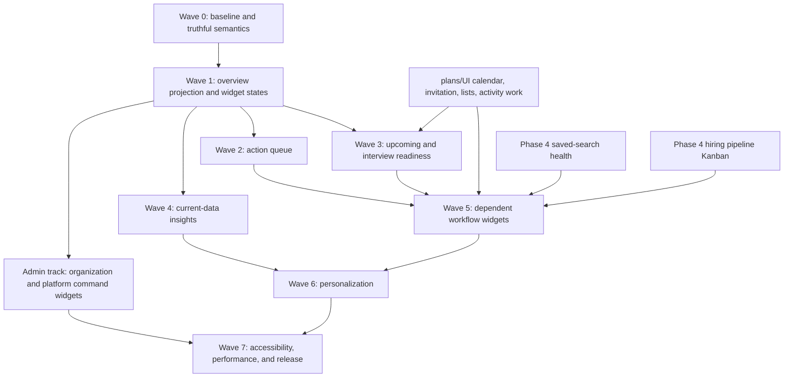

# Action-Centered Dashboard — Implementation Plan

> **Status**: `implemented`
> **Spec**: [`spec.md`](./spec.md)
> **Execution order**: truth and accessibility -> data projection -> critical workflows -> dependent widgets -> personalization -> release gates
> **Status reconciliation 2026-08-12.** `pending` → `implemented`. Every task is checked with no `- [ ]` and no
> `- [~]`, and the four rulings recorded in `tasks.md` closed the last of them on their evidence rather than by
> flipping a marker: the `from` return context could only ever carry one value, the hidden-widget control has
> nothing optional to act on, the persona default table would re-encode what `roles`/`isVisible`/`whenEmpty`
> already express and keep a widget hidden after the workspace stopped being new, and "disabling either admin
> surface" describes a capability this product does not have. The one item that was open inside a checked task —
> bounding the legacy `/api/admin/metrics` response — was closed as code, not recounted.
> **Depends on**: selected deliverables from [`plans/UI`](../56-UI/spec.md), [`saved-search-health`](../../../phase-4/saved-search-health/spec.md), and [`hiring-pipeline-kanban`](../../../phase-4/hiring-pipeline-kanban/spec.md)
> **Blocks**: nothing. The dashboard consumes existing surfaces; no schema, API or migration in this
> plan gates another one.
> **Reality check**: the dashboard already had banners, four metric tiles, activity, sprints,
> recommendations, alerts, saved searches, recent builders, plan usage and source mix. The problem was
> never an empty dashboard — it was weak prioritization, ambiguous data semantics, disconnected
> workflows, and incomplete failure and accessibility states.

## Delivery principles

1. Fix misleading semantics and keyboard order before adding widgets.
2. Build one role-safe dashboard projection instead of accumulating unrelated client requests.
3. Keep domain ownership in Calendar, Interviews, Sprints, Alerts, Lists, Billing, and Pipeline; the dashboard consumes bounded projections.
4. Ship useful current-data widgets without waiting for Phase 4, while hiding dependency-gated widgets until their canonical data exists.
5. Add a visualization only after its question, exact data, comparison period, and accessible equivalent are defined.
6. Verify each wave with authenticated member and owner/admin fixtures before proceeding.

## Dependency map

Dependencies are capability gates, not permission to duplicate their implementation. If a dependency is not shipped, the corresponding dashboard adapter remains disabled and the rest of the plan proceeds.

## Wave 0 — Baseline, semantics, and safe layout

### Outcome

The existing dashboard is measurable, truthful, keyboard-stable, and testable before new product behavior is introduced.

### Work

- Establish authenticated fixtures for new workspace, active recruiter, organization owner/admin, verified profile owner, and platform admin.
- Capture current desktop, 320 px, 400% zoom, reduced-motion, and forced-colors behavior.
- Inventory request count, payload size, server timing, layout shift, keyboard order, and accessible names.
- Remove dense grid reordering where it can separate visual and DOM order.
- Define a canonical, typed widget registry with stable IDs, role eligibility, default order, allowed spans, criticality, and dependency state.
- Rename or rebuild “Weekly Activity” so its title reflects the exact `lastSeenAt` aggregation. Add exact values and an accessible equivalent immediately.
- Replace sampled Source mix with an explicitly labeled temporary recent-sample view or hide it until workspace coverage exists.
- Resolve Search/New hunt duplication and remove the default Private notes metric.
- Add explicit secondary-section failure states instead of silently returning empty content.

### Exit gate

- A keyboard walk follows the exact visual order on desktop and mobile.
- Every current aggregate states scope, period, and freshness.
- Empty, unavailable, stale, and error fixtures render differently.
- Baseline screenshots and timings are committed to test artifacts, not product docs.

## Wave 1 — Dashboard overview projection

### Outcome

The page loads a versioned, role-aware core projection with independent section health.

### Work

- Define shared dashboard contract schemas for ranges, action kinds, summary aggregates, section states, and widget IDs.
- Add repository/query functions that aggregate only bounded, indexed tenant data.
- Implement `GET /api/dashboard/overview` with 7-, 30-, and 90-day allowlisted ranges.
- Return `generatedAt`, section scope, exact totals, top-N rows, and section-level readiness/error metadata.
- Use the canonical billing summary and minimize fields by role.
- Preserve heavy optional widgets as lazy independent queries with organization/range-scoped query keys.
- Split the current page-level loading/error boundary into shell and widget boundaries.
- Add short cache TTLs and instrumentation for endpoint duration and section failures.

### Exit gate

- Member, owner/admin, cross-tenant, suspended, signed-out, partial failure, and stale-cache contract tests pass.
- The main shell remains useful if one optional repository fails.
- The endpoint meets the representative p95 target without unbounded rows or dates.

## Wave 2 — Prioritized action queue

### Outcome

The first meaningful dashboard region tells the user what requires action and why.

### Work

- Implement a deterministic server-side action-rule registry with priority, eligibility, reason, resource type/ID, due time, dismissibility, and expiry.
- Start with existing data: onboarding, organization invitations, alert triggers, sprint states/results, and role-safe limit warnings.
- Add deduplication so one underlying issue does not appear as a banner, metric, and action item.
- Map action kinds to typed route builders in the client; reject unknown action kinds.
- Render ordered items with severity text, reason, time context, one primary action, and optional safe dismissal.
- Prevent critical workflow, security, and billing items from being hidden.
- Track allowlisted impressions, continuations, dismissals, and resolutions without sensitive payloads.

### Exit gate

- Rule precedence and expiry are covered by table-driven tests.
- Every returned action is re-authorized at its destination.
- No arbitrary URL or private candidate/payment/note content appears in the DTO.
- Onboarding and invitation banners are removed after equivalent queue items ship.

## Wave 3 — Today, scheduling, and interview readiness

### Outcome

Users can see the next relevant events and prepare or join without hunting through separate pages.

### Work

- Add a bounded upcoming projection from Calendar, Interviews, and Scheduling.
- Merge duplicate representations of one booked interview/event.
- Calculate explicit readiness conditions: missing brief, unassigned preparation, invitation requiring action, conflict, or unavailable organizer schedule.
- Render a compact accessible agenda with local timezone, start/end, state, and one context-aware action.
- Continue to Calendar event, invitation hub, interview brief, live workspace, or validated external meeting URL as appropriate.
- Add contextual action-queue rules for imminent unprepared interviews and scheduling blockers.
- Use the central invitation hub, availability UI, and shared-interview projection from `plans/UI` when shipped.

### Exit gate

- DST boundaries, cancelled/rescheduled events, duplicate records, changed timezone, private attendee data, and cross-tenant access have fixtures.
- Join is available only in the valid time/state window; Prepare and View details remain usable otherwise.
- Agenda works at 320 px, 400% zoom, keyboard-only, and screen-reader navigation.

## Wave 4 — Current-data workflow and insight widgets

### Outcome

The dashboard exposes useful comparisons from data that already exists, with honest wording and direct continuations.

### Work

- Consolidate recommendations, unread alert matches, sprint results, and recent builders into a bounded Candidates to review experience without losing their provenance.
- Add newly tracked builders by day using organization-builder creation timestamps.
- Add alert-trigger volume by day and type only where the type comparison changes a decision.
- Add real workspace Source coverage with a defined denominator and source-filtered Search continuation.
- Add Shortlists summary after list navigation/counts are available.
- Add human Team activity after actor labels and safe target routes are available.
- Rebuild Workspace usage from canonical billing summary with plan, credit, and seat meters appropriate to role.
- Keep exact-value lists/tables available for every visualization.

### Exit gate

- Every widget states denominator, range, timezone, generated time, and excluded data.
- A chart can be removed without losing the underlying values or actions.
- Source and billing contracts are tenant/role tested.
- No page loads an unbounded activity, alert, builder, or shortlist collection.

## Wave 5 — Dependency-gated workflow widgets

### Outcome

Canonical Phase 4 workflows gain dashboard summaries only after their domain data exists.

### Saved-search health adapter

- Consume the approved current 30-day health verdict.
- Show status distribution and a short ranked issue list.
- Add tune, inspect, or retire continuation according to authorization.
- Do not add a trend line or invent snapshots.

### Pipeline adapter

- Consume canonical stage counts, stage entry time, and stuck definitions from the Kanban domain.
- Show stage distribution with a segmented bar and exact values.
- Show aging/stuck counts only when timestamps support them.
- Call the chart a distribution, never a funnel, until cohort transitions exist.

### Invitation lifecycle adapter

- Show current state distribution and organizer follow-ups.
- Treat it as a snapshot, not conversion analytics.
- Link into the central invitation hub.

### Exit gate

- Dependency flags prevent incomplete adapters from registering.
- Contract tests fail when the source schema changes.
- Domain pages remain the only place for full editing and history.

## Admin track — Organization administration and platform operations

### Outcome

Organization owners/admins get a tenant-scoped administrative section inside `/dashboard`, while
platform administrators get a separate `/admin` Command Center. Neither surface replaces detailed
settings or operator pages, and the two scopes cannot share DTOs, caches, preferences, or queries.

### Organization Admin section

- Add server-authorized projections for members/seats, role/access review, canonical billing and
  entitlements, workflow coordination, feature adoption, security posture, and eligible privacy/data
  request counts.
- Promote critical access, billing, or security issues into the shared Action queue; keep supporting
  summaries after normal workflow widgets.
- Link to Team, Billing, Security, Privacy, Calendar, Interviews, Sprints, and other canonical pages.
- Present organization adoption and blocked objects without ranking or scoring individual members.
- Preserve owner-only financial and destructive-action boundaries.

### Platform Admin Command Center

- Add an `/admin` index route and versioned `/api/admin/overview?range=24h|7d|30d` projection.
- Compose a redacted platform action queue from incidents, worker/integration health, billing alerts,
  disputes/refunds, abuse/trust queues, entitlement anomalies, and policy deadlines.
- Add Service health, Worker/integration health, Billing operations, Abuse/trust, User anomalies,
  Growth/conversion, and Public content widgets only when their canonical source projections exist.
- Use allowlisted destination kinds, per-section states, freshness, thresholds, units, and bounded rows.
- Keep manual worker runs, incident publication, refunds/replays, enforcement, revocation, and content
  publication on their detailed pages behind step-up, confirmation, idempotency, and audit evidence.
- Store platform-admin preferences in a separate namespace with critical widgets fixed.

### `/admin/metrics` optimization

- Preserve `/admin/metrics` as the analytical drill-down linked from the Command Center rather than
  duplicating its full widgets on `/admin`.
- Establish a reproducible performance/query baseline for the current 15-second polling request,
  including the unused cross-organization billing sweep.
- Split the monolithic endpoint into a lightweight overview and lazy Traffic, Search, Discovery,
  Activation, Conversion, Feature reliability, and Runtime sections with independent states.
- Remove null/dead cards, expose generated/reset/source scope, and distinguish a process-local counter
  from persisted platform history.
- Add persistent time buckets or an observability adapter before rendering rates, percentiles, or
  trends; otherwise show the prerequisite honestly.
- Optimize conversion reporting into one bounded aggregate query/batch, enforce a 90-day maximum,
  and render canonical numerators, denominators, CI95, variant, and insufficient-sample states.
- Remove detailed billing aggregation from frequent Metrics refresh. Show only a cached alert summary
  and link to Billing operations.
- Add validated URL filters, section-aware refresh, visibility pause, cancellation/deduplication,
  last-success/stale states, accessible exact-value tables, and per-section performance budgets.

### Exit gate

- Organization admin/member/owner negative field tests and platform-admin/non-platform-admin route
  tests pass.
- Cross-scope cache, preference, and response tests prove that tenant and platform data cannot mix.
- A critical incident, billing inconsistency, failed worker, and abuse/trust issue each deep-link to the
  exact authorized admin destination without exposing a mutation in the dashboard.
- No platform widget appears in the tenant grid, and no ordinary organization admin can discover the
  platform overview endpoint or its resource existence.
- `/admin/metrics` initial load performs no billing cross-organization sweep, no hidden analytical
  section fetch, and no overlapping poll; its process-local and persisted metrics are labeled
  differently and its conversion totals reconcile with the canonical repository.

## Wave 6 — Server-backed personalization

### Outcome

Users can reduce noise and preserve a useful layout across sessions and devices without compromising required notices or focus order.

### Work

- Add versioned preferences scoped by user and organization.
- Define role/journey defaults and a safe migration from the local density preference.
- Implement compact/standard density, time range, Pin/Unpin, Hide/Show, Move up/down, and Reset.
- Ignore unknown/retired widget IDs and append newly required widgets deterministically.
- Keep critical widgets and notices outside hide controls.
- Provide a customization drawer/dialog with complete keyboard and touch controls.
- If pointer drag is retained, use the exact same command model underneath it and announce changes.

### Exit gate

- Preferences do not cross organizations or users on a shared browser.
- Keyboard-only reorder, hide/show, reset, and focus restoration pass.
- Server rejection/offline save has a recoverable state and does not destroy the last valid layout.
- DOM and visual order remain identical after every customization.

## Wave 7 — Accessibility, performance, analytics, and release

### Outcome

The dashboard is safe to release as the default authenticated landing surface.

### Work

- Build or consolidate small accessible chart primitives: bars, segmented bars, progress meters, summaries, and data disclosures.
- Add automated Axe/semantic checks plus manual screen-reader, keyboard, 400% zoom, forced-colors, reduced-motion, and touch-target audits.
- Add component/contract tests for every widget state and action kind.
- Add authenticated E2E journeys for each persona and critical dashboard continuation.
- Add responsive visual regression coverage for empty, populated, partial failure, stale, customized, and high-density states.
- Enforce query/payload/performance budgets and prevent chart-library bundle regressions.
- Add privacy-safe product telemetry and a staged feature flag/rollback path.
- Reconcile docs, navigation, endpoint registry, and the previous UI plan before general release.

### Exit gate

- Typecheck, lint, unit, integration, tenant-isolation, E2E, accessibility, visual, and performance gates pass.
- Runtime behavior is verified through the authenticated app, not source inspection alone.
- Product copy matches actual scopes and dependencies.
- Rollback disables new projections/widgets without breaking `/dashboard` navigation.

## Recommended release slices

1. **Truthful dashboard** — Wave 0 only; immediate accessibility and trust improvement.
2. **Actionable dashboard** — Waves 1 and 2; highest navigation value using current data.
3. **Daily workspace** — Wave 3; scheduling and interview preparation.
4. **Insight dashboard** — Wave 4; honest accessible comparisons.
5. **Pipeline-aware dashboard** — Wave 5 as dependencies ship.
6. **Admin command surfaces** — the Admin track, including `/admin/metrics` optimization, after stable overview contracts and source projections.
7. **Personal dashboard** — Wave 6 after stable widget contracts.
8. **General availability** — Wave 7 gates and staged rollout.

## Rollback strategy

- Protect new projection consumption, action queue, dependent adapters, and persisted personalization behind separate flags.
- Gate the organization-admin section and platform `/admin` Command Center independently; disabling
  either preserves every detailed settings/admin destination.
- Keep the stable widget registry capable of rendering the corrected current dashboard if the overview endpoint is disabled.
- Do not dual-write domain data from dashboard code; rollback therefore removes projections, not source-of-truth state.
- Preferences are additive and versioned; disabling customization leaves the canonical default order intact.
