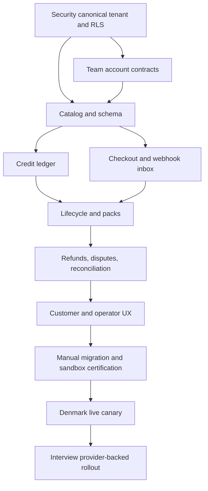

# Delivery Plan: Stripe Billing Platform

> **Status**: `pending`
> **Depends on**: [`security-and-multitenancy`](../01-security-and-multitenancy/plan.md),
> [`team-accounts`](../27-team-accounts/plan.md)
> **Blocks**: [`calendar-scheduling-interview-intelligence`](../44-calendar-scheduling-interview-intelligence/plan.md)
> **Reality check**: organization entitlement storage and manual billing UI exist, but no Stripe or
> credit runtime exists. Preserve the dirty/uncommitted migration `0019` and generate the next free
> migration. Do not expose Stripe until organization canonical/RLS evidence is complete.

## Delivery strategy

Ship behind `STRIPE_BILLING_ENABLED=false`. Build internal invariants and a shadowable provider
adapter first, then sandbox billing, then migrate voluntary customers, and only then enable live
mutations. Read-only entitlement behavior must remain shippable after every phase.

## Phase 0 — Dependency and launch contract

- Verify canonical organization/RLS/runtime roles from `security-and-multitenancy` and owner/member/
  invitation/seat contracts from `team-accounts`.
- Record the Stripe API version, SDK version, account country, individual KYC state, USD catalog,
  Denmark customer allowlist, product tax code, tax behavior, Terms/Privacy versions, support/refund
  process, and financial retention decision.
- Create sandbox Products/Prices and Portal configuration from the catalog manifest; do not enable
  live mode.
- Define release flags, alert recipients, worker authentication, secret rotation, and rollback owner.

**Gate**: no schema or provider mutation work proceeds with unresolved tenant ownership; no live
charge proceeds without seller/tax/KYC evidence.

## Phase 1 — Catalog and provider seam

- Add the pinned Stripe SDK and server-only client with stable idempotency, bounded network retries,
  request-ID logging, API-version enforcement, and test/live separation.
- Extend shared tier/status types with Pro Max and the explicit billing lifecycle without exposing
  server secrets to client bundles.
- Implement an immutable server catalog and startup/provider validation of Product/Price amount,
  currency, interval, tax behavior, metadata, archive state, and livemode.
- Add fake provider contracts so unit/API tests never require Stripe network access.

**Gate**: deliberate wrong Price/livemode/version prevents billing mutations and emits an alert.

## Phase 2 — Additive financial schema and RLS

- Add all billing, credit, refund, webhook, configuration, consent, and reconciliation tables from
  the spec with integer checks, unique idempotency constraints, organization-preserving references,
  append-only ledger enforcement, and explicit state checks.
- Add tenant RLS for customer-visible rows and platform/worker policies for system rows.
- Add migration, schema, exact-role RLS, cross-tenant A/B, rollback, backup, and restore tests.
- Do not modify or drop legacy plan tables in this additive phase.

**Gate**: migration forward/rollback rehearsal and non-owner runtime-role tests pass on restored data.

## Phase 3 — Billing repositories, permissions, and seller configuration

- Build DTO-only repositories for customers, subscriptions, checkout attempts, terms, invoices,
  grants, reservations, ledger, refunds, reconciliation, and seller profile.
- Centralize organization billing permission predicates: owner mutation, admin read, member minimal.
- Build platform-admin seller/country/tax configuration with recent auth, versioning, preview, audit,
  provider reconciliation, and no CPR/bank/card fields.
- Add startup/live readiness evaluation including `charges_enabled`, KYC, public profile, prices,
  webhook, tax registrations, country allowlist, and runbook evidence.

**Gate**: no route can import billing tables directly; boundary and role-matrix tests pass.

## Phase 4 — Credit ledger foundation

- Implement atomic grants, earliest-expiry allocation, reservations, heartbeat/extension,
  settlement, release, expiry, freeze/unfreeze, revoke, and compensating adjustments.
- Enforce server rate-card versions, maximum operation duration, settlement grace, no negative
  balances, and exact reservation-to-grant slices.
- Add property/concurrency tests for duplicate calls, crash/retry, expiry boundary, exhausted grants,
  abandoned reservation, and refund after consumption.
- Expose server-only feature contracts; do not expose mutable balance endpoints.

**Gate**: randomized/concurrent tests cannot produce a negative or duplicated unit.

## Phase 5 — Stripe Customer and subscription Checkout

- Create/reuse one Customer per organization/livemode and persist owner billing contact separately.
- Create idempotent Checkout attempts from catalog keys only with approved methods, automatic tax,
  billing address, tax ID, URL allowlist, country policy, and versioned consent.
- Build pending/success/cancel UX that polls internal state and never trusts redirect parameters.
- Implement initial `invoice.paid` activation and exactly-once first grant.

**Gate**: sandbox Checkout succeeds/fails/SCA-authenticates without optimistic access or duplicates.

## Phase 6 — Durable webhooks and worker

- Implement raw-body signature verification, rotating secrets, durable unique inbox, fast response,
  pinned API version, livemode checks, normalized redacted errors, and payload retention.
- Implement monotonic, idempotent handlers for Checkout, invoice, subscription, PaymentIntent,
  refund, and dispute event families; retrieve provider objects when ordering is ambiguous.
- Build the HTTP-triggered worker for inbox retries, dead-letter alerting, replay, and safe unknown
  events using the repository's existing cron pattern.
- Add signed fixture, duplicate, reordered, delayed, invalid signature/version/mode, and replay tests.

**Gate**: every event can be delivered repeatedly in arbitrary order with exactly-once effects.

## Phase 7 — Renewals, annual monthly grants, and plan changes

- Project paid renewal state into organization entitlements and monthly grants.
- Implement month-end-clamped annual anniversary worker and unique grant windows.
- Build Stripe-backed previews and immediate pending-update upgrades with proportional delta credits.
- Build monthly-to-annual immediate conversion without duplicate grant; schedule annual-to-monthly,
  downgrade, and cancellation at period end.
- Enforce Team downgrade seat/invitation blocker from `team-accounts` without automatic eviction.

**Gate**: Test Clocks pass a complete monthly and annual lifecycle including leap/month-end dates.

## Phase 8 — Dunning, grace, and entitlement degradation

- Configure retry policy within seven days; handle first failure, notices, grace countdown, recovery,
  post-grace blocking, included-credit freeze, pack preservation, and data/export continuity.
- Suspend non-owner Team workspace access after Team entitlement loss without deleting membership.
- Add owner payment-recovery UI and action-required Portal flow.
- Test cancellation during grace, recovery at deadline, late events, and permanent failure.

**Gate**: no provider-backed operation starts after grace while preserved data remains accessible.

## Phase 9 — Packs, auto-recharge, and risk controls

- Build active-paid-only pack Checkout and grant only on payment success.
- Build opt-in off-session auto-recharge with saved-method setup, separate consent, threshold, monthly
  cap, rolling three/$1,000 limit, and paused authentication/failure state.
- Enable approved card/wallet methods, Stripe Radar/provider 3DS, velocity/card-rotation checks, and
  audited time-bounded high-volume exceptions.
- Test concurrent threshold crossing, duplicate success, SCA recovery, failure, cap rollover,
  cancellation, subscription lapse/reactivation, and pack expiry.

**Gate**: no failed/pending/risky charge produces credits or bypasses daily/monthly caps.

## Phase 10 — Refunds and disputes

- Build unused-pack self-service request and operator exception review with exact financial/credit
  preview.
- Implement full/partial pack and subscription refund state machines, revised service ends,
  compensating ledger entries, conflict locks, repair cases, and customer/operator notices.
- Implement pack/subscription dispute freeze, immediate subscription block, win restoration, loss
  revocation, unrelated-grant preservation, evidence deadline alerting, and reconciliation.
- Test provider/internal partial failures and repeated/out-of-order refund/dispute webhooks.

**Gate**: refund/dispute replay cannot double-refund, double-revoke, or mutate unrelated grants.

## Phase 11 — Customer, owner-transfer, deletion, and admin UX

- Replace manual billing settings with plan/period/payment/grace/scheduled change, invoice, credit-
  expiry, usage, pack, auto-recharge, billing-contact, Portal, and role-aware controls.
- Update pricing with Pro Max, new Team/annual prices, monthly/annual toggle, tax language, credits,
  seats, pack distinction, and Checkout actions.
- Integrate ownership-transfer billing disclosure/notifications and immediate authority change.
- Integrate normal/immediate organization deletion with renewal prevention, access period, forfeiture
  warning, retained financial evidence, and no silent resubscribe.
- Build platform billing operations UI for seller profile, readiness, events/replay, refunds,
  disputes, reconciliation, high-volume exceptions, and metrics.

**Gate**: owner/admin/member/platform role snapshots, accessibility, mobile, and destructive-flow E2E
tests pass.

## Phase 12 — Reconciliation, accounting, and observability

- Build daily comparison of Customers, subscriptions, invoices, payments, refunds, disputes,
  entitlements, and grants; create repair cases rather than inventing payment success.
- Record payout currency/FX/fees/net without bank details and create monthly accounting export.
- Add dashboards/alerts for webhook age, checkout failures, dunning, credit invariants, auto-recharge,
  refunds/disputes, cost/margin, country gate, and reconciliation mismatches.
- Add expiry notices at 30/7/1 days and deduplicated financial email delivery.

**Gate**: injected mismatches are detected within the SLO and repaired idempotently from runbooks.

## Phase 13 — Manual migration and cross-plan reconciliation

- Import manual organization periods/trials/promos as `legacy_manual` without Customer or charge.
- Offer voluntary Checkout migration and atomically end overlapping manual authority on success.
- Make legacy user-plan mutation/request flows read-only history after canonical cutover.
- Mark `pricing-and-billing` superseded by this plan while preserving delivered evidence.
- Make calendar/interview depend on this plan and retain only feature rate cards/reserve-settle use.
- Reconcile `team-accounts` billing permissions to owner mutation/admin read.

**Gate**: mixed manual/Stripe fixtures have exactly one effective entitlement and no duplicate grant.

## Phase 14 — Sandbox certification

- Run unit, property, schema, migration, RLS, security boundary, API, component, signed-webhook,
  sandbox, Test Clock, E2E, accessibility, performance, backup/restore, and dependency-security suites.
- Exercise the acceptance matrix for all tiers/intervals, roles, country/tax types, ownership,
  deletion, failures, replay, refunds, disputes, packs, and auto-recharge.
- Complete tax/KYC, refund/support, dispute, incident, reconciliation, accounting, secret rotation,
  webhook recovery, backup/restore, and rollback runbooks.

**Gate**: attach evidence to the release checklist; flags remain off if any critical row is missing.

## Phase 15 — Live canary and rollout

- Create live Products/Prices from the approved manifest and verify them read-only.
- Enable live webhook ingestion first, then internal operator account, then one voluntary Danish
  customer, then a percentage rollout. Keep public country allowlist Denmark-only.
- Observe at least one successful purchase/refund and reconciliation cycle before expansion.
- Roll back by disabling new mutations, not by deleting provider objects or financial records.

## Dependency graph

## Risks and controls

| Risk                                      | Likelihood | Impact   | Control                                                                       |
| ----------------------------------------- | ---------- | -------- | ----------------------------------------------------------------------------- |
| Duplicate/out-of-order events grant twice | Medium     | Critical | durable unique inbox, monotonic refresh, unique source keys, replay tests     |
| Provider cost exceeds paid credits        | Medium     | Critical | synchronous reservation, hard non-negative ledger, provider stop, caps        |
| Test/live or wrong Price mix              | Low        | Critical | livemode columns, startup manifest validation, separate secrets, release gate |
| Cross-tenant financial access             | Low        | Critical | server tenant resolution, composite FKs, RLS, DTOs, A/B tests                 |
| Tax collected without registration        | Medium     | High     | Denmark allowlist, admin tax gate, Stripe registrations, finance sign-off     |
| Annual grants duplicate or drift          | Medium     | High     | anchor algorithm, unique window key, Test Clocks/month-end tests              |
| Refund/dispute diverges from ledger       | Medium     | High     | state machine, compensating entries, conflict lock, daily reconciliation      |
| Ownership/deletion charges old card       | Low        | High     | transfer disclosure/audit; deletion prevents renewal immediately              |
| Pack fraud/chargeback                     | Medium     | High     | Radar/3DS, rolling caps, review, linked grant freeze/revoke                   |
| Stripe outage blocks existing product     | Medium     | Medium   | internal read authority; disable only new billing mutations                   |
| Manual and Stripe overlap                 | Medium     | High     | voluntary migration, atomic authority cutover, unique effective subscription  |

## Rollback

- `STRIPE_BILLING_ENABLED=false` blocks new Checkout, changes, packs, and auto-recharge.
- Keep webhook ingestion, internal entitlement reads, reconciliation, refunds, and dispute handling on.
- Never delete Stripe Customers, subscriptions, invoices, payments, events, or ledger entries to roll
  back application code.
- Revert UI/API mutations independently while preserving additive schema.
- If catalog configuration is wrong, archive new Prices and issue a corrected version; never mutate
  historical semantics.
- If a migration fails, use the rehearsed additive rollback before live financial writes; after
  financial writes, repair forward.

## Completion evidence

The plan is complete only with: migration/RLS reports; Stripe manifest validation; signed webhook
replay matrix; Test Clock exports; credit property/concurrency results; role/tenant E2E matrix;
refund/dispute/SCA/auto-recharge evidence; seller/tax/KYC checklist; reconciliation/accounting sample;
worker/alert SLO; secret rotation; backup/restore; rollback rehearsal; and Denmark canary results.
