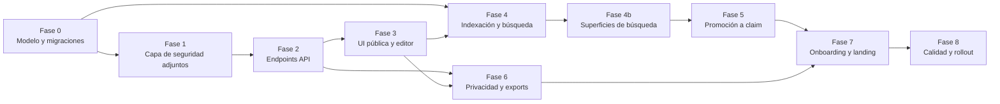

# Plan de implementación — perfiles auto-gestionados

> **Status**: `pending`
> **Depends on**: [`02-segmentacion-usuarios`](../02-segmentacion-usuarios/spec.md),
> [`03-onboarding-segmentado`](../03-onboarding-segmentado/spec.md),
> [`04-dashboard-personalizado`](../04-dashboard-personalizado/spec.md),
> [`06-landing-segmentada`](../06-landing-segmentada/spec.md),
> [`phase-1/36-claimable-profiles`](../../implemented/phase-1/36-claimable-profiles/spec.md),
> [`phase-1/37-portfolio-builder`](../../implemented/phase-1/37-portfolio-builder/spec.md), and
> [`phase-1/38-work-sample`](../../implemented/phase-1/38-work-sample/spec.md)
> **Blocks**: nothing
> **Reality check**: The current migration tip is `0154`. The complete quarantine, magic-byte,
> S3-signing and ClamAV pipeline already exists under `src/lib/storage/` and
> `src/lib/scheduling/document-worker.ts`; implementation extends it rather than creating a second
> storage tree as described by the original draft.

> Este plan describe el orden de ejecución recomendado, los criterios de salida por
> fase y la estrategia de despliegue. Las tareas individuales viven en `tasks.md`;
> el contrato y los criterios de éxito, en `spec.md`.

## Resumen ejecutivo

BuilderHunt hoy indexa actividad pública de developer y permite reclamar perfiles
contra una `(source, sourceId)` verificada. El segmento `building` descrito en
`phase-2/01-investigacion-icp` y `phase-2/03-onboarding-segmentado` asume esa
huella. Una persona sin perfil público — un traductor es↔en↔fr, un ilustrador sin
Dribbble, un investigador con publicaciones en repositorios no indexados — no puede
hoy crear perfil en BuilderHunt. Este plan abre ese caso sin debilitar la
propuesta de "proof of work" de los builders con claim.

El plan entrega:

- una vía de creación de perfil desde cero, sin `(source, sourceId)`;
- un editor de CV y bio con adjuntos verificables (PDF, imágenes, audio, vídeo con
  duración cap);
- una capa de seguridad para uploads consistente con la de enrichment (safe
  delivery, magic bytes, antivirus, retention, deduplicación);
- indexación en la misma búsqueda que el resto de builders, con marca visual
  distinta (chip "Self-managed" vs. badge "verified");
- una ruta de promoción a `builder_claims` verificada para quien en el futuro
  consiga huella pública, sin perder el trabajo ya hecho.

## Decisiones de arquitectura relevantes

1. **No se reutiliza `builder_claims` para perfiles sin fuente**. La fila de
   `builder_claims` exige `UNIQUE (source, sourceId)`; un perfil auto-gestionado no
   encaja. Se introduce `selfManagedProfiles` con su propio modelo.
2. **No se debilita el badge "verified"**. Un perfil auto-gestionado nunca se
   renderiza con el verde del badge verificado. Chip separado, color secundario.
3. **Adjuntos separados de `work-sample`**. `38-work-sample` modela evidencias
   scrapeadas/verificadas de builders con claim; los adjuntos del dueño viven en
   `selfManagedAttachments`. Reutiliza el provider, object-key policy, antivirus y signed-download
   existentes con un nuevo owner kind; no duplica la implementación de storage.
4. **Migración a claim sin perder datos**. `promotedToBuilderClaimId` en
   `selfManagedProfiles` permite que el upgrade sea aditivo.
5. **Taxonomía cerrada para `services`, abierta para `topics` e `languages`**. La
   búsqueda necesita poder filtrar por servicio sin inventarios arbitrarios; los
   temas e idiomas son demasiado diversos para encasillarlos.

## Fases de ejecución

### Fase 0 — modelo y migraciones (1 sprint)

Salida: la migración generada en el siguiente número libre aplica en local y en CI; los repositories CRUD existen
con tests unitarios; la taxonomía de servicios se puede importar desde
`service-taxonomy.ts`.

Riesgo bajo. Sin cambios en runtime, sin UI, sin endpoints expuestos.

Criterio de salida: la migración corre forward y backward en CI sin diffs no
intencionales; los repositories tienen al menos un test por método público.

### Fase 1 — capa de seguridad para adjuntos (1 sprint)

Salida: la política de adjuntos reutiliza `document-validation.ts`, el provider S3,
las claves `quarantine/` → `clean/`, ClamAV y el worker existentes; se ve
`pending` → `clean` en una prueba local real.

Esta fase puede correr en paralelo a la Fase 0 en otro stream, pero se bloquea la
Fase 2 hasta que esté completa. Razón: cualquier endpoint que acepte multipart
antes de que la nueva policy sobre `document-validation.ts` esté testeada es un vector de ataque abierto.

Criterio de salida: ningún test de seguridad de la suite
`tests/unit/security/` queda en rojo; el script de retention pass se ejecuta
contra fixtures sin errores.

### Fase 2 — endpoints públicos y autenticados (1 sprint)

Salida: 7 endpoints con auth, validación, rate limit y cobertura de tests de
integración. RLS reforzado a nivel de fila.

Criterio de salida: el bench E2E de Playwright para auth y ownership pasa;
`pnpm test:security` y `pnpm test:api-isolation:local` están verdes.

### Fase 3 — UI pública y editor (2 sprints)

Salida: la página `/u/$handle` renderiza; el editor `/me/profile` funciona con
autosave; el `AttachmentUploader` soporta drag-and-drop y los estados
`pending_scan` / `clean` / `infected`.

Riesgo medio: la UI debe distinguir visualmente "Self-managed" de "verified" sin
inducir a error. La fase 3.5 (test de accesibilidad con axe-core) es gate.

Criterio de salida: los tests E2E
`tests/e2e/self-managed-profile.spec.ts` pasan; axe-core reporta 0 violaciones de
contraste en el chip "Self-managed".

### Fase 4 — indexación y búsqueda (1 sprint)

Salida: el `discovery worker` conoce el source `self-managed`; la búsqueda
full-text devuelve perfiles auto-gestionados junto a builders con claim; el campo
`kind` se renderiza en cada card.

Criterio de salida: una búsqueda por "traducción español inglés" devuelve
correctamente perfiles auto-gestionados cuyo bio/headline/services matchea, sin
regresión en los resultados existentes.

### Fase 4b — superficies de búsqueda (cobertura integral) (1.5 sprints)

Esta fase es el grueso de la integración con el resto de la app. Sin ella, los
perfiles auto-gestionados existen pero son invisibles en las superficies que los
usuarios ya usan para descubrir builders.

Subfases:

- **4b.1** Búsqueda federada en vivo (1 día): connector `self-managed`,
  dedup, filterSuppressed, ranking.
- **4b.2** Búsqueda semántica (0.5 días): `upsertEmbeddingStubs` con
  `kind: 'self-managed-person'`.
- **4b.3** Recomendaciones "For you" (0.5 días): query param y
  `user_preferences`.
- **4b.4** Sourcing sprints (0.5 días): `sprintConfig.includeSelfManaged` y
  breakdown en summary.
- **4b.5** Alert matching (1 día): trigger de eventos de
  `selfManagedProfiles` al pipeline de alerts con ventana de supresión.
- **4b.6** Solutions (1.5 días): nueva fuente `kind: 'people'` en
  `src/lib/solutions/composer/` con sección "People who can do this" y
  disclaimer fijo. Métricas de inclusión/exclusión.
- **4b.7** Sourcing workspace y talent market intelligence (0.5 días):
  acción contractual sobre planes futuros; no se implementa aquí, se
  documenta la cláusula estándar.
- **4b.8** Look-alike sourcing (0.5 días): acción contractual análoga a
  4b.7.
- **4b.9** Cross-linking `/builders/$builderId` ↔ `/u/$handle` (1 día):
  secciones "People like this" y "Also active on", sitemap unificado.
- **4b.10** Garantía común (0.5 días): componente único
  `<BuilderCard variant="self-managed">`, tests de invariante por
  superficie, telemetría segmentada.

Criterio de salida:

- E2E por superficie: cada una tiene un test que verifica que un perfil
  auto-gestionado aparece cuando matchea el query de la superficie, con el
  chip "Self-managed" visible.
- Tests de invariante: 10 snapshot tests (uno por superficie) que rompen si
  alguna deja de renderizar el chip.
- Telemetría: para cada superficie, el evento
  `surface_result_rendered` se emite con `kind: 'self-managed-person' | 'claimed-person'`.
- Cero regresión: las búsquedas que antes solo devolvían builders con claim
  siguen devolviéndolos; la introducción de auto-gestionados es aditiva.
- El toggle `includeSelfManaged: false` filtra correctamente cuando el
  usuario lo pide explícitamente.

### Fase 4c — principio de cobertura universal (0.5 sprints)

Esta fase codifica el principio "siempre que alguien o algo busque
coincidencias, los perfiles auto-gestionados deben estar en el pool". No
enumera superficies (eso ya está hecho en 4b); codifica la regla para que
sobreviva a futuras superficies no anticipadas.

Subfases:

- **4c.1** Helper único `includeSelfManagedInResults` (0.5 días).
- **4c.2** Suite de tests con ≥ 90% cobertura (0.5 días).
- **4c.3** Refactor de las 10 superficies para consumir el helper
  (1 día). Es trabajo de consolidación: si la cobertura real se
  mantiene igual, el código baja porque la lógica ya no está
  duplicada.
- **4c.4** Checklist de 5 preguntas en
  `CODEOWNERS` / review template (0.5 días).
- **4c.5** Documentar el principio en
  `docs/architecture/extensibility.md` (0.5 días).
- **4c.6** Notas en los planes adyacentes que tocan builders (1 día,
  paralelizable).
- **4c.7** Telemetría `self_managed_coverage_invoked` (0.5 días).

Criterio de salida:

- `includeSelfManagedInResults` existe con cobertura ≥ 90%.
- Las 10 superficies consumen el helper, no lógica inline.
- La checklist de 5 preguntas está activa en review template.
- `docs/architecture/extensibility.md` referencia el principio.
- La métrica `self_managed_coverage_invoked` se emite en cada
  llamada, y el dashboard segmentado por superficie reporta el
  número de invocaciones y los resultados añadidos.

### Orden sugerido de las fases 4b y 4c

- **Fase 4b antes de 4c**: las superficies deben estar funcionando
  con su lógica inline antes de consolidarse en el helper de la 4c.
- **Fase 4c después de 4b**: el helper se construye consolidando las
  10 implementaciones inline, no deduciendo en abstracto.

### Fase 5 — promoción a `builder_claims` verificada (1 sprint)

Salida: si el dueño tiene actividad en una fuente indexable y la verifica, el
perfil auto-gestionado se sigue renderizando con sus adjuntos y muestra además el
bloque "Verified claim". El upgrade es aditivo.

Criterio de salida: un usuario con perfil auto-gestionado + `builder_claims`
verificada ve su `/u/$handle` con ambos bloques y no pierde adjuntos ni bio.

### Fase 6 — privacidad, GDPR y exports (0.5 sprints)

Salida: `data-export` y `delete-account` incluyen los datos auto-gestionados; el
consent se persiste con `policyVersion` bumped; el admin puede suspender.

Criterio de salida: un export de prueba del segmento `building` con perfil
auto-gestionado incluye ambos bloques; un delete-account cascada correctamente.

### Fase 7 — onboarding segmentado y landing (0.5 sprints)

Salida: el paso "localiza tu perfil" bifurca; `/for/builders` menciona "no
necesitas GitHub"; email post-onboarding a building sin adjuntos.

Criterio de salida: A/B test del onboarding bifurcado muestra que el cohorte con
la nueva ruta tiene una tasa de activación mayor (medible vía
`onboarding_progress`).

### Fase 8 — calidad y rollout (1 sprint)

Salida: cobertura de tests > 85%; feature flag `self_managed_profiles_enabled`
con rollout gradual; entrada en `public-enrichment-source-register.md`;
anuncio en `/changelog`.

Criterio de salida: deploy a producción con flag al 5%, sin regresiones en
métricas D7 (signup, activación, retención). Rollout a 100% tras 14 días sin
alertas.

## Dependencias externas

- `docker/clamav/` debe estar operativo antes de la Fase 1.
- `src/lib/storage/`, `src/lib/scheduling/document-worker.ts`, MinIO and ClamAV are the mandatory
  existing primitives; do not create a parallel storage tree.
- `04-dashboard-personalizado` debe estar implementado para la Fase 7 (el banner
  de sugerencia de promoción requiere el dashboard del segmento `building`).
- `02-segmentacion-usuarios` debe estar implementado para la Fase 4 (la
  búsqueda necesita el campo `user_segment`).
- `src/lib/solutions/composer/` debe estar estable antes de la Fase 4b.6. Si está
  en fase de diseño, esta fase documenta el contrato esperado pero no bloquea
  el rollout del resto de superficies.
- Los planes de phase-4 (`sourcing-workspace`, `talent-market-intelligence`,
  `look-alike-sourcing`) reciben una cláusula contractual en su redacción:
  "toda agregación debe segmentar `kind: 'self-managed-person'` separado de
  builders con `builder_claims`". La cláusula se aplica vía revisión de
  código en PR; no se implementa aquí.

## Riesgos transversales y mitigaciones

| Riesgo | Probabilidad | Impacto | Mitigación |
|---|---|---|---|
| Spam de perfiles auto-gestionados para inflar la SERP | Media | Alto | Rate limit en creación + retención de handle a 7 días + antivirus obligatorio en adjuntos + revisión manual semanal de perfiles nuevos con > 3 adjuntos |
| Malware en adjuntos | Baja | Crítico | Reutilizar `document-validation.ts`, ClamAV y `quarantine/` → `clean/`; nunca servir un estado no limpio; report button en página pública |
| Squatting de handles | Media | Medio | TTL 7 días + rate limit 5/día por usuario + auto-liberación tras 30 días sin perfil |
| Perfiles auto-gestionados diluyen "proof of work" | Media | Alto | Chip "Self-managed" siempre visible; nunca comparten badge verde con verificados; ranking documentado en `04-dashboard-personalizado` |
| Usuarios con claim se sienten rebajados | Baja | Medio | Anuncio en `/changelog` antes del rollout; la marca "verified" no cambia; ningún builder con claim pierde posición |
| Storage costs por adjuntos pesados | Baja | Bajo | Cap 25 MB por adjunto + cap 12 adjuntos por perfil + retention pass de 30 días |

## Métricas de éxito

- **Activación**: 50% de los nuevos perfiles auto-gestionados completan al menos
  bio + 1 adjunto en 7 días desde el alta.
- **Engagement**: 30% de los perfiles auto-gestionados con `visibility = 'public'`
  reciben al menos una visita de búsqueda en 30 días.
- **Cobertura por superficie**: cada una de las 10 superficies
  (`/api/search/builders`, `/api/search/semantic`, `/api/recommendations`,
  sprints, alerts, discovery, solutions, sourcing workspace, look-alike,
  profile cross-links) emite el evento `surface_result_rendered` con
  `kind: 'self-managed-person' | 'claimed-person'` desde el día uno. El ratio
  `self-managed-person / (self-managed-person + claimed-person)` se reporta
  semanalmente.
- **Engagement segmentado por superficie**: el CTR, el tiempo en página y la
  conversión a contacto se miden por separado para
  `self-managed-person` y `claimed-person` en cada superficie. Esto detecta
  si la introducción diluye engagement en alguna superficie concreta.
- **Conversión a claim**: 5% de los perfiles auto-gestionados consiguen una
  `builder_claims` verificada en 90 días.
- **Retención**: los builders que añadieron al menos un adjunto en su primer mes
  tienen D30 retention ≥ 60%.
- **Seguridad**: 0 adjuntos con malware servidos; 0 adjuntos servidos desde
  estado `quarantined`; 0 reports de PII expuesta sin consent.
- **Visibilidad del chip**: 0 resultados auto-gestionados renderizados sin el
  chip "Self-managed" en cualquiera de las 10 superficies (verificado por los
  tests de invariante de la fase 4b.10).

## Plan de comunicación

- Anuncio en `/changelog` una semana antes del rollout al 5%.
- Email a builders con claim explicando que la marca "verified" no cambia.
- FAQ en `/for/builders` y en la página de precios (el plan free incluye
  perfiles auto-gestionados; el plan Pro/Team añade analytics y CVs privados).
- Postmortem público 30 días después del rollout al 100% con métricas reales.

## Rollback

El feature flag `self_managed_profiles_enabled` permite apagar el endpoint público
y el flujo de creación sin migraciones rollback. Las filas de
`selfManagedProfiles` y `selfManagedAttachments` permanecen en DB; la UI muestra
un coming-soon si el flag está en off. El rollback es seguro porque:

- la tabla es nueva y no afecta a `builder_claims`;
- los endpoints nuevos no comparten rutas con los existentes;
- la indexación se inyecta en el `discovery worker` solo si el flag está activo.

Si se requiere rollback más profundo (por ejemplo, retirar el chip
"Self-managed" de la UI), se puede hacer en una release menor sin migración
porque el chip se renderiza desde `kind: 'self-managed'` del `builder_claims`
extendido, no desde una columna nueva.

## Próximo paso

Empezar la Fase 0 en cuanto `02-segmentacion-usuarios` esté al menos en revisión
de código. La Fase 0 y la Fase 1 pueden correr en paralelo en distintos streams;
la Fase 2 espera a las dos.
