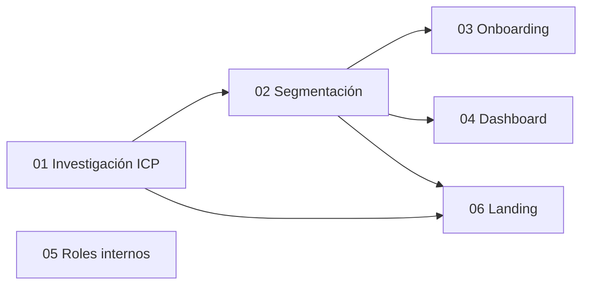

# Fase 3 — segmentación, personalización y operación interna

> **Idioma excepcional**: esta fase está escrita en español por petición expresa del propietario
> del producto para poder compartirla con el equipo hispanohablante. El código, los nombres de
> contratos, las migraciones, los tests, los commits y los logs de implementación seguirán en inglés.

## Objetivo de la fase

Convertir BuilderHunt de una experiencia única para todos en una plataforma que entiende el
objetivo principal de cada persona, guía su primera activación y prioriza la información relevante,
sin confundir personalización con autorización.

La taxonomía propuesta para el MVP es:

- `hiring`: founders, responsables de contratación y recruiters que buscan builders.
- `investing`: inversores, scouts y analistas que buscan builders, equipos o proyectos.
- `building`: builders/developers que quieren reclamar, enriquecer y distribuir su perfil.
- `other`: salida explícita para casos todavía no comprendidos.

`user` no se usa como segmento porque no describe un trabajo ni una necesidad: todos los
anteriores son usuarios.

## Principios no negociables

1. `user_segment` personaliza mensajes y prioridades; nunca concede permisos.
2. `organization_role` mantiene `owner | admin | member` y protege recursos del workspace.
3. `platform_role` protege las herramientas internas de BuilderHunt.
4. plan y entitlement controlan acceso comercial; tampoco sustituyen permisos.
5. `submitSegmentsResponseSchema` no participa en esta fase: pertenece al envío de segmentos de
   transcripción de entrevistas en `src/shared/lib/interview-api.ts`.
6. La personalización debe producir diferencias útiles de workflow, no solo cambiar títulos.
7. Toda afirmación de mercado debe clasificarse como evidencia, inferencia o hipótesis.

## Planes

| Orden | Plan | Resultado |
|---|---|---|
| 1 | [`01-investigacion-icp`](./01-investigacion-icp/spec.md) | ICPs y buyer personas validados |
| 2 | [`02-segmentacion-usuarios`](./02-segmentacion-usuarios/spec.md) | Contrato, persistencia, settings y analítica |
| 3 | [`03-onboarding-segmentado`](./03-onboarding-segmentado/spec.md) | Activación diferente por objetivo |
| 4 | [`04-dashboard-personalizado`](./04-dashboard-personalizado/spec.md) | Presets de widgets y acciones por segmento |
| 5 | [`05-roles-internos-plataforma`](./05-roles-internos-plataforma/spec.md) | RBAC interno auditable y de mínimo privilegio |
| 6 | [`06-landing-segmentada`](./06-landing-segmentada/spec.md) | Mensajes y páginas de conversión por ICP |

## Dependencias

Roles internos puede ejecutarse independientemente, pero por riesgo de seguridad debe tener su
propia revisión y despliegue. Landing puede empezar con prototipos después de investigación, pero la
persistencia de la selección y el handoff a signup dependen del contrato de segmentación.

## Orden recomendado de entrega

### Ola A — aprender antes de construir

- ejecutar entrevistas y pruebas de mensaje;
- decidir la taxonomía definitiva;
- establecer baseline de signup, activación y retención.

### Ola B — fuente de verdad

- crear el contrato compartido y persistencia;
- exponer lectura/escritura autenticada;
- añadir configuración y eventos de analítica.

### Ola C — activación y adquisición

- publicar landing segmentada detrás de feature flag;
- desplegar onboarding v2 por cohortes;
- comparar activación contra el onboarding actual.

### Ola D — valor recurrente

- convertir el dashboard actual en un compositor de widgets;
- activar presets progresivamente;
- conservar personalización manual y fallback.

### Ola E — operación interna

- migrar la allowlist administrativa a permisos internos;
- desplegar en modo sombra y luego enforcement;
- conservar un mecanismo de emergencia documentado.

## Criterio global de éxito

- existe una única fuente de verdad para el segmento;
- cada segmento tiene un evento de activación observable;
- landing → signup → onboarding → activación puede atribuirse de extremo a extremo;
- cambiar de segmento no pierde datos ni cambia permisos;
- los usuarios sin segmento conservan una experiencia completa;
- las rutas internas rechazan en servidor a quien no tenga permiso;
- todos los cambios pasan tests, build, controles de tenancy y smoke tests reales.
