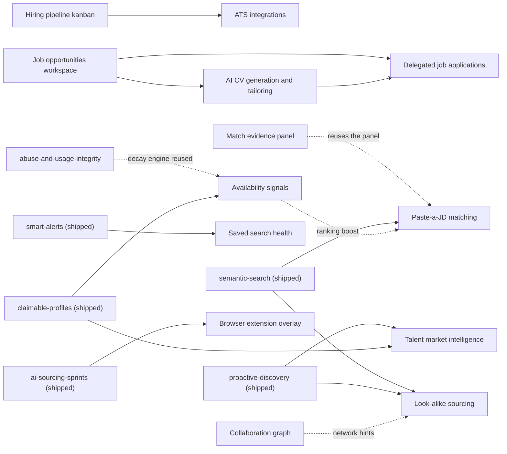

# Fase 2 — feature backlog

Thirteen feature plans: ten derived from [`new-plans.md`](./new-plans.md) on 2026-07-24 and
three candidate-side career plans added by direct request on 2026-07-27; plus one infrastructure
plan ([`postgres-18-upgrade`](./postgres-18-upgrade/spec.md), added 2026-07-26).
Each is the usual trio: `spec.md` (WHAT/WHY), `plan.md` (HOW, phases + risks + rollback),
`tasks.md` (executable checklist). All fourteen are `pending` with zero implementation — the trios
are implementation-ready, not implemented.

The three career plans are written in Spanish by direct user request/continuation so they can be
shared with the Spanish-speaking team. Code, schemas, task IDs, commits and runtime logs remain
English.

These live one directory deeper than the phase-1 plans, so cross-plan links are
`../../phase-1/<plan>/spec.md` for phase-1 and `../<plan>/spec.md` for a fase-2 sibling.

Read [`../_meta/app-reality.md`](../_meta/app-reality.md),
[`../_meta/security-policy.md`](../_meta/security-policy.md),
[`../_meta/ai-policy.md`](../_meta/ai-policy.md) and
[`../_meta/conventions.md`](../_meta/conventions.md) before executing any of them.

## Verification status

The original ten passed a mechanical gate (header/link/task-format shape, no stale tech, no path cited
without `(new)` that doesn't exist) and an adversarial review against the real codebase — not a
read-through, but grep/EXPLAIN/type-check verification of the load-bearing claims in each trio.
That review found **5 blockers**, all some variant of "this write happens under a database role
that holds no grant for it" or "this labels client-supplied data as server-measured" — the two
failure classes [`_meta/app-reality.md`](../_meta/app-reality.md) constraint 7 and
[`project-hygiene`](../phase-1/project-hygiene/spec.md) exist to catch. Every blocker was fixed with a
real design decision, not a patch — see "Known cross-plan collisions" below and each plan's Risks
table for the resolution and reasoning. Two findings turned out to be pre-existing defects in
*shipped* code, not in these plans, and are tracked separately: the security-header/CSRF logic was
duplicated between a tested-but-unused module and an untested copy that actually ran (fixed
2026-07-24, see `server/security.mjs`), and `findSimilarBuilderEmbeddings` never uses the HNSW
index it is named after (open, tracked as a background task; two fase-2 plans depend on the fix).

**`postgres-18-upgrade` is verified to a different standard, stated here so nobody assumes
otherwise.** Every claim in it was checked against the working tree by grep (images, roles, RLS
force flags, `serial`/trigger/FTS/`COPY`/`AT TIME ZONE` absence, the six `uuid` defaults, the
`conversion_events` indexes) and the target image tag was confirmed to exist on Docker Hub on
2026-07-26. It has **not** been through the same second-pass adversarial review the ten feature
plans got, and — by design — its Phase 0 exists to *reproduce* its own three most dangerous
claims against a live PG18 cluster before anything touches production.

The three career plans were reconciled against the current schema, AI task registry, billing
ledger, source-policy crawler, document-processing plan and tenant authorization model. They passed
the same mechanical header/link/task-shape gate. Their explicit Phase 0 work still requires privacy,
source-policy, truthfulness and autonomy approval before implementation.

## The thirteen feature plans

| Plan | What it is | New tables | New AI tasks | New env vars |
| ---- | ---------- | ---------- | ------------ | ------------ |
| [`match-evidence-panel`](./match-evidence-panel/spec.md) | "Why this match" evidence disclosure on every result | 0 | 0 | 0 |
| [`saved-search-health`](./saved-search-health/spec.md) | Kill/tune/keep verdict per saved search | 0 | 1 | 0 |
| [`hiring-pipeline-kanban`](./hiring-pipeline-kanban/spec.md) | Kanban board over tracked builders | 2 | 0 | 0 |
| [`look-alike-sourcing`](./look-alike-sourcing/spec.md) | "More like this" over the shipped vector index | 0 | 0 | 0 |
| [`jd-to-candidates-matching`](./jd-to-candidates-matching/spec.md) | Paste a JD, get 20 ranked candidates with cited evidence | 1 | 2 | 0 |
| [`collaboration-graph`](./collaboration-graph/spec.md) | Who ships well with whom, from public repo metadata | 2 | 0 | 5 |
| [`availability-signals`](./availability-signals/spec.md) | Coarse open-to-work state from self-declared signals | 3 | 1 | 8 |
| [`ats-integrations`](./ats-integrations/spec.md) | Greenhouse / Ashby / Lever export + status write-back | 4 | 0 | 8 |
| [`browser-extension-overlay`](./browser-extension-overlay/spec.md) | BuilderHunt card on GitHub profiles | 3 | 0 | 3 |
| [`talent-market-intelligence`](./talent-market-intelligence/spec.md) | Public market reports + monthly digest | 2 | 1 | 2 |
| [`job-opportunities-workspace`](./job-opportunities-workspace/spec.md) | Private manual/URL/CSV/batch workspace for job opportunities | 4 | 1 | 0 |
| [`ai-cv-generation-and-tailoring`](./ai-cv-generation-and-tailoring/spec.md) | Truth-linked base CVs and per-job variants, including batches | 8 | 5 | 0 |
| [`delegated-job-applications`](./delegated-job-applications/spec.md) | Discover, score and prepare applications with per-application human approval | 7 | 2 | 0 |

## The infrastructure plan

Added 2026-07-26 from a direct request, **not** derived from `new-plans.md`. It is not a feature and
does not appear in the dependency graph or build order below, because it is ordered against
*everything*: it moves the database major version, and its Phase 4 is the gate any plan must cite
before writing PG18-only SQL.

| Plan | What it is | New tables | New AI tasks | New env vars |
| ---- | ---------- | ---------- | ------------ | ------------ |
| [`postgres-18-upgrade`](./postgres-18-upgrade/spec.md) | PostgreSQL 16 → 18 across dev/CI/prod, then the four PG18 capabilities that touch existing code | 0 | 0 | 0 (one ops-only `process.env` escape hatch) |

It also fixes four pre-existing gaps found while it was written: the daily backup
(`--no-owner --no-acl`) is not a valid upgrade vehicle, `FORCE ROW LEVEL SECURITY` makes a
data-only restore silently insert nothing unless the restoring role is a superuser,
`drizzle.__drizzle_migrations` collides on such a restore, and nothing anywhere asserts the
server's major version — so dev, CI and production can disagree silently.

## Dependency graph

Five hard edges are internal to fase 2. The career plans form their own ordered chain.

## Suggested build order

Ordered for early value, the smallest schema surface first, and to put the two
ethically-heaviest plans behind a deliberate decision rather than in the first wave.

1. **`match-evidence-panel`** — no new tables (one grants migration), closes open `audit-trust`
   findings, and raises trust on every existing surface. It also decomposes `src/lib/score.ts`,
   which several later plans want.
2. **`saved-search-health`** — small, and its Phase 0 fixes a latent `ON DELETE NO ACTION` bug on
   `alerts.query_id` that would start throwing the moment that column is ever populated.
3. **`hiring-pipeline-kanban`** — hard prerequisite for `ats-integrations`; introduces the stage
   model.
4. **`look-alike-sourcing`** — zero new tables, pure reuse of the shipped semantic index.
5. **`jd-to-candidates-matching`** — the biggest hiring pain-killer, and the first plan on the
   credit/rate-card billing path.
6. **`collaboration-graph`** — first plan needing a genuinely new GitHub crawl; budget its API
   quota before starting.
7. **`availability-signals`** — needs its own Phase 0 to create bio history that does not exist
   today, and carries the heaviest disclosure obligations. Read its Non-goals before scoping.
8. **`ats-integrations`** — blocked on 3 for stage write-back; its Phase 0 (secret-at-rest) is a
   prerequisite worth landing even if the rest waits.
9. **`browser-extension-overlay`** — a new deployment artifact with store-review latency; the API
   compatibility contract matters more than the UI.
10. **`talent-market-intelligence`** — ships its named-list content type disabled; the metric
    methodology is the deliverable, not the pages.
11. **`job-opportunities-workspace`** — foundation for candidate-side workflows; ship manual CRUD
    before URL extraction or batches.
12. **`ai-cv-generation-and-tailoring`** — depends on the job workspace and the private-document
    foundation; ship manual fact-linked CVs before AI tailoring and batch.
13. **`delegated-job-applications`** — ethically highest-risk candidate-side plan; starts as a
    manual tracker, then adds scoring and preparation. The MVP never submits externally.

## Known cross-plan collisions

Recorded because no single plan can see them:

- **Migration numbering.** `match-evidence-panel`, `hiring-pipeline-kanban`, and
  `saved-search-health` all claim `0046` as an illustrative tag; `hiring-pipeline-kanban`
  additionally claims `0047`/`0048`. The head of `drizzle/` is `0045`. Every hand-written or
  grants-only migration task in every plan now says to mint via
  `pnpm exec drizzle-kit generate --custom` and read the real next index from
  `drizzle/meta/_journal.json` rather than trust the number written in the plan — confirm before
  running it regardless.
- **Migration snapshots are enforced by a test.** `migration-integrity.test.ts` compares
  `drizzle/*.sql` against `drizzle/meta/_journal.json` and the `*_snapshot.json` files; it was
  briefly red on 2026-07-24 for a missing `0045_snapshot.json` and is green again (46/46/46).
  Grants-only migrations DO get a snapshot, so do not skip one.
- **`src/shared/lib/billing-shared.ts`** gains a new limits constant in 7 of the 10 plans.
  Names verified distinct; expect merge conflicts, not semantic ones.
- **`src/shared/lib/authorization/permissions.ts`** gains `pipeline:move`/`pipeline:configure`
  (`hiring-pipeline-kanban`) and `integration:read`/`integration:manage` (`ats-integrations`).
  No overlap, but `security-policy.md` requires a dedicated security review for authorization
  changes.
- **`src/lib/enrichment/worker.ts`'s `cascadeBuilderProcessingRestriction`** is extended by both
  `collaboration-graph` and `availability-signals` to purge their own tables. Additive, same
  function.
- **`src/lib/score.ts`** is refactored by `match-evidence-panel` (adds `explainScore`,
  reimplements `scoreBuilders` on top of it, wire format unchanged) and read by
  `browser-extension-overlay`. Land the refactor first.
- **`src/shared/lib/ai/tasks.ts`** gains 5 task ids across 4 plans; all verified distinct.
- **The three career plans share private ownership semantics.** Every career/job/application table
  carries both `organization_id` and `owner_user_id`; organization admins do not gain access to
  another member's job search. Implement these permissions once consistently and add negative
  org-admin tests to every plan.
- **The career plans add eight AI task IDs**:
  `job-description-extract`, `career-facts-extract`, `resume-base-compose`,
  `resume-job-fit-analyze`, `resume-tailor`, `resume-quality-review`, `candidate-job-fit`, and
  `application-cover-letter`. They share `src/shared/lib/ai/tasks.ts`, billing rate cards and
  provider budgets; expect merge conflicts and keep every ID unique.
- **Document storage must not fork.** `ai-cv-generation-and-tailoring` reuses the PDF/DOCX/TXT,
  quarantine, ClamAV and private R2 foundation specified by
  `calendar-scheduling-interview-intelligence`. If that foundation is not implemented, manual
  career facts may ship but upload/import remains blocked.
- **Candidate-side and employer-side pipelines are separate.** `job_applications` never writes to
  `pipeline_*`, `candidate_submissions` or ATS integrations. They have different subjects,
  permissions, consent and disclosure.
- **`builder_identities.discovered_by`** is introduced by `collaboration-graph` (additive, nullable,
  `NULL` = tenant-tracked, `'collaboration_crawl'` = crawler-discovered), because its crawler
  becomes a second writer of `builder_identities` and `first_seen_at` is `.defaultNow().notNull()`.
  Registered as a shared surface with a value registry in `docs/architecture/data-classification.md`
  — any future crawler claims its own value there. **Resolved, no filter needed downstream**:
  `talent-market-intelligence`'s cohort metrics are keyed on `builder_embeddings`, not
  `builder_identities` — and `collaboration-graph` never writes `builder_embeddings` (verified: its
  only writers are `src/lib/semantic/index-writer.ts` and `src/lib/discovery/worker.ts`). That set
  is pinned as `INDEX_WRITERS` in `market-reports/metrics.ts` with a test that fails the build if a
  future plan adds a third writer — a guard against the *next* version of this same collision, not
  just this one.
- **`src/shared/lib/repositories/public-builder-embeddings.ts`'s `findSimilarBuilderEmbeddings`** is
  was to be corrected by BOTH `look-alike-sourcing` and `jd-to-candidates-matching`, identically:
  order by the bare `<=>` operator ascending so the HNSW index is actually used, keeping
  `similarity` as a selected column. It was a fix to shipped code — `/api/search/semantic` used to
  sequentially scan `builder_embeddings` (verified by `EXPLAIN`: `Limit → Sort → Seq Scan` vs.
  `Limit → Index Scan using builder_embeddings_hnsw_idx`
  for the two orderings). **This fix has now landed** as a standalone change outside fase 2 —
  `similarBuilderEmbeddingsQuery` orders by the bare operator ascending with `similarity` as a
  selected column, covered by an EXPLAIN-based regression test. Both plans now *assert* it rather
  than owning it. Note the consequence both plans flag: retrieval becomes approximate, so recall is
  bounded by `hnsw.ef_search` (default 40) — a quality knob. Both plans previously claimed
  `ef_search` must be ≥ the query `LIMIT` "or results silently under-return"; that is false on
  pgvector 0.8.5, which searches with `ef = max(ef_search, limit)` and always returns the requested
  count (measured — see `look-alike-sourcing/spec.md`).
- **New `PermissionAction` values**, one owner each, all verified non-colliding:
  `pipeline:move`/`pipeline:configure` (`hiring-pipeline-kanban`),
  `integration:read`/`integration:manage` (`ats-integrations`), `match:delete`
  (`jd-to-candidates-matching`, which needed its own action because `jd_match_runs` has no
  `visibility` column, so the generic `resource:delete` arm would make org-paid runs undeletable
  by their creator).
- **"Add to sprint" became read-only.** `browser-extension-overlay` originally planned to insert
  into `sprint_results` as the app role, which only has `SELECT` there (`drizzle/0024`, INSERT is
  worker-only) — and would also have corrupted `sourcing_sprints.quota`-driven completion logic
  even with a grant. Resolved as a read-only `sprintMatches` field plus a `Shortlist` write action
  against `organization_builders.status`, whose grant and check constraint already exist.

## A note on the source document

[`new-plans.md`](./new-plans.md) proposed each feature with a "Cómo" implementation sketch.
Several of those sketches turned out to be wrong about the current codebase, and the specs
document the correction rather than inheriting it. The three biggest:

- Item 2 called the evidence panel a "pure consumer of `builder_source_snapshots`" — that table
  has no runtime writer and no `builderhunt_app` grant.
- Item 3 claimed "cero schema nuevo" — the alert-to-saved-search attribution it needs is not
  recorded anywhere today.
- Item 10 assumed index growth can be reported as market growth — it cannot; that is crawler
  coverage, and the spec replaces the metric rather than publishing the artifact.
