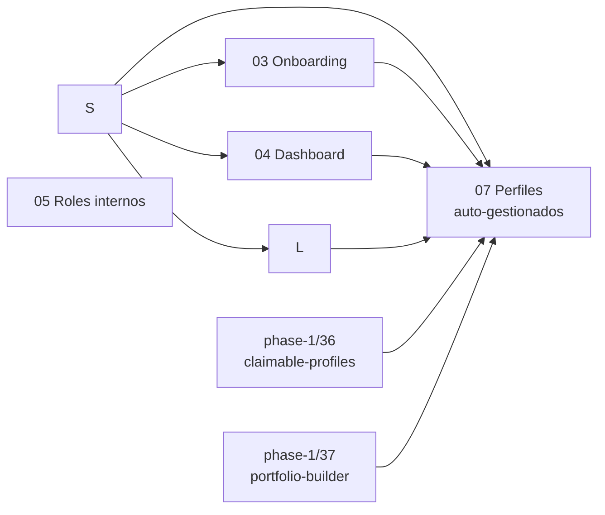

# Fase 2 — segmentación, personalización y operación interna

> **Idioma excepcional**: esta fase está escrita en español por petición expresa del propietario
> del producto para poder compartirla con el equipo hispanohablante. El código, los nombres de
> contratos, las migraciones, los tests, los commits y los logs de implementación seguirán en inglés.

## Objetivo de la fase

Convertir BuilderHunt de una experiencia única para todos en una plataforma que entiende el
objetivo principal de cada persona, guía su primera activación y prioriza la información relevante,
sin confundir personalización con autorización.

La taxonomía propuesta para el MVP es:

- `hiring`: founders, responsables de contratación y recruiters que buscan builders.
- `investing`: inversores, scouts y analistas que buscan builders, equipos o proyectos.
- `building`: builders/developers que quieren reclamar, enriquecer y distribuir su perfil.
  El segmento cubre dos sub-modalidades: (a) builders con huella pública que pueden
  reclamar y verificar; (b) builders sin huella pública que crean perfil desde cero
  (cubierto por [`07-perfiles-autogestionados`](./07-perfiles-autogestionados/spec.md)).
- `other`: salida explícita para casos todavía no comprendidos.

`user` no se usa como segmento porque no describe un trabajo ni una necesidad: todos los
anteriores son usuarios.

## Principios no negociables

1. `user_segment` personaliza mensajes y prioridades; nunca concede permisos.
2. `organization_role` mantiene `owner | admin | member` y protege recursos del workspace.
3. `platform_role` protege las herramientas internas de BuilderHunt.
4. plan y entitlement controlan acceso comercial; tampoco sustituyen permisos.
5. `submitSegmentsResponseSchema` no participa en esta fase: pertenece al envío de segmentos de
   transcripción de entrevistas en `src/shared/lib/interview-api.ts`.
6. La personalización debe producir diferencias útiles de workflow, no solo cambiar títulos.
7. Toda afirmación de mercado debe clasificarse como evidencia, inferencia o hipótesis.
8. **Cobertura universal en matching**: cualquier ruta, worker, agente o job que produzca una
   lista de candidatos, matches o builders relevantes debe considerar perfiles
   auto-gestionados (`selfManagedProfiles`) con `visibility = 'public'`, con las
   mismas reglas de inclusión, exclusión, dedup, ranking y marca visual que los
   builders con `builder_claims` verificada. Detalle y checklist en
   [`07-perfiles-autogestionados/spec.md`](./07-perfiles-autogestionados/spec.md)
   §"Principio de cobertura universal en matching".

## Planes

| Orden | Plan | Resultado |
|---|---|---|
| 1 | [`01-investigacion-icp`](./01-investigacion-icp/spec.md) | Paquete de investigación y baseline listos para post-launch |
| 2 | [`02-segmentacion-usuarios`](../implemented/phase-2/02-segmentacion-usuarios/spec.md) | Contrato, persistencia, settings y analítica |
| 3 | [`03-onboarding-segmentado`](./03-onboarding-segmentado/spec.md) | Activación diferente por objetivo |
| 4 | [`04-dashboard-personalizado`](./04-dashboard-personalizado/spec.md) | Presets de widgets y acciones por segmento |
| 5 | [`05-roles-internos-plataforma`](./05-roles-internos-plataforma/spec.md) | RBAC interno auditable y de mínimo privilegio |
| 6 | [`06-landing-segmentada`](./06-landing-segmentada/spec.md) | Mensajes y páginas de conversión por ICP |
| 7 | [`07-perfiles-autogestionados`](./07-perfiles-autogestionados/spec.md) | Perfiles para builders sin huella pública (CV + adjuntos) |

## Dependencias

Investigación y roles internos pueden ejecutarse independientemente. Las entrevistas y la decisión
de ICP están en phase 5; phase 2 construye la taxonomía como hipótesis reversible. Roles internos,
por riesgo de seguridad, mantiene revisión y despliegue gradual propios. El handoff de landing a
signup depende solamente del contrato de segmentación.

`07-perfiles-autogestionados` depende además de los planes `36-claimable-profiles`,
`37-portfolio-builder` y `38-work-sample` de la fase 1 (modelos canónicos y DTOs públicos).
Sin esos, no se puede integrar el perfil auto-gestionado con la búsqueda, el portfolio,
ni la ruta de promoción a claim.

## Orden recomendado de entrega

### Ola A — preparar la medición y construir la hipótesis

- preparar el screener, el guion y el scorecard que usará phase 5;
- establecer baseline de signup, activación y retención.

### Ola B — fuente de verdad

- crear el contrato compartido y persistencia;
- exponer lectura/escritura autenticada;
- añadir configuración y eventos de analítica.

### Ola C — activación y adquisición

- publicar landing segmentada detrás de feature flag;
- desplegar onboarding v2 por cohortes;
- comparar activación contra el onboarding actual.

### Ola D — valor recurrente

- convertir el dashboard actual en un compositor de widgets;
- activar presets progresivamente;
- conservar personalización manual y fallback.

### Ola E — operación interna

- migrar la allowlist administrativa a permisos internos;
- desplegar en modo sombra y luego enforcement;
- conservar un mecanismo de emergencia documentado.

### Ola F — abrir el segmento `building` a quien no tiene huella

- introducir `selfManagedProfiles` y `selfManagedAttachments` con su propia
  capa de seguridad (misma capa safe-deliver que el resto, validada contra
  magic bytes, antivirus obligatorio);
- renderizar perfiles auto-gestionados con chip "Self-managed" — nunca con el
  badge "verified" de los builders con claim;
- integrar con `04-dashboard-personalizado` y `06-landing-segmentada` para que
  el segmento `building` cubra también a personas sin actividad pública;
- permitir promoción futura a `builder_claims` sin perder adjuntos ni bio.

## Criterio global de éxito

- existe una única fuente de verdad para el segmento;
- cada segmento tiene un evento de activación observable;
- landing → signup → onboarding → activación puede atribuirse de extremo a extremo;
- cambiar de segmento no pierde datos ni cambia permisos;
- los usuarios sin segmento conservan una experiencia completa;
- las rutas internas rechazan en servidor a quien no tenga permiso;
- todos los cambios pasan tests, build, controles de tenancy y smoke tests reales;
- una persona sin huella pública puede tener perfil público y descubrible en
  BuilderHunt, con adjuntos, sin que ese perfil compita visualmente con un
  builder con `builder_claims` verificada;
- un perfil auto-gestionado puede migrar a `builder_claims` verificada sin
  perder adjuntos, bio ni handle;
- cualquier nueva superficie de matching que se introduzca en planes futuros
  cumple la checklist de 5 preguntas del principio de cobertura universal
  (ver `07-perfiles-autogestionados/spec.md` §"Principio de cobertura
  universal en matching") y consume `includeSelfManagedInResults`.
