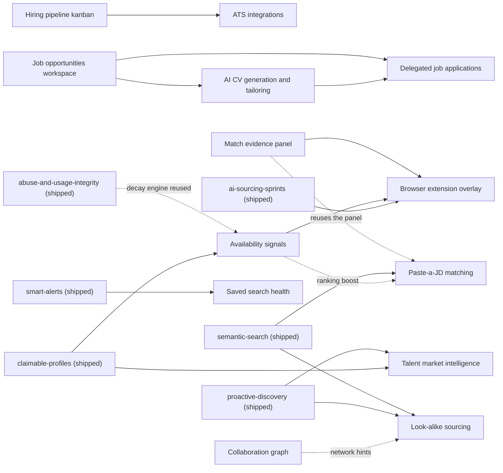

# Fase 4 — feature backlog

Fourteen plans: ten derived from [`new-plans.md`](./new-plans.md) on 2026-07-24, three
candidate-side career plans added 2026-07-27, and one infrastructure plan
([`postgres-18-upgrade`](../phase-1/03-postgres-18-upgrade/spec.md), added 2026-07-26;
**moved into phase-1 at position 03 on 2026-07-28** — the cutover only gets more expensive as data
and paying tenants grow, so it was pulled forward).
Each is the usual trio: `spec.md` (WHAT/WHY), `plan.md` (HOW, phases + risks + rollback),
`tasks.md` (executable checklist). All fourteen are `pending` with zero implementation — the trios
are implementation-ready, not implemented. **547 open tasks** across the phase.

The three career plans are written in Spanish by direct user request so they can be shared with the
Spanish-speaking team. Code, schemas, table and column names, task IDs, commands, commits and
runtime logs remain English. (This is a deliberate exception to
[`conventions.md`](../_meta/conventions.md) rule 9, recorded here so nobody "fixes" it.)

These live one directory deeper than the phase-1 plans, so cross-plan links are
`../../phase-1/<plan>/spec.md` for phase-1 and `../<plan>/spec.md` for a fase-4 sibling.

Read [`../_meta/app-reality.md`](../_meta/app-reality.md),
[`../_meta/security-policy.md`](../_meta/security-policy.md),
[`../_meta/ai-policy.md`](../_meta/ai-policy.md) and
[`../_meta/conventions.md`](../_meta/conventions.md) before executing any of them.

## Verification status — re-verified against HEAD on 2026-07-27

The ten original plans were written and adversarially reviewed on 2026-07-25. **The codebase then
moved 40 migrations.** On 2026-07-27 every one of the fourteen trios went through a second
adversarial pass against `master` HEAD: not a read-through, but grep/EXPLAIN/type-check
verification of every load-bearing claim, plus a mechanical gate over all 42 files (every cited
path exists or is marked `(new)`; every markdown link resolves; no hardcoded next-migration index;
no co-located test paths; every task carries `Files:`/`Do:`/`Verify:`). **14/14 pass that gate.**

Three defects were systemic — present in every plan, and none of them the plan author's fault:

- **105 broken cross-plan links.** Phase-4 plans moved a directory deeper; every link to a phase-1
  plan still read `../../<plan>/`. None resolved. Fixed.
- **119 dead test paths.** The test tree was unified under `tests/{unit,e2e,regression}` on
  2026-07-27 and `vitest.config.ts` now includes ONLY `tests/unit/**`. Every plan specified
  co-located `src/**/*.test.ts` files — a location where **a test passes by not running**. Fixed,
  and the root cause fixed too: `app-reality.md`'s Tests bullet was the instruction that produced
  them, and it has been rewritten. Phase-1 plans still carry ~339 of the same stale paths.
- **Migration numbering.** This README claimed the head of `drizzle/` was `0045`. It is `0085`
  (86 journal entries; `0084`/`0085` are untracked working-tree WIP). No plan hardcodes an index
  any more: every migration task mints via `pnpm exec drizzle-kit generate --custom` and reads the
  real next index from `drizzle/meta/_journal.json` at implementation time.

The pass also found that four claims **in this README** were false. They are corrected below and
listed here so the correction is not silent: the drizzle head; the `INDEX_WRITERS` evidence;
private document storage described as R2 when it is private MinIO; and
`match-evidence-panel` described as *closing* `audit-trust` findings when it *files* new ones.

`postgres-18-upgrade` is held to a different standard, by design: its Phase 0 exists to
**reproduce** its own three most dangerous claims against a live PG18 cluster before anything
touches production. The 2026-07-27 pass tightened that gate rather than shortening it, and found
the danger understated — see its row below.

## The thirteen feature plans

`Tasks` is the verified open-task count. `Verdict` is the outcome of the 2026-07-27 pass.

| Plan | What it is | Tasks | New tables | New AI tasks | Verdict |
| ---- | ---------- | ----: | ---------: | -----------: | ------- |
| [`match-evidence-panel`](./match-evidence-panel/spec.md) | "Why this match" evidence disclosure on every result | 39 | 0 | 0 | READY |
| [`saved-search-health`](./saved-search-health/spec.md) | Kill/tune/keep verdict per saved search | 22 | 0 | 1 | READY |
| [`hiring-pipeline-kanban`](./hiring-pipeline-kanban/spec.md) | Kanban board over tracked builders | 30 | 2 | 0 | READY |
| [`look-alike-sourcing`](./look-alike-sourcing/spec.md) | "More like this" over the shipped vector index | 29 (+2 done) | 0 | 0 | READY |
| [`jd-to-candidates-matching`](./jd-to-candidates-matching/spec.md) | Paste a JD, get 20 ranked candidates with cited evidence | 28 (+1 done) | 1 | 2 | READY |
| [`collaboration-graph`](./collaboration-graph/spec.md) | Who ships well with whom, from public repo metadata | 30 | 2 | 0 | READY |
| [`availability-signals`](./availability-signals/spec.md) | Coarse open-to-work state from self-declared signals | 31 | 3 | 1 | READY |
| [`ats-integrations`](./ats-integrations/spec.md) | Greenhouse / Ashby / Lever export + status write-back | 42 | 4 | 0 | READY — blocked on #3 |
| [`browser-extension-overlay`](./browser-extension-overlay/spec.md) | BuilderHunt card on GitHub profiles | 48 | 2 | 0 | READY |
| [`talent-market-intelligence`](./talent-market-intelligence/spec.md) | Public market reports + monthly digest | 38 | 2 | 1 | READY |
| [`job-opportunities-workspace`](./job-opportunities-workspace/spec.md) | Private manual/URL/CSV/batch workspace for job opportunities | 50 | 4 | 1 | READY — see blocker |
| [`ai-cv-generation-and-tailoring`](./ai-cv-generation-and-tailoring/spec.md) | Truth-linked base CVs and per-job variants, including batches | 61 | 8 | 5 | READY |
| [`delegated-job-applications`](./delegated-job-applications/spec.md) | Discover, score and prepare applications with per-application human approval | 57 | 7 | 2 | READY |

The three career plans were rewritten from summary level to executable depth on 2026-07-27
(16→50, 18→61, 21→57 tasks). Before that they were headlines: one checkbox reading "create
opportunities, versions, batches/items, composite FKs, checks, indexes, grants and RLS" stood in
for four tables plus RLS plus per-role grants. They now carry full column lists, check
constraints, composite FKs, RLS predicate text and per-role GRANTs inline.

## The infrastructure plan

Ordered against *everything*: it moves the database major version, and its Phase 4 is the gate any
plan must cite before writing PG18-only SQL.

| Plan | What it is | Tasks | Verdict |
| ---- | ---------- | ----: | ------- |
| [`postgres-18-upgrade`](../phase-1/03-postgres-18-upgrade/spec.md) | PostgreSQL 16 → 18 across dev/CI/prod, then the four PG18 capabilities that touch existing code | 39 | **Moved to phase-1 as `03-postgres-18-upgrade` on 2026-07-28** — no longer part of this phase |

Its three dangerous claims were re-verified and **restated upward**: the plan described "tenant
tables" under `FORCE ROW LEVEL SECURITY`; HEAD has **58 tables and 356 policies across 5 roles**,
and all seven roles are `NOSUPERUSER NOBYPASSRLS`. A non-superuser data-only restore therefore
inserts zero rows into those tables while the row counts look plausible. The four pre-existing gaps
it fixes are all still gaps. The target image `pgvector/pgvector:0.8.5-pg18` was confirmed on
Docker Hub (amd64 + arm64) on 2026-07-27, and pgvector availability is now stated as a hard
requirement with the incident rationale, not a footnote.

**Its blocker has since been resolved**: `drizzle/0084`/`0085` (the candidate-documents schema and
its RLS/grants) were untracked working-tree WIP when this pass ran; they are now committed and
tracked at HEAD (`git ls-files` confirms both), so a clean checkout provisions the same schema that
Phase 0 rehearses. No WIP remains to land first.

## Dependency graph

Two solid edges into `browser-extension-overlay` are **new**, found by the 2026-07-27 pass — see
"the `builder_source_snapshots` ordering decision" below.

## Suggested build order

1. **`match-evidence-panel`** — no new tables (one grants migration), decomposes `src/lib/score.ts`
   (adds `explainScore`), which `browser-extension-overlay` reads and `jd-to-candidates-matching`
   reuses, and raises trust on every existing surface. It **files** new connector findings against
   `audit-trust`; it does not close that plan's two open tasks, which are unrelated.
2. **`saved-search-health`** — small, and its Phase 0 fixes a latent `ON DELETE NO ACTION` bug on
   `alerts.query_id` (re-verified still present) that would start throwing the moment that column
   is ever populated.
3. **`hiring-pipeline-kanban`** — hard prerequisite for `ats-integrations`; introduces the stage
   model, which is now written up as a **published contract** (six numbered clauses) because
   another plan builds on it.
4. **`look-alike-sourcing`** — zero new tables, pure reuse of the shipped semantic index.
5. **`jd-to-candidates-matching`** — the biggest hiring pain-killer, and the first plan on the
   credit/rate-card billing path.
6. **`collaboration-graph`** — first plan needing a genuinely new GitHub crawl; its API-quota
   arithmetic is now written out and should be approved before starting.
7. **`availability-signals`** — heaviest disclosure obligations in the phase. Its Phase 0 also
   lands the `builder_source_snapshots` writer and grant that three other plans want; see below.
8. **`ats-integrations`** — blocked on 3. Its Phase 0 (secret-at-rest) is independently shippable
   and worth landing even if the rest waits.
9. **`browser-extension-overlay`** — a new deployment artifact with store-review latency. The API
   compatibility contract now exists as five numbered rules plus a per-status degradation table and
   a real `api-version.ts` module: an extension in the wild outlives any server deploy.
10. **`talent-market-intelligence`** — ships its named-list content type disabled. The metric
    methodology is the deliverable, not the pages.
11. **`job-opportunities-workspace`** — foundation for candidate-side workflows; ship manual CRUD
    before URL extraction or batches.
12. **`ai-cv-generation-and-tailoring`** — ship manual fact-linked CVs before AI tailoring and batch.
13. **`delegated-job-applications`** — ethically highest-risk plan; starts as a manual tracker.
    **The MVP never submits externally** and never impersonates the user to a third party; every
    application requires per-application human approval. The conditions under which that floor
    could be revisited are written into its Non-goals so a future reader knows it was a decision.

## Decisions this pass had to make

Recorded because they change the order or the shape of the work, not just the wording.

### The `builder_source_snapshots` ordering decision — NEEDS A CALL

`builder_source_snapshots` has no runtime writer and no non-owner grant (re-verified: no `GRANT` on
it exists in any of the 86 migrations). Four plans touch that gap and they currently disagree:

- `availability-signals` Phase 0 creates the writer **and** the grant — the only plan that closes
  the gap properly, because a grant without a writer buys an empty table plus a widened role.
- `match-evidence-panel` Phase 4 also grants it, with a writer.
- `browser-extension-overlay` planned to mint its **own** duplicate grant, and defers its
  `activityBand` field to `'unknown'` because of the gap.
- `talent-market-intelligence` records the table as unusable.

Resolved for now by making `browser-extension-overlay` depend on whichever of the two writers lands
first (it branches on a `grep`) and forbidding it from adding the grant itself. **The open question
is whether `availability-signals` should move earlier than #7**, since three plans are waiting on
its Phase 0. It is #7 for disclosure-risk reasons, not technical ones.

### `ai-cv-generation-and-tailoring` cannot reuse `candidate_documents`

The plan claimed it reuses the private-document foundation from
[`calendar-scheduling-interview-intelligence`](../phase-1/44-calendar-scheduling-interview-intelligence/spec.md).
Verified false in part: `candidate_documents` has `submission_id uuid NOT NULL` with a composite FK
to `candidate_submissions(organization_id, id)` `ON DELETE CASCADE`. **A job seeker's base CV has no
candidate submission**, and cascade-deleting someone's CV because an unrelated interview submission
was removed would be wrong. Storage is private **MinIO**, not R2 as this README previously said, and
no `src/lib/documents/` pipeline code exists yet — only the schema landed. The plan now reuses the
*design* (scan/extract/retention shape, declared-vs-detected media type, the no-audio and
rejection-code invariants, the evidence map, object-key-only-no-public-URL) and owns its own
owner-scoped table.

### `talent-market-intelligence` nearly recommitted its own founding error

The plan exists because index growth is **crawler coverage**, not market growth. It then proposed a
"cohort activity rate" keyed on `builder_embeddings.updated_at` — which is set on *every* upsert
regardless of content hash, i.e. "last touched by our own pipelines". That is the same error through
a different column. The metric is now `cohortReobservationRate`, moved out of `ReportMetrics` into
`ReportCoverage`, and rendered only under a "crawl coverage" heading with an explicit "this is not
builder activity" sentence. Every published metric now carries a definition, a named data source,
and a written statement of what it is **not**.

### `availability-signals` was about to mine bios BuilderHunt wrote

Its phrase detector would have searched `builder_identities.bio` for availability language and
labelled a hit "the person's public bio". Eight of the connectors *synthesize* that field: Stack
Overflow's is `"87% accept rate"`, HN's is `Posted: "<title>"`, npm's is a package description. The
plan now carries an `AVAILABILITY_BIO_SOURCE_ALLOWLIST` verified line-by-line against
`src/lib/sources/*.ts`, plus an explicit rejection rule for HN's fallback shape.

## Known cross-plan collisions

- **Shared surfaces nobody had listed.** Four surfaces are edited by many plans and were absent
  from this list: `OPERATIONAL_SCHEDULES` (`src/shared/lib/operational-schedules.ts`) — every
  worker registers a globally-unique `jobKey` and is wrapped in `withJobRun`; claimed so far:
  `pipeline.stale-digest`, `ats.sync`, `availability.signals`, `collaboration.crawl`,
  `market-reports.generate`, `market-reports.digest`, `career.documents`,
  `career.resume-batches`. `SEO_SURFACES`
  (`src/shared/lib/seo/surfaces.ts`) — fails closed to `noindex`, so a public page whose surface is
  not registered ships silently unindexed. `scripts/db/audit-schema.ts`'s `classifications` array —
  every table-adding plan edits it. `nav-config.ts`'s `NAV_AREAS` — see below.
- **The dashboard nav registry moved.** Commit `1e2ac57` replaced `DashboardLayout.tsx`'s flat
  `NAV`/`MOBILE_NAV_ITEMS` arrays with `NAV_AREAS` in
  `src/modules/dashboard/ui/shell/nav-config.ts`. Adding a destination means editing the area's
  `items` **and** its `routes` prefix list, or `nav-config.test.ts` fails on registry integrity and
  `resolveActiveArea` lights the wrong icon. An area with `id: 'pipeline'` already exists (owning
  `/sprints` and `/calendar`), so `hiring-pipeline-kanban` joins it rather than creating a second.
  `job-opportunities-workspace` creates the `career` area; the other two career plans add items to
  it. Every plan written before 2026-07-27 targeted the old arrays.
- **`pnpm security:provider-metering` is a build gate, not a runtime check.**
  `scripts/check-provider-metering.mjs` walks function boundaries by brace depth and hard-fails any
  `embedTexts(`/`minimaxChat(` not preceded, in the *same* enclosing function, by
  `checkAndConsumeBudget(` or `reserveCredits(`. A plan can stay at "0 new AI tasks" and still
  satisfy it by passing an inline pseudo-task, the way `semantic-search.ts` does.
- **Allowance tables: `OrganizationTier`, not `PlanTier`.** An allowance that is also *advertised*
  must be keyed `Record<OrganizationTier, number>` and read from `entitlement.tier` directly.
  Keying it `Record<PlanTier, number>` and laundering through `resolveLegacyPlanTier` lossily
  collapses `pro_max` into `team` — the exact shape that let `/pricing` and the enforcing route
  disagree for seven sprints. `PLAN_SEAT_LIMITS` remains `Record<PlanTier, number>` legitimately,
  so the type alone is not the bug. Four plans were rekeyed this pass.
- **`src/lib/sources/types.ts`'s `SOURCE_NAMES` has 15 entries, not 12.** `devpost`,
  `producthunt` and `bluesky` shipped after these plans were drafted. Type any per-source
  enumeration as `Record<SourceName, …>` so `pnpm type-check` catches the next one.
- **`src/shared/lib/db/schema.ts`** — eleven plans add tables. Expect merge conflicts, not
  semantic ones.
- **`src/shared/lib/authorization/permissions.ts`** gains `pipeline:move`/`pipeline:configure`
  (`hiring-pipeline-kanban`), `integration:read`/`integration:manage` (`ats-integrations`),
  `match:delete` (`jd-to-candidates-matching`), and `job:read|create|update|delete|import`
  (`job-opportunities-workspace`). All verified non-colliding. `security-policy.md` requires a
  dedicated security review for authorization changes.
- **`match:delete` needed its own action** because `jd_match_runs` has no `visibility` column, so
  the generic `resource:delete` arm would make org-paid runs undeletable by their creator.
- **`src/lib/enrichment/worker.ts`'s `cascadeBuilderProcessingRestriction`** is extended by both
  `collaboration-graph` and `availability-signals` to purge their own tables. Additive, same
  function, but both widen its return type — land one, then rebase.
- **`src/shared/lib/repositories/account-privacy.ts`'s `hardDeleteAccountSubject`** is edited by
  both `hiring-pipeline-kanban` and `ats-integrations`.
- **ATS must not write `pipeline_stage` directly.** `hiring-pipeline-kanban` models stage history as
  an append-only `organization_builder_stage_events` table with `pipeline_stage` as a cache;
  `moveBuilderStage(..., { source: 'ats' })` is the sole write path. ATS's plan was rewritten
  accordingly, and ships the worker `INSERT` grant kanban does not.
- **`builder_identities.discovered_by`** is introduced by `collaboration-graph` (additive, nullable;
  `NULL` = tenant-tracked, `'collaboration_crawl'` = crawler-discovered), because its crawler becomes
  a second writer of `builder_identities` and `first_seen_at` is `.defaultNow().notNull()`.
  Registered with a value registry in `docs/architecture/data-classification.md`.
- **`builder_embeddings` writers — the previous entry here was wrong.** This README claimed the only
  writers were `src/lib/semantic/index-writer.ts` and `src/lib/discovery/worker.ts`. At HEAD the sole
  SQL writer is `src/shared/lib/repositories/public-builder-embeddings.ts`, and row-creating callers
  are **six**: `index-writer.ts`, `discovery/worker.ts`, `semantic/semantic-search.ts`,
  `sprints/semantic-write-through.ts`, `api/builders/track.ts`, `api/search/builders.ts`. The
  *conclusion* still holds — `collaboration-graph` never writes the table — but the guard was
  redesigned as two layers (`INDEX_WRITE_CHOKEPOINT` + `INDEX_ROW_CREATORS`), both pinned in
  `market-reports/metrics.ts` with a build-failing test. Note the consequence
  `talent-market-intelligence` now discloses: sprint execution is a tenant-triggered action that
  permanently widens a *global public* sampling frame, so "indexed profiles" is partly a function of
  which customers ran sprints.
- **The HNSW ordering fix landed and is asserted, not owned.**
  `similarBuilderEmbeddingsQuery` orders by the bare `<=>` operator ascending with `similarity` as a
  selected column, covered by an EXPLAIN-based regression test with a negative control.
  `look-alike-sourcing` and `jd-to-candidates-matching` both assert it and escalate if it is ever
  reverted. Retrieval is approximate, so recall is bounded by `hnsw.ef_search` (default 40) — a
  quality knob. The older claim that `ef_search` must be ≥ the query `LIMIT` "or results silently
  under-return" is **false** on pgvector 0.8.5, which searches with `ef = max(ef_search, limit)` and
  always returns the requested count.
- **"Add to sprint" is read-only.** `builderhunt_app` has only `SELECT` on `sprint_results`
  (`drizzle/0024`). Resolved as a read-only `sprintMatches` field plus a `Shortlist` write against
  `organization_builders.status`, whose grant and check constraint already exist. The read is also
  index-shaped: `sprint_results`' indexes both lead with `sprint_id`, so the query leads with
  `sourcing_sprints` filtered by org and nested-loops in.
- **The career plans share private ownership semantics.** Every career/job/application table carries
  both `organization_id` and `owner_user_id`; the RLS predicate is tenant **AND** owner, because the
  tenant predicate alone leaks between members of the same organization. Organization admins do not
  gain access to another member's job search, and every plan carries a negative test proving an org
  admin gets 404/empty rather than 403. `src/shared/lib/auth/career-principal.ts` is created by
  `job-opportunities-workspace` and consumed by the other two.
- **Candidate-side and employer-side pipelines are separate.** `job_applications` never writes to
  `pipeline_*`, `candidate_submissions` or ATS integrations. Different subject, permissions, consent
  and disclosure.
- **The career plans add eight AI task IDs**, one owner each: `job-description-extract`
  (`job-opportunities-workspace`); `career-facts-extract`, `resume-base-compose`,
  `resume-job-fit-analyze`, `resume-tailor`, `resume-quality-review` (`ai-cv-generation-and-tailoring`);
  `candidate-job-fit`, `application-cover-letter` (`delegated-job-applications`). Plus
  `saved-search-tune`, `availability-explain`, `market-report-narrative`, `match-jd-requirements`
  and `match-jd-rerank` from the feature plans. All verified distinct from the 12 registered ids.
- **Arbitrary-URL job import is not possible today.** `safeFetch`'s `allowedHosts` is a required
  parameter, so `job-opportunities-workspace` ships a deny-by-default `JOB_SOURCE_POLICIES` register
  and paste as the universal fallback. Both `'disallowed'` and `'unavailable'` from
  `isPathAllowedByRobots` stop an import: absence of permission is not permission.

## Cross-cutting work worth scheduling

The `tenant AND owner` RLS predicate now appears in `drizzle/0069`, `drizzle/0085` and all three
career plans. Factoring it into a shared SQL snippet or repository base would cut copy-paste risk
across four plans. This is a refactor to schedule, not something to bury inside one plan.

## Repo defects found in passing

Found while verifying, **not fixed** (this was a documentation pass). Each is real and independent
of any phase-4 plan:

- `.github/workflows/quality.yml:248` runs `pnpm vitest run src/shared/lib/billing/real-provider.test.ts`,
  which does not exist. It is the only real step in the `stripe-sandbox-certification` job.
- ~~`scripts/check-tenant-boundaries.mjs` detected the auth-broker import with a pattern that never
  matched a **dynamic** `import('../db/auth-db')`, so `organization-lifecycle.ts` used the
  privileged connection while the gate reported clean.~~ **Fixed 2026-07-27**: both the auth-broker
  and global-db rules now match static and dynamic forms (and the bare `~/shared/lib/db` barrel),
  the role-literal rule covers destructured and Yoda spellings, and `organization-lifecycle.ts` is
  allowlisted with a written justification. `pnpm security:boundaries` passes.
- `src/routes/api/consent/index.ts` hardcodes its own `CURRENT_VERSIONS`, already drifted from
  `src/shared/lib/legal.ts` (`privacy: 'v1.0'` vs `'v1.1'`) — the endpoint tells clients a stale
  required version.
- `pnpm db:audit-schema` exits 1 on ~53 pre-existing unclassified tables, so **no plan can use
  "audit-schema passes" as a gate** until that backlog is cleared.
- `RATE_CARDS.settlementGraceSeconds` is dead config; `settleReservation` hardcodes 60.
- `src/routes/sitemap[.]xml.ts` 500s the whole route on a DB outage (two unguarded queries).
- `docs/architecture/data-classification.md` still describes `saved_queries`/`alerts`/`builder_notes`
  as "currently `user_id`; target `organization_id`", contradicted by `drizzle/0081`, and is missing
  several newer tables.
- `docs/operations/deploy-runbook.md` claims every worker connects as `builderhunt_worker` (false for
  discovery, embeddings and collaboration-graph) and its env table omits `DATABASE_CAPABILITY_URL`.
- Phase-1 plans carry ~339 co-located test paths, the same defect fixed here.

## A note on the source document

[`new-plans.md`](./new-plans.md) proposed each feature with a "Cómo" implementation sketch. Several
sketches were wrong about the codebase, and the specs document the correction rather than inheriting
it. The three biggest:

- Item 2 called the evidence panel a "pure consumer of `builder_source_snapshots`" — that table has
  no runtime writer and no `builderhunt_app` grant.
- Item 3 claimed "cero schema nuevo" — the alert-to-saved-search attribution it needs is recorded
  nowhere today.
- Item 10 assumed index growth can be reported as market growth — it cannot; that is crawler
  coverage, and the spec replaces the metric rather than publishing the artifact.
